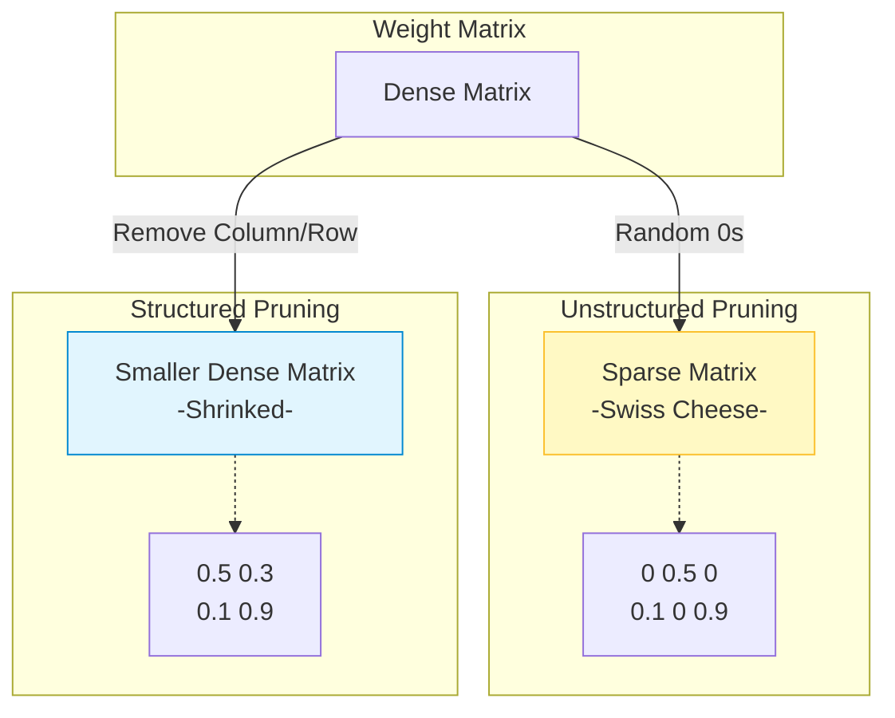

# Pruning

## 1. 개요
인간의 뇌가 성장 과정에서 불필요한 시냅스를 제거(Synaptic Pruning)하여 효율을 높이듯, 인공신경망에서 **중요도가 낮은 파라미터(Weight)를 제거(0으로 설정)하여 모델의 크기를 줄이고 연산 속도를 높이는 기술**이다.

> [!abstract] 핵심 목표
> **"정확도(Accuracy) 손실은 최소화하면서, 모델의 파라미터 수(Sparsity)를 극대화한다."**
> - **Inference Speed Up**: 연산량(FLOPs) 감소.
> - **Memory Footprint Down**: 모델 용량 감소.

## 2. 분류: 무엇을 자를 것인가? (Granularity)
Pruning의 가장 중요한 분류 기준은 **'어떤 단위로 자르느냐'** 이다. 이는 하드웨어 가속 여부와 직결된다.

### 2.1. Unstructured Pruning (비정형 가지치기)
- **방법**: 가중치 행렬 $W$에서 개별 원소(Weight) 단위로 0을 만든다.
- **장점**: 중요하지 않은 가중치만 핀셋으로 골라내므로, 높은 압축률(90% 이상)에도 성능 유지가 잘 된다.
- **치명적 단점**: 행렬이 **희소(Sparse)** 해지지만, 형태는 그대로라 일반 GPU(Dense Matrix 연산)에서는 속도 향상이 거의 없다. (별도의 Sparse Kernel 필요)

### 2.2. Structured Pruning (정형 가지치기)
- **방법**: 필터(Filter), 채널(Channel), 혹은 어텐션 헤드(Head)를 통째로 들어낸다.
- **장점**: 행렬의 크기 자체가 줄어든다 ($N \times M \to N \times (M-k)$). 따라서 **즉각적인 속도 향상**이 가능하다.
- **단점**: 통째로 들어내기 때문에 성능 하락폭이 크다.

## 3. 중요도 산정 기준 (Scoring Criteria) 
어떤 가중치가 쓸모없는지 어떻게 판단할까? 
### 3.1. Magnitude-based (크기 기반) 
- **아이디어**: "절댓값이 작은 가중치($|w| \approx 0$)는 출력에 영향을 거의 안 줄 것이다." 
- **수식**: $L_1$-norm 등을 기준으로 하위 $k\%$를 자른다. 
- **특징**: 가장 직관적이고 계산이 빠르지만, '작지만 중요한' 가중치를 놓칠 수 있다. 
### 3.2. Gradient/Hessian-based (민감도 기반) 
- **아이디어**: "이 가중치를 지웠을 때 **Loss가 얼마나 변하는지** 보자." (테일러 급수 근사) 
- **OBD (Optimal Brain Damage)**: 2차 미분(Hessian)의 대각 성분만 고려. 
- **OBS (Optimal Brain Surgeon)**: Hessian의 모든 성분 고려 (정확하지만 계산 비용 폭발). 
### 3.3. Activation-based 
- **아이디어**: "특정 데이터셋을 넣었을 때 활성화(Activation) 값이 0에 가까운 뉴런은 죽은 뉴런이다." 
## 4. Pruning 프로세스 (Pipeline) 
전통적인 Pruning은 **Iterative**하게 진행된다. 
1. **Pre-training**: 큰 모델을 학습시킨다. 
2. **Pruning**: 기준에 따라 $k\%$를 자른다. 
3. **Fine-tuning**: 성능이 떨어졌으므로, 남은 가중치로 다시 학습하여 회복시킨다. 
4. **Repeat**: 목표 사이즈가 될 때까지 2~3번 반복. 
> [!tip] Lottery Ticket Hypothesis (복권 가설)
> 
> 거대 신경망 안에는, **"초기화 상태 그대로 학습시켜도 원본 모델만큼 성능이 나오는 작은 부분 신경망(Winning Ticket)"** 이 존재한다는 가설. Pruning은 이 당첨 복권을 찾는 과정으로 해석되기도 한다.

## 5. LLM 시대의 Pruning
LLM은 너무 커서 **재학습(Fine-tuning) 비용이 비싸다**. 따라서 재학습 없이(Zero-shot) 혹은 아주 적은 데이터로 자르는 기술이 대세다.

### 5.1. SparseGPT & Wanda
-   **SparseGPT**: 2차 미분(Hessian) 정보를 근사하여, 재학습 없이 레이어 단위로 최적의 희소성을 찾는다. (OBD의 LLM 버전)
-   **Wanda (Pruning by Weights and activations)**:
    -   가중치 크기($|W|$)만 보는 게 아니라, 입력 활성화 값의 크기($|A|$)도 같이 본다.
    -   Score $= |W| \cdot |A|$
    -   복잡한 Hessian 계산 없이도 SparseGPT급 성능을 낸다.

### 5.2. 2:4 Sparsity (NVIDIA Ampere Architecture)
-   **개념**: 4개의 연속된 가중치 중 2개만 0이면 가속해주는 NVIDIA A100/H100의 하드웨어 기능.
-   **의의**: Semi-structured 방식으로, 하드웨어 가속과 성능 유지의 타협점을 찾음.

## 6. 요약 및 연결

| 구분 | Magnitude Pruning | SparseGPT / Wanda |
| :--- | :--- | :--- |
| **대상** | 일반 CNN/RNN | 거대 언어 모델 (LLM) |
| **비용** | 낮음 (단, 재학습 필요) | 중간 (재학습 불필요) |
| **성능** | 재학습 시 원본 복구 가능 | 약간의 성능 하락 감수 |
