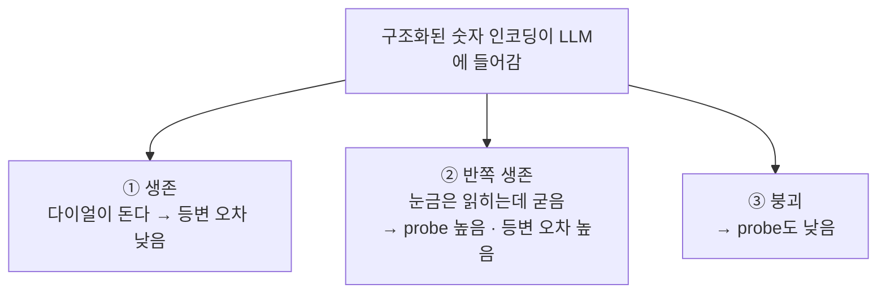
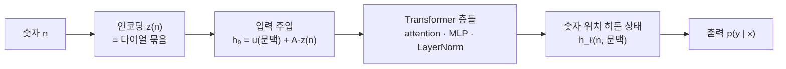

# 구조화된 숫자 임베딩은 LLM 안에서 살아남는가?

> [!abstract] 초록 (3줄 요약)
> **질문** — FoNE·PFE처럼 숫자에 미리 대수 구조를 심은 인코딩이, LLM의 수십 개 층을 통과한 뒤에도 그 구조를 유지하는가?
> **방법** — ① 값 복원 ② 구조 보존 ③ 인과적 사용을 **분리 측정**하는 *Structure Survival Audit* 제안.
> **핵심 메시지** — 값은 읽히는데 구조는 죽어 있을 수 있다. 기존 평가(probe 정확도, 벤치마크 점수)는 이 둘을 구분하지 못한다.

---
## 1. 한눈에 보기

> [!tip] 다이얼 비유 — 이것만 이해하면 논문의 절반은 이해한 것
> FoNE은 숫자를 **자릿수 규모($10^k$)마다 바늘이 하나씩 있는 시계 묶음**으로 표현한다.
> 숫자에 $a$를 더하면 → 모든 바늘이 **정해진 각도만큼 돌아간다.** 이것이 "덧셈 = 회전" 구조다.
>
> 이 시계 묶음이 LLM의 층을 통과하면 결과는 셋 중 하나다.
>
> | 결과 | 상태 | 기존 평가가 잡아내는가? |
> |---|---|---|
> | ① 생존 | 다이얼이 그대로 남아 **잘 돈다** | ❌ (구조까지는 못 봄) |
> | ② 반쪽 생존 | **눈금은 읽히는데 다이얼이 굳었다** (값은 복원됨, 회전은 안 됨) | ❌ (값만 보므로 ①로 착각) |
> | ③ 붕괴 | 다이얼 자체가 사라짐 | ✅ |
>
> **이 논문은 ②를 잡아내는 논문이다.**

**연구 대상은 화살표가 아니라 가운데 상자다** — 층을 지나는 동안 구조가 어떻게 되는가.

---

## 2. 배경 — 무엇이 있고, 무엇이 비어 있나

### 2.1 이미 있는 것: 구조화된 숫자 인코딩

| 인코딩 | 구조 (비유) | 자연스러운 과제 |
|---|---|---|
| [[FoNE]] | 10진 오도미터 — $10^k$ 주기 다이얼 | 자릿수, carry, mod $10^k$ |
| [[PFE (Prime Fourier Embeddings)]] | 소수별 시계벽 — $(p,d)$마다 다이얼 | mod $p$, CRT, 합성 modulus |
| [[xVal]] | 실수 직선 위 한 점 (연속 크기) | 비교, 스케일, 회귀형 추론 |
| [[BitTokens]] | 이진 오도미터 | parity, bitwise, 이진 carry |

공통점: 숫자를 "그냥 벡터"가 아니라 **변환 규칙이 있는 벡터**로 만든다. FoNE의 $k$번째 시계는

$$z_k(n+a) = R_k(a)\, z_k(n)$$

— 즉 "$a$를 더한다"는 항상 "고정 각도 회전"이 된다. PFE는 각 소수 시계 $(p,d)$마다 $z_{p,d}(n+a)=R_{p,d}(a)\,z_{p,d}(n)$.
### 2.2 비어 있는 것: 생존 여부의 직접 측정
기존 평가는 사실상 전부 **입력 근처 또는 출력 근처**에서 이뤄진다.
- 벤치마크 정확도 (출력)
- hidden state probe (값 복원)

하지만 "probe로 $n$을 읽을 수 있다"와 "덧셈·자리올림·모듈러 변환이 hidden space에서 일관된 변환으로 남아 있다"는 **다른 명제**다. 
**그 사이를 검사한 연구가 없다.**

> [!info] PFE와의 관계 (포지셔닝)
> PFE는 **숫자만 있는 세팅**(모듈러 분류기)에서 관련 prime 채널이 선택적으로 쓰이는지를 보였다. 이 논문은 그 다음 단계 — **자연어 instruction, 참조 해석, distractor, Transformer 문맥화를 모두 거친 뒤에도 그 구조가 살아 있는가.** PFE가 남긴 열린 문제(gradient descent가 등변 해를 언제 찾는가)를 LLM hidden space에서 측정 가능한 형태로 구체화하는 확장이기도 하다.

---
## 3. 논문의 뼈대 — 세 층위 사다리

| 층위 | 이름 | 묻는 것 | 도구 |
|---|---|---|---|
| **A** | 정보 보존 (decodability) | 값 자체가 남았는가? | linear probe |
| **B** | 구조 보존 (algebraic preservation) | 값들 **사이의 관계**가 남았는가? | 등변 오차 |
| **C** | 인과적 사용 (causal use) | 그 구조로 **실제로 답하는가**? | ablation · patching |

$$\text{A 달성} \;\not\Rightarrow\; \text{B 달성} \;\not\Rightarrow\; \text{C 달성}$$

학생 비유:
- **A** — 전화번호를 다 외운 학생 (번호 하나하나는 꺼낼 수 있음)
- **B** — 번호 체계의 원리를 이해한 학생 (아무 번호를 줘도 같은 규칙으로 처리)
- **C** — 실제로 그 원리로 문제를 푸는 학생 (원리를 흔들면 성적이 떨어짐)

---

## 4. 연구 질문

> [!question] 최종 RQ (논문 1편 분량으로 축소)
> 고정된 구조적 숫자 임베딩이 Transformer의 **문맥화(contextualization)를 거친 뒤에도, 원래 인코딩이 정의한 덧셈 구조를 보존하는가?** 
> 그리고 그렇게 보존된 구조가 **자연어 조건부 수치 추론의 OOD 일반화에 실제로 필요한가?**

원래 세 개였던 RQ는 이렇게 흡수됐다:

| 원래 RQ                      | 행방                                    |
| -------------------------- | ------------------------------------- |
| RQ1. 히든 공간에 구조적으로 embed되는가 | → 최종 RQ 전반부                           |
| RQ2. 정보는 남는데 구조는 사라질 수 있는가 | → 핵심 결과 목표 (해리 현상)                    |
| RQ3. 어떤 구조가 어떤 과제와 호환되는가   | → FoNE(decimal) vs PFE(prime) 2축으로 축소 |

**범위: FoNE + PFE만.** 둘 다 "회전"이라는 같은 수학 언어를 쓰므로 같은 척도로 깊게 팔 수 있다. xVal·BitTokens·AOE는 Discussion에서 "다른 변환군으로의 확장"으로.

> [!warning] 흔한 함정 피하기
> "FoNE·PFE·xVal·BitTokens·AOE 중 뭘 쓰는 게 최고인가?"는 **연구 프로그램**이지 1편의 RQ가 아니다. 
> 인코딩마다 보존해야 할 구조가 달라서, 전부 깊게 다루면 각각에 대한 설득력 있는 증거를 쌓기 어렵다.

---
## 5. 핵심 주장 3개

> [!example] Claim 1 — 넣는 것은 통합이 아니다
> 인코딩을 입력 임베딩에 넣는 것($z(n) \to h_0$)은 정보를 **주입**하는 행위일 뿐. 통합 여부는 **층 $\ell$을 지난 뒤에도 관계가 유지되는지**로 판정해야 한다.

> [!example] Claim 2 — 읽을 수 있음은 구조 보존보다 약하다
> $h_\ell(n,c)$에서 $n$이나 $n \bmod m$을 선형 probe로 읽어도, 덧셈 같은 군 작용이 hidden space에서 일관된 변환으로 남는다는 보장은 없다. (= ② 반쪽 생존이 존재한다)

> [!example] Claim 3 — 호환성은 조건부다
> 어떤 인코딩도 모든 과제·문맥에서 동등하게 잘 통합되지 않는다. 최종 산출물은 "최고 인코딩 순위표"가 아니라 **encoding × task 호환성 지도**다.

---

## 6. 이론 — 아주 최소판

> [!note] 이론의 역할에 대한 합의
> 새 대형 정리가 아니다. 실험 지표를 정당화하는 수준이면 충분하다. 아래 명제들은 표준 표현론 사실에 가깝다는 점을 논문에서 솔직하게 밝히기.

### 6.1. Normanclature
- **군 작용 $G$** — 숫자에 가할 수 있는 변환 모임. 예: "$a$ 더하기"
- **표현 $\rho(g)$** — 그 변환이 벡터 공간에서 하는 일. 예: 회전 행렬
- **구조화된 인코딩의 정의** — $E(g\cdot n) = \rho(g)E(n)$ ("숫자를 변환하면 벡터도 정해진 방식으로 변한다")

### 6.2. Theorem 1 - 통역사 조건

입력 주입: $h_0(n,c) = u(c) + A z(n)$    ($u(c)$: 문맥 몫, $A$: 숫자 공간 → LLM 공간으로 옮기는 선형 통역사)

> [!important] Theorem 1 — 정확한 구조 보존의 조건
> $A$가 injective할 때, 수치 표현이 hidden space에 **정확히** 보존되려면:
> 1. $A$의 이미지가 hidden 작용에 대해 불변(invariant)이고,
> 2. $A\rho(g) = \pi(g)A \quad (\forall g \in G)$ 즉, $A$가 **intertwiner**여야 한다.
>
> **통역 비유** — 좋은 통역사는 ①원문을 변환한 뒤 번역한 결과와 ②번역한 뒤 번역어 규칙으로 변환한 결과가 같다. 나쁜 통역사는 단어는 다 옮기지만(정보 보존) 문법을 부순다(구조 소실).

여기서 나오는 세 줄:
1. $A$가 injective → **정보는** 살 수 있다
2. $A$가 intertwiner가 아니면 → **구조는** 자동으로 살지 않는다
3. 따라서 **마구 초기화된 dense projection은 "중립적 인터페이스"가 아니라 대칭을 깨는 연산**이다

> [!example] Proposition 2 — probe의 한계 (이 논문의 존재 이유)
> injective한 $A$는 값을 완벽히 복원 가능하게 만들지만 intertwiner가 아닐 수 있다. → "probe 정확도가 높다"는 기존 평가 관행이 **왜 불충분한지**를 한 문장으로 정당화해 준다.

### 6.3. 층별 병목 측정 (Proposition 3)

비선형 층의 국소 도함수(Jacobian) $J_\ell$이 숫자 작용과 commute하지 않으면 그 층 부근에서 구조가 깨진다.

$$\Delta_\ell(g;h) = \big\lVert J_\ell(h)\,\pi_\ell(g) - \pi_{\ell+1}(g)\,J_\ell(h) \big\rVert_F$$

- $\Delta_\ell$ 작음 → 이 층은 국소적으로 숫자 대칭 보존
- $\Delta_\ell$ 큼 → 이 층이 **구조를 깨는 병목** 후보

### 6.4. 왜 vanilla Transformer는 자동으로 못 지켜주나

attention(토큰 의존적) · MLP(비선형) · LayerNorm · residual mixing · 위치 정보 — 어느 부품도 숫자 군 작용과 commute해야 할 이유가 없다.

> [!warning] 온도 조절
> "Transformer는 절대 구조를 못 보존한다"가 아니라, **"어떤 구조가 어떤 문맥에서 어느 층을 지나며 얼마나 보존되는지를 측정 가능한 대상으로 만든다"**는 것. 전체 global equivariance 증명은 불가능에 가깝고 제외 확정.

---
## 7. 측정 프로토콜 — Structure Survival Audit

> [!example] 감사(audit)라는 관점
> 방법론적 기여는 새 인코딩이 아니라 **감사 프로토콜**이다. 
> 세금 감사처럼 — "제대로 신고했는가(값)", "장부 규칙을 지켰는가(구조)", "실제로 그 장부로 결재했는가(인과)"를 따로 따로 확인한다.

### 지표 1 — 값 복원 점수 $\mathrm{Dec}_\ell$
각 층 hidden state에서 $n$, 부호, 자릿수, $n \bmod m$, parity 등을 읽는 probe 정확도.
**통제**: random 인코딩 / 셔플 매핑 / 동일 차원 learned / unseen 크기·형식 split.

### 지표 2 — 등변 오차 EqErr ⭐ 논문의 심장
**알려진 법칙과 직접 비교하는 트릭**: 모델 표현을 **원래 인코더의 좌표로 되돌리는** 선형 decoder $D_\ell$을 학습한다.

$$\hat z_\ell(n,c) = D_\ell\, h_\ell(n,c)$$

복원된 좌표가 실제 회전 법칙을 따르는지 잰다:
$$\mathrm{EqErr}_{\ell,k}(a) = \mathbb{E}_{n,c}\Big[\big\lVert D_\ell h_\ell(n+a,c) - R_k(a)\, D_\ell h_\ell(n,c) \big\rVert_2\Big]$$
- **왜 강한가**: 데이터에 맞춘 임의의 행렬이 아니라 **진짜 인코딩의 좌표계**와 비교하므로 "우연히 그럴듯하게 피팅"될 수 없다.
- FoNE: $n \mapsto n+a \pmod{10^k}$ 검사 / PFE: 각 $(p,d)$ 블록마다 $n \mapsto n+a \pmod{p^{d+1}}$ 검사
- (대안: paired activation에서 최적 선형 $\hat\pi_\ell(g)$를 fit하는 방식 — 부록으로)

### 지표 3 — 합성 오차 CompErr
개별 이동이 그럴듯해도 이동들이 **일관된 체계(군 법칙)** 를 이루지 못할 수 있다:

$$\mathrm{CompErr}_\ell(a,b)=\frac{\lVert \hat\pi_\ell(a+b)-\hat\pi_\ell(a)\hat\pi_\ell(b)\rVert_F}{\lVert\hat\pi_\ell(a+b)\rVert_F+\epsilon}$$

비유: 체스에서 각 수는 혼자 두면 다 옳은데, 수들의 규칙이 서로 안 맞는 것.

### 지표 4 — 부분공간 안정성
문맥 $c$가 바뀌어도 숫자 정보가 사는 부분공간 $U_\ell$이 제자리인가? (측정: principal angle, CKA)
- 너무 안정 → 문맥과 안 섞이는 **별도 채널**일 수 있음 (참조 해석에 약함)
- 너무 불안정 → 문맥만 바뀌어도 구조 붕괴
- **이상적(골디락스)**: task-무관 문맥 변화에는 안정, task-관련 지시에만 선택적 변화

### 지표 5 — 인과 구조 사용 점수 CSU

$$\mathrm{CSU} = \frac{\Delta_{\text{관련 채널 제거 시 하락}}}{\Delta_{\text{무관 채널 제거 시 하락}}+\epsilon}$$

과제에 필요한 채널만 지웠을 때 크게 무너지고, 무관 채널은 지워도 태연해야 한다.

---

## 8. 실험 설계

### 8.1. 원안 → 축소안 (무엇을 뺐는가)

| 원래 계획 | 결정 | 이유 |
|---|---|---|
| 인코딩 5종 전부 비교 | **FoNE + PFE만** | 구조·과제가 이질적. 둘은 "회전"으로 통일 가능 |
| 주입 방식 6종 탐색 | **1종 고정** | fusion 방법론 논문으로 보이면 본질(무엇이 남는가)이 흐려짐 |
| 실제 문서 QA·표 추론 | Appendix | 통제된 결과가 약해짐 |
| 범용 언어 벤치마크 다수 | **1–2개만** | "숫자 살렸는데 언어 망가짐" 방지가 목적 |
| Transformer 전체 등변 증명 | 제외 | 사실상 불가능 |
| 새로운 fusion 아키텍처 제안 | 제외 | 초점 이동 |

### 8.2. 실험 조건 4개

| 조건 | 구조 | 역할 |
|---|---|---|
| FoNE | $10^k$ 회전 | 구조 있음 — decimal 대응 |
| PFE | 소수별 회전 | 구조 있음 — prime 대응 |
| Learned vector | 없음 | 통제 (학습으로 외우는 경우) |
| Random fixed vector | 없음 | 통제 (하한선) |

### 8.3. 주입 방식 — side-token 하나만

$$h_0 = e_{\langle\texttt{NUM}\rangle} + A\,z(n)$$

- 숫자 **문자열은 원래 텍스트 스트림에 그대로** 두고, 별도 `<NUM>` 토큰 위치에 고정 벡터 $Az(n)$을 실는다.
- 예시 프롬프트:
  > The recorded value is **1024**. `<NUM>` What is its remainder modulo 16?
- $A$: 고정 orthonormal projection 또는 아주 작은 adapter
- **왜 이 방식**: "텍스트 공간과 구조화된 숫자 공간의 공존"이라는 질문 자체를 가장 깨끗하게 구현

### 8.4. 벤치마크

**A. Text-conditioned 산수 스위트 (핵심)** — 자연어로 쓰였지만 필요한 대수 구조가 명확한 과제

*Decimal 축 (FoNE 주특기)*
- "$a+b$의 마지막 두 자리" / $n \bmod 10^k$ / carry 발생 여부 / "세 번째 자리 숫자는?"
- 표기 변형: `1024` = `1,024` = `1.024e3` = "one thousand twenty-four"

*Prime·CRT 축 (PFE 주특기)*
- $(a+b) \bmod p$ / $\bmod pq$ / CRT 복원
- 자연어 modulus·참조: "The divisor mentioned in the previous sentence is 21." / "Add the second quantity to the first, then reduce."
- unseen prime · unseen 합성 modulus 일반화

*문맥 난이도 3단계 (모든 과제 공통)*
1. 짧은 템플릿
2. 패러프레이즈 + 무관 텍스트
3. 복수 숫자 + distractor + 참조 해석 (예: "민지는 사과 17개, 준호는 29개. **두 번째 값**에 첫 번째 값을 더하라.")

**B. OOD 3종 (많이 만들지 말고 이 셋만)**

| OOD | 내용 |
|---|---|
| 문장 OOD | unseen paraphrase |
| 문맥 OOD | 긴 문맥 + distractor 숫자 |
| 조합 OOD | 학습 때 각각 본 연산의 새로운 조합 |

(원안의 크기·형식·modulus OOD는 각 과제군 내 변형으로 흡수)

**C. 언어 보존 (최소)** — perplexity + 숫자 없는 과제 1개

### 8.5. 모델·학습
- pretrained decoder-only 2개: **~300M–700M** 1개 + **~1B–3B** 1개
- 목적은 리더보드가 아니라 **스케일을 달리한 현상 재현** → 거대 모델 1개보다 서로 다른 크기 2개
- 학습: 완전 pretraining이 아니라 **controlled continued pretraining 또는 PEFT**
- 동일 예산, **seed ≥ 3**, 과제별 신뢰구간
- 참고: PFE 원 논문은 단일 seed → 후속인 이 논문에서는 더 엄격하게

---

## 9. 예상 결과 — "돈 그림"

### 9.1. dissociation 표 — 이게 나오면 논문은 성공

| 조건 | 값 probe | 구조(등변) | 해석 |
|---|---|---|---|
| Learned / Random | 높음 | **낮음** | 외웠지, 구조는 없다 |
| FoNE + decimal 과제 | 높음 | **높음** | decimal 대칭 생존 |
| FoNE + prime 과제 | 높음/중간 | **낮음** | 값은 남았는데 과제와 구조 불일치 |
| PFE + prime 과제 | 높음 | **높음** | 소수별 대칭 생존 |

### 9.2. 대표 상관
$$\text{EqErr 낮음} \;\Longleftrightarrow\; \text{OOD 수치 정확도 높음}$$
인코딩 × 층 × seed × 과제 전반에서 일관되면 "구조 생존이 일반화를 만든다" 주장 성립.

### 9.3. 층별 생존 곡선 (Figure 2 재료) — 예상 모양
- **초반 층**: 인코딩의 원래 구조가 강하게 보임
- **중반 층**: 문맥과 통합되는 구간 (여기서 갈림길)
- **후반 층**: 출력 특화 정보로 압축되며 일부 구조 소실
- FoNE: decimal에선 중간층까지 $10^k$ 회전 유지, prime에선 조기 붕괴 예상
- PFE: **관련 prime 채널만** 선택적 생존 예상

---

## 10. 인과 검증 — 두 개면 충분

### ① 관련 vs 무관 채널 절제
예: $a+b \bmod 21$ → $21 = 3 \times 7$이므로 **$p=3,7$ 채널만 관련**
- $3,7$ 채널 제거 → 성능 급락 ✅ (기대)
- $11,13$ 채널 제거 → 거의 무변화 ✅ (기대)
- 새로움: PFE는 숫자-only 세팅에서 이미 유사 결과. 여기서는 **언어 조건부·문맥화 이후에도** 재현되는지가 포인트

### ② 부분공간 패칭
- source: 모델이 맞히는 instance / target: 비슷하지만 틀리는 instance
- 특정 층의 **수치 부분공간만** source → target으로 이식
- 기대: 수치 부분공간 패치 → target 출력이 source 값으로 바뀜 / random 부분공간·무관 층 패치 → 무변화
- "구조가 단순한 상관이 아니라 **출력 계산의 원인**"임을 보이는 최강 증거

---

## 11. Hypothesis

> [!tip] H1 — 구조 없는 통제군은 "외운다"
> Learned / random: probe 높음 · 등변 오차 높음 · 합성 오차 높음 · OOD 약함

> [!tip] H2 — FoNE은 decimal-local에서만 오래 삶
> $10^k$ 주기 과제에서는 등변 오차 낮음. 단 $2, 5$ 외 소수 과제(mod 7 등)는 대응 좌표가 없어 약하거나 텍스트 회로에 의존

> [!tip] H3 — PFE는 prime 과제에서 높은 인과 선택성
> "mod 21" 지시 시 관련 채널 활성 증가, $p=3,7$ 절제 시 큰 하락, $p=11,13$은 무변화. 재현되면 PFE가 "섞여 사라진 게 아니라 **문맥이 선택적으로 접근하는 구조적 성분**"으로 남았다는 뜻

> [!tip] H4 — 최적 통합은 완전혼합도 완전분리도 아니다
> 완전 분리 → 산수는 되는데 참조·설명 약함 / 너무 빨리 혼합 → 언어는 되는데 대수 붕괴. 좋은 모델은 **무관 문맥에 안정, 관련 지시에 선택적 변화**

---

## 12. 리스크 3종 — 전부 "결과"가 된다

> [!warning] 리스크 1 — 전 인코딩이 빠르게 붕괴
> **그것도 좋은 논문이다.** 결론: "고정 수치 표현을 주입하는 것만으로 구조적 통합은 보장되지 않는다." 특히 입력층에선 등변 오차가 낮은데 중간층부터 급증 + 정확도는 유지 + 인과 절제에서 구조 채널 중요도 낮음 → 기존 연구가 input-level 평가에 치우쳤다는 비판으로 직결

> [!warning] 리스크 2 — 인코딩 간 차이가 안 잡힘
> 대응: 과제를 더 구조적으로 분리(decimal vs prime) · unseen modulus·범위 외삽 강화 · 표면형 변형 추가 · 군 합성 테스트 추가 · 인과 개입으로 차이 측정. **단순 산수 정확도는 인코딩 차이를 가릴 가능성이 크다**

> [!warning] 리스크 3 — PFE만 유리한 synthetic 과제처럼 보임
> 대응: decimal에선 FoNE, magnitude엔 xVal, binary엔 BitTokens 강점이 드러나도록 벤치마크 균형 유지. 메시지는 "PFE 최고"가 아니라 **"수치 구조는 task-정렬적으로 평가해야 한다"**

---

## 13. Figure 계획 (5장)

| # | 내용 | 역할 |
|---|---|---|
| 1 | 문제 개념도 — 생존 / 혼합·사용 / 붕괴 3경우 | 첫인상 |
| 2 | **Decodability vs Equivariance 해리** (층별·인코딩별) | 대표 그림 ⭐ |
| 3 | Encoding–Task 호환성 매트릭스 (색: OOD 정확도 또는 CSU) | 최종 산출물 |
| 4 | 문맥 개입 — 같은 숫자, 지시만 바꿀 때 부분공간 변화 ("last digit" / "mod 7" / ">100?" / "읽어라") | 문맥-구조 상호작용 |
| 5 | 인과 절제 대비 (relevant vs irrelevant 채널) | 인과 마무리 |

---

## 14. 실행 로드맵
### Phase 1 — 해리가 실제로 잡히는지 확인 (가장 중요)
- [ ] 소형 transformer + FoNE / PFE / learned / random 4조건
- [ ] 벤치마크 A(decimal·prime) + 문맥 3단계
- [ ] 층별 probe + EqErr + CompErr 측정
- [ ] 성공 기준: **값-구조 해리 관측** + 붕괴 시작 층이 모델·조건마다 다름 (FoNE은 $10^k$-정렬 과제에서만 낮은 EqErr, 통제군은 probe만 가능 등)

### Phase 2 — 인과 검증
- [ ] 채널 절제 (relevant vs irrelevant)
- [ ] 부분공간 패칭
- [ ] 반사실 숫자 치환 (같은 값, 다른 표면형)

### Phase 3 — 확장
- [ ] xVal · BitTokens · AOE 추가 (부록 수준)
- [ ] 1B–3B 모델 재현 (+가능하면 다른 아키텍처 1개)
- [ ] 실제 혼합 수치 텍스트 · 언어 보존 측정

---
## 부록 A — 용어 미니 사전

| 용어 | 한 줄 정의 |
|---|---|
| 등변성 (equivariance) | 입력을 변환하면 표현도 정해진 방식으로 변함. "덧셈 = 회전"이 지켜지는 것 |
| 복원 가능성 (decodability) | 표현에서 값을 선형으로 읽어낼 수 있음 |
| intertwiner | 두 공간 사이에서 구조를 존중하는 선형 사상: $A\rho(g)=\pi(g)A$ |
| probe | hidden state에 얹는 작은 선형 판독기 |
| ablation (절제) | 특정 채널·성분을 지우고 출력 변화를 관찰 |
| patching (이식) | 다른 입력의 활성값을 끼워 넣어 출력 변화를 관찰 |
| CRT (중국인 나머지 정리) | 소수별 나머지들로 전체 나머지 복원. $21=3\times7$이면 mod 3과 mod 7만 있으면 충분 |
| CKA / principal angle | 두 부분공간의 방향 유사도 측정 |
| residual stream | 토큰 위치별로 층을 거치며 흐르는 표현의 통로 |
| OOD | 학습 분포 밖 일반화 |
