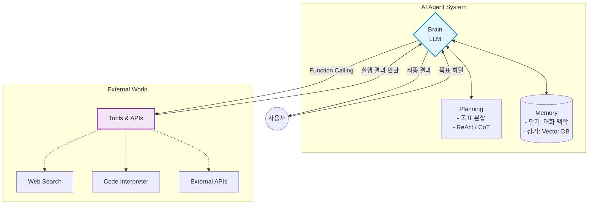

연관 노트: [[Agent는 어떻게 생각하는가]], [[Agent는 어떻게 행동하는가]], [[Multi-Agent 시스템]]
# 대화형 AI에서 행동하는 AI로: 에이전트의 탄생
최근 AI 업계의 가장 뜨거운 화두는 단연 'AI 에이전트(AI Agent)'입니다. 

지금까지 우리가 알던 AI가 질문에 대답만 하는 '만물박사'였다면, 이제는 스스로 계획을 세우고 도구를 사용해 일을 처리하는 '자율형 실무자'로 진화하고 있습니다.

이 시리즈의 첫 번째 글에서는 AI 에이전트가 정확히 무엇인지, 그리고 우리가 알던 기존의 AI(LLM, RAG)와 무엇이 다른지 알아봅니다.

## 1. AI 에이전트란 무엇인가?

사전적 의미의 Agent는 '대리인' 또는 '요원'을 뜻합니다. 즉, 나를 대신해서 어떤 임무를 수행하는 존재입니다.

소프트웨어 공학에서 **AI 에이전트**란, 

> 주어진 목표(Goal)를 달성하기 위해 스스로 환경을 인지(Perceive)하고, 계획을 세워(Plan), 도구를 사용해 행동(Action)하는 독립적인 시스템

을 말합니다.

단순한 챗봇과의 가장 큰 차이점은 '**자율성(Autonomy)**'과 '외부 세계와의 **상호작용**'에 있습니다. 

사용자가 모든 단계를 지시할 필요 없이, "이번 주 IT 뉴스 요약해서 내 메일로 보내줘"라는 큰 목표만 주면 알아서 척척 해내는 똑똑한 인턴과 같습니다.

## 2. AI의 진화: LLM $\rightarrow$ RAG $\rightarrow$ Agent
에이전트의 개념을 가장 쉽게 이해하는 방법은 기존 시스템들과 비교해 보는 것입니다.

### 1단계: 순수 LLM (대화형 AI)

- **특징**: 내부에 학습된 파라미터(기억)에만 의존합니다.
- **비유**: 방 안에 갇힌 천재 학자.
- **한계**: "오늘 서울 날씨 어때?"라고 물으면 "저는 실시간 정보를 알 수 없습니다"라고 답합니다. (환각 현상 발생)

### 2단계: RAG (검색 증강 생성)

- **특징**: 외부 데이터베이스(Vector DB 등)를 검색할 수 있는 능력이 생겼습니다.
- **비유**: 도서관에 출입할 수 있게 된 천재 학자.
- **한계**: 문서를 찾아보고 대답할 수는 있지만, 그 정보를 바탕으로 무언가를 '실행'하지는 못합니다.
### 3단계: AI Agent (자율 행동 AI)

- **특징**: 목표가 주어지면 스스로 '생각'하고, 필요한 '도구(인터넷, 엑셀, 이메일 API 등)'를 선택하여 **'실행'**합니다.
- **비유**: 스마트폰과 노트북, 그리고 법인카드까지 지급받은 유능한 비서.
- **능력**: "오늘 서울 날씨 어때?" $\rightarrow$ (생각: 날씨를 알아야겠다) $\rightarrow$ (행동: 기상청 API 호출) $\rightarrow$ (결과: 비가 옴) $\rightarrow$ (행동: 사용자에게 우산 챙기라고 슬랙 메시지 전송).

## 3. 에이전트를 구성하는 4대 핵심 요소
현대적인 AI 에이전트 아키텍처는 보통 다음의 4가지 핵심 모듈로 구성됩니다. (OpenAI의 *Lilian Weng*이 제안한 구조가 가장 유명합니다.)

1. **두뇌 (LLM / Brain)** 
   에이전트의 중심이자 의사결정권자입니다. 들어온 정보를 분석하고, 다음에 무엇을 할지 판단합니다. (예: GPT-4, Claude 3.5 Sonnet 등)
   
2. **계획 (Planning)** 
   "유럽 여행 일정 짜줘"라는 거대한 목표를 받았을 때, 이를 "1. 항공권 검색, 2. 호텔 검색, 3. 관광지 동선 기획"처럼 **실행 가능한 작은 단위(Sub-tasks)로 쪼개는 능력**입니다. 문제가 생기면 계획을 수정하기도 합니다.
   
3. **기억 (Memory)**
	- **단기 기억 (Short-term)**: 현재 진행 중인 대화나 작업의 맥락을 기억합니다. (In-context learning)
	- **장기 기억 (Long-term)**: 과거에 했던 실수나 사용자의 취향(예: "이 사용자는 매운 걸 못 먹어")을 Vector DB 등에 저장해두고 꺼내 씁니다.
	  
4. **도구 (Tools)** 
   AI가 외부 세계와 소통하는 '손발'입니다. 코드를 실행하거나(Code Interpreter), 웹을 검색하거나, 사내 시스템에 접속하는 등의 API를 말합니다.

## 4. 요약
> AI 에이전트는 "LLM을 단순한 텍스트 생성기가 아닌, 시스템의 제어부(Controller)로 사용하는 패러다임의 전환"입니다.

다음 노트: [[Agent는 어떻게 생각하는가]]