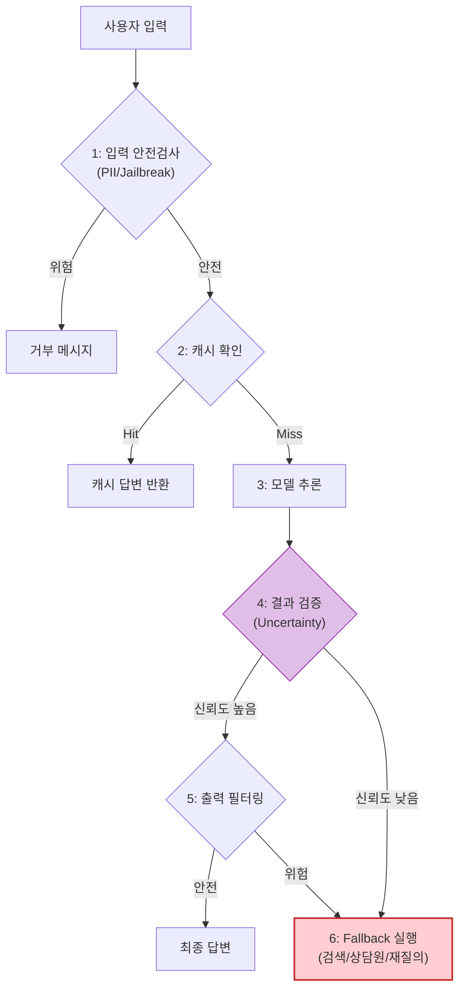

# AI Fallback Strategies (오작동 대응 전략)

## 1. 개요
확률적(Probabilistic)인 AI 모델이 실패하거나 신뢰할 수 없는 답을 내놓을 때, 시스템 전체가 중단되지 않고 사용자에게 최선의 대안을 제공하는 **결정론적(Deterministic) 안전장치**다.

> [!abstract] 핵심 철학
> **"Graceful Degradation"**: 시스템의 기능이 떨어지더라도, 완전히 셧다운되지 않고 점진적으로 기능을 축소하여 서비스를 유지한다.

## 2. 오작동의 3단계 계층 (Failure Hierarchy)
오작동의 원인에 따라 대응 전략이 달라진다.

| 레벨 | 상황 | 대응 전략 (Fallback) |
| :--- | :--- | :--- |
| **L1. 인프라** | 서버 타임아웃, GPU OOM | **Rule-based**: 정적 메시지, 캐시 반환 |
| **L2. 품질** | 할루시네이션, 낮은 신뢰도 | **Model Cascading**: 더 큰 모델 재호출   **Human Handoff**: 상담원 연결 |
| **L3. 안전** | 욕설, 개인정보(PII), 경쟁사 언급 | **Guardrails**: 입출력 필터링 및 차단 |

## 3. Fallback 아키텍처
모든 AI 요청은 '가드레일'과 '검증기'를 거쳐야 한다. 구체적인 판단 수식은 [[Uncertainty_Estimation]]을 참조한다.

## 4. 주요 Fallback 패턴

### 4.1. Semantic Caching
유사한 질문이 이전에 성공적으로 처리되었다면, 모델을 호출하지 않고 저장된 답변을 반환한다. (비용/속도 최적화)

### 4.2. Model Cascading (모델 이어달리기)
1.  빠르고 싼 모델(7B)에게 먼저 물어본다.
2.  답변의 신뢰도가 낮으면(Low Confidence), 크고 비싼 모델(70B)에게 다시 물어본다.

### 4.3. Deterministic Override
"환불 규정", "영업 시간" 등 팩트가 중요한 질문은 의도 분류(Intent Classification) 후 하드코딩된 룰을 출력한다.
