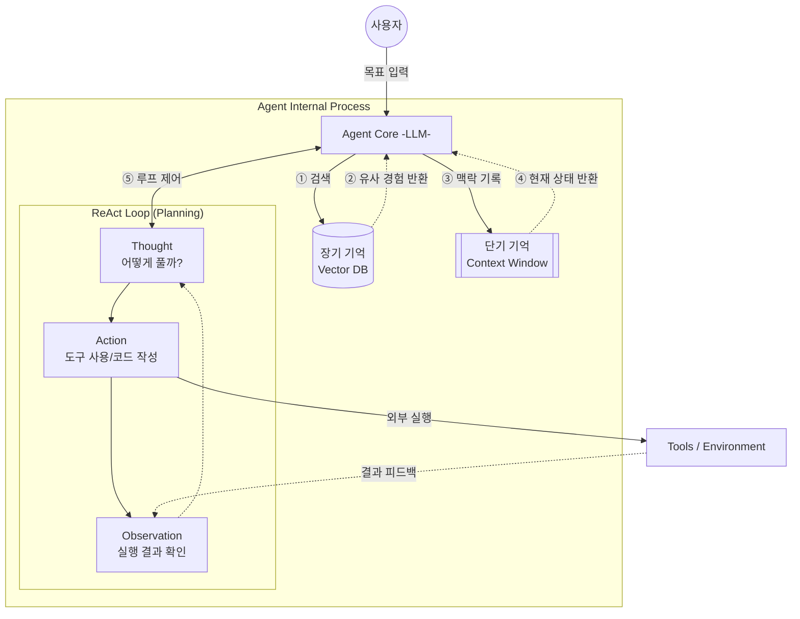

연관 노트: [[AI Agent의 탄생]], [[Agent는 어떻게 행동하는가]], [[Multi-Agent 시스템]]
# 에이전트는 어떻게 생각하는가? (Planning & Memory)
[[AI Agent의 탄생]]에서 우리는 AI 에이전트가 "스스로 계획을 세우고 도구를 사용하여 행동하는 시스템"이라는 것을 알게 되었습니다.

하지만 본질적으로 다음 단어(Token)를 예측할 뿐인 언어 모델(LLM)이 어떻게 인간처럼 복잡한 문제를 단계별로 풀어나갈 수 있을까요? 

이번 글에서는 에이전트의 '두뇌'를 실제 작동하게 만드는 두 가지 핵심 기제, **Planning**(계획)과 **Memory**(기억)에 대해 알아봅니다.

## 1. Planning: 복잡한 문제를 정복하는 법

아무리 뛰어난 모델이라도 한 번의 프롬프트만으로 복잡한 시스템을 구축하거나 어려운 문제를 풀 수는 없습니다. 

에이전트의 Planning은 거대한 목표를 관리 가능하고 실행 가능한 작은 단위(Sub-tasks)로 쪼개는 과정입니다.

### 1.1 생각의 연결고리 CoT(Chain of Thought)
Planning의 가장 기초가 되는 개념은 CoT(사고의 사슬)입니다. 

단순히 정답만 말하게 하는 것이 아니라, 도출 과정을 단계별로 서술하게 만드는 프롬프팅 기법입니다.

- **표준 프롬프트**: "이 알고리즘의 시간 복잡도는?" $\rightarrow$ 틀릴 확률이 높음.

- **CoT 프롬프트**: "이 알고리즘의 동작 과정을 단계별로 분석하고, 최종적으로 시간 복잡도를 구해봐." $\rightarrow$ 스스로 논리를 전개하며 정답률 상승.
### 1.2 행동과 관찰의 순환: ReAct (Reasoning + Acting)
에이전트 시스템에서 가장 널리 쓰이는 Planning 프레임워크는 **ReAct**입니다. 

단순히 생각만 하는 것(Reasoning)을 넘어, 도구를 사용해 행동(Acting)하고 그 결과를 관찰(Observation)하여 다음 생각을 이어갑니다.

알고리즘 코딩 테스트에서 빈출되는 'LRU Cache(Least Recently Used Cache) 설계'를 에이전트에게 지시했다고 가정해 봅시다. 

에이전트는 ReAct 패턴을 통해 다음과 같이 문제를 해결합니다.

**목표**: $O(1)$ 시간 복잡도를 가지는 LRU Cache 클래스 구현하기.
1. **Thought (생각)**: $O(1)$의 시간 복잡도로 데이터 조회와 삽입/삭제를 모두 처리하려면 두 가지 자료구조가 필요하다. Hash Map과 Doubly Linked List(이중 연결 리스트)를 조합해야겠다.

2. **Action (행동)**: 파이썬 코드 작성 및 테스트 코드 실행.
    
3. **Observation (관찰)**: 에러 발생. "용량이 꽉 찼을 때 가장 오래된 항목(Tail)이 제대로 삭제되지 않고 메모리 누수가 발생함."
    
4. **Thought (생각)**: 아, 이중 연결 리스트에서 노드를 제거할 때 이전(prev) 노드와 다음(next) 노드의 포인터 연결을 갱신하는 로직이 누락되었구나. 해당 부분을 수정해야겠다.
    
5. **Action (행동)**: 포인터 갱신 로직 추가 후 재실행.
    
6. **Observation (관찰)**: 모든 테스트 케이스 통과. (임무 완수)

이처럼 에이전트는 한 번에 완벽한 코드를 짜내는 것이 아니라, **환경과 피드백을 주고받으며(ReAct) 점진적으로 정답에 도달**합니다.
## 2. Memory: 과거를 통해 진화하는 능력
에이전트가 ReAct 루프를 여러 번 돌다 보면 처리해야 할 정보량이 방대해집니다. 

이때 필요한 것이 에이전트의 '상태(State)'를 유지해 주는 **기억(Memory)** 시스템입니다.

### 2.1. 단기 기억 (Short-term Memory)
단기 기억은 **현재 진행 중인 작업의 맥락**을 유지하는 역할을 합니다. 컴퓨터의 RAM(메모리)과 비슷합니다.

- **원리**: LLM의 컨텍스트 윈도우(Context Window) 내에 이전 대화 내역과 방금 실행한 Action/Observation 결과를 계속 누적해서 전달합니다.
    
- **한계**: 모델이 한 번에 받아들일 수 있는 토큰(Token) 수에 제한이 있으므로, 대화가 길어지면 과거 정보가 밀려나거나 비용이 급증합니다.

### 2.2. 장기 기억 (Long-term Memory)
단기 기억의 한계를 극복하고, 며칠 전이나 몇 달 전의 경험까지 활용하기 위해 **장기 기억**을 도입합니다. 컴퓨터의 하드 드라이브와 같습니다.

- **원리**: RAG(Retrieval-Augmented Generation) 아키텍처를 에이전트 내부에 이식한 것과 같습니다. 과거의 경험, 성공/실패 사례, 사용자의 성향 등을 벡터 DB(Vector DB)에 임베딩하여 저장해 둡니다.
    
- **활용**: 새로운 문제가 주어지면, 에이전트는 장기 기억 저장소를 검색(Retrieval)하여 "아, 예전에 이와 비슷한 Priority Queue(우선순위 큐) 최적화 문제를 풀 때 이런 방식이 효과적이었지"라고 참고할 수 있습니다.

## 3. 한 눈에 보는 Planning & Memory 아키텍처

## 4. 요약
> 에이전트가 똑똑하게 작동할 수 있는 이유는 문제를 쪼개어 해결하는 Planning(ReAct)과 **맥락과 경험을 저장하는 Memory**가 LLM을 든든하게 받쳐주고 있기 때문입니다.

다음 노트: [[Agent는 어떻게 행동하는가]]