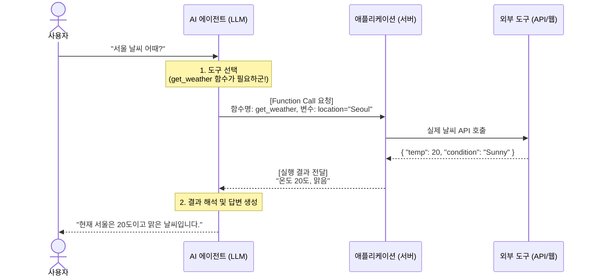

연관 노트: [[AI Agent의 탄생]], [[Agent는 어떻게 생각하는가]], [[Multi-Agent 시스템]]
# AI에게 손과 발을 달아주다: 도구 사용과 Function Calling
[[Agent는 어떻게 생각하는가]]에서는 AI 에이전트가 복잡한 문제를 어떻게 쪼개어 생각(Planning)하고 기억(Memory)하는지 알아보았습니다. 

하지만 스스로 생각만 할 줄 아는 AI는 여전히 '채팅창 안의 똑똑한 비서'에 불과합니다. 에이전트가 진정한 가치를 발휘하려면 스스로 웹을 검색하고, 엑셀을 분석하고, 이메일을 보내는 등 **'현실 세계에 개입(Action)'** 해야 합니다. 

이번 노트에서는 텍스트만 생성하던 LLM에게 어떻게 손과 발을 달아주는지, 그 핵심 기술인 도구 사용(Tools)과 Function Calling에 대해 파헤쳐 봅니다.

## 1. LLM은 어떻게 세상을 조작하는가?

본질적으로 LLM은 텍스트를 입력받아 텍스트를 뱉어내는 모델입니다. LLM 자체가 마우스를 클릭하거나 데이터베이스에 접속할 수는 없습니다. 

그렇다면 에이전트는 어떻게 외부 도구를 사용할까요? 바로 **Function Calling(함수 호출)** 이라는 약속된 대화 방식을 사용합니다.

### 1.1 Function Calling의 작동 원리
식당에 간 상황을 상상해 봅시다. 
* **사용자**: "날씨가 추운데 따뜻한 국물 요리 하나 주세요." 
* **에이전트 (웨이터)**: "손님, 메뉴판(도구 목록)을 보니 '우동'이 좋겠네요. 주방장님, `make_food(name="우동", type="hot")` 함수 실행해 주세요!" 
* **시스템 (주방장)**: (실제로 우동을 끓여서 내옴)

즉, 개발자가 LLM에게 **"네가 쓸 수 있는 함수(도구)들의 이름과 설명서"** 를 미리 쥐여주면, LLM은 상황을 판단하여 **"어떤 함수를, 어떤 재료(파라미터)를 넣어서 실행해라"** 라고 시스템에 명령을 내리는 구조입니다.

## 2. 에이전트의 무기고: 대표적인 도구들
에이전트에게 어떤 도구를 쥐여주느냐에 따라 그 능력은 무한히 확장됩니다. 현재 가장 널리 쓰이는 3대 핵심 도구는 다음과 같습니다.

### 2.1. Web Search (웹 검색)
* **역할**: LLM의 고질적인 약점인 '지식의 한계(Knowledge Cut-off)'와 '환각(Hallucination)'을 해결합니다. 
* **작동 방식**: 모르는 내용을 물어보면, 에이전트가 스스로 검색어 키워드를 생성해 구글/빙(Bing) API를 호출하고, 검색된 문서를 읽고 요약하여 답변합니다.

### 2.2. Code Interpreter (코드 실행기)
* **역할**: 정확한 수학 계산이나 복잡한 데이터(CSV, 엑셀) 분석을 수행합니다. 
* **작동 방식**: LLM은 숫자에 약합니다. 따라서 복잡한 계산식이 주어지면 직접 풀지 않고, 파이썬 코드를 작성하여 내부의 안전한 샌드박스 환경에서 실행한 뒤 그 결과값을 가져옵니다.
### 2.3. Custom APIs (사용자 맞춤형 API) 
* **역할**: 사내 시스템이나 외부 서비스(Slack, Gmail, Jira 등)와 연동합니다. 
* **작동 방식**: "오늘 들어온 고객 불만 사항 요약해서 슬랙 마케팅 채널로 보내줘"라고 하면, 에이전트가 DB 조회 API와 Slack 전송 API를 순차적으로 호출하여 업무를 자동화합니다.

## 3. 안전장치: 인간의 개입 (Human-in-the-Loop)
에이전트가 스스로 도구를 쓰고 행동할 수 있다는 것은 매우 편리하지만, 동시에 **치명적인 위험**을 내포하고 있습니다.

만약 에이전트가 판단을 실수해서 "중요한 사내 DB 테이블을 삭제(Drop)"해 버리거나, "거래처에 욕설이 담긴 이메일을 전송"한다면 어떻게 될까요? 

이를 방지하기 위해 설계된 개념이 **HITL (Human-in-the-Loop)** 입니다.

* **읽기 작업 (Read/GET)**: 정보 검색, 날씨 확인 등은 에이전트가 자율적으로 실행하도록 허용합니다. 
* **쓰기/수정/삭제 작업 (Write/POST/DELETE)**: 결제, 이메일 전송, DB 수정 등 돌이킬 수 없는 중요한 행동(Action)을 하기 직전에는 **반드시 시스템이 일시 정지**하고 사용자에게 "정말 실행할까요? (Yes/No)"를 묻도록 설계해야 합니다.

## 4. 요약
> 도구(Tools)와 Function Calling 메커니즘을 통해 AI는 비로소 현실 세계의 문제를 직접 해결하는 **'행동하는 에이전트'** 로 거듭나게 되었습니다.

| 개념                   | 역할                       | 비유            |
| :------------------- | :----------------------- | :------------ |
| **LLM**              | 상황 판단, 도구 선택, 결과 요약      | **지휘관 (두뇌)**  |
| **Function Calling** | "이 도구를 이렇게 써라"는 명령 체계    | **명령서 (통신망)** |
| **Tools (API)**      | 실제 작업을 수행하는 물리/소프트웨어적 기능 | **손과 발 (무기)** |

다음 노트: [[Multi-Agent 시스템]]