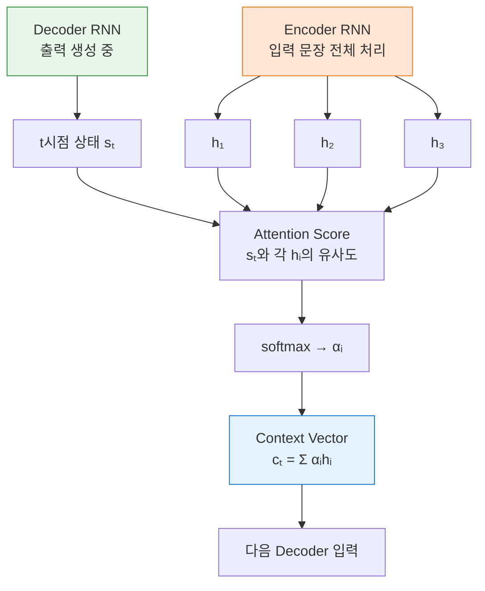
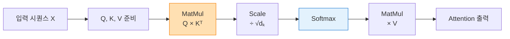
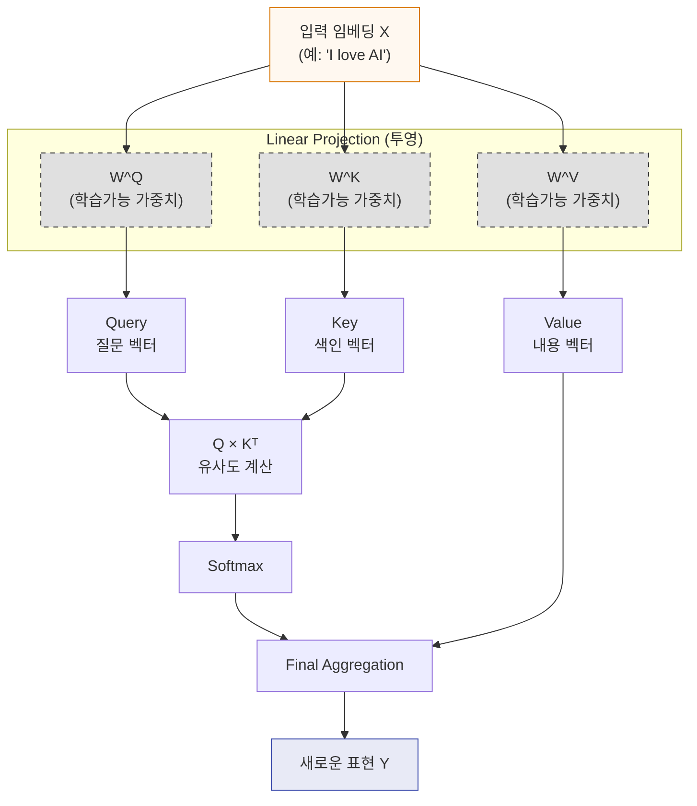
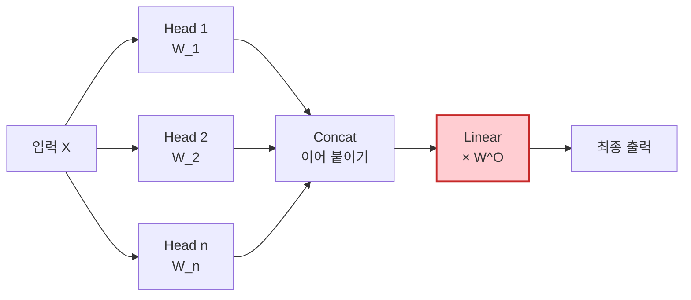

# 1. 개요
초기 [[RNN]] 계열 모델은 긴 문장을 번역할 때 앞부분의 정보를 까먹는 "장기 의존성 문제(Long-term dependency)"가 있었다. 이를 해결하기 위해 **"모든 단어를 다 기억하되, 현재 시점에 중요한 단어에 더 집중(Attention)하자"**는 아이디어가 등장했다.

> [!abstract] 핵심 요약 > **Attention**은 "어디를 봐야 할지 모델 스스로 결정해서 중요한 정보만 가중치를 두어 모으는 메커니즘"이다.
# 2. 오리지널 Attention (Bahdanau, 2014)
- Decoder가 출력을 생성할 때마다 Encoder의 모든 입력 상태($h$)를 다시 훑어본다. 이때, 지금 번역할 단어와 연관성이 높은 입력 단어에 더 높은 점수(Attention Score)를 준다.

## 핵심 수식
$$ \begin{align} e_{t,i} &= v^T\tanh(W[s_t ; h_i]) \quad \text{(유사도 점수 계산)} \\ \alpha_{t,i} &= \dfrac{\exp(e_{t,i})}{\sum_j\exp(e_{t,j})} \quad \text{(Softmax로 확률 변환)} \\ c_t &= \sum_i\alpha_{t,i}h_i \quad \text{(Context Vector = 가중합)} \end{align} $$
- **의의**: 고정된 크기의 벡터 하나에 모든 정보를 욱여넣던 RNN의 병목 현상을 해결했다.

# 3. Dot-Product Attention (Transformer, 2017)
- "RNN 없애고 바로 계산하자"가 모토

## 핵심 수식
$$ \text{Attention}(Q,K,V) = \text{softmax}\left( \dfrac{QK^T}{\sqrt{d_k}} \right) V $$
- **Scaled Dot-Product**: 차원($d_k$)이 커지면 내적 값이 너무 커져 Softmax 기울기가 소실되는 것을 방지하기 위해 $\sqrt{d_k}$로 나눠준다.
- **장점**: 병렬 처리가 가능하여 연산 속도가 매우 빠르다.
# 4. Self-Attention
- 입력된 문장 내의 단어들이 **서로 간의 관계**를 파악하는 과정이다. 여기서 $W^Q, W^K, W^V$가 처음 등장한다.
### 4.1. 가중치 행렬 W의 정체 
- 입력 벡터(단어 임베딩) $X$ 자체를 바로 쓰는 것이 아니라, **세 가지 다른 역할**로 변환하기 위해 학습 가능한 가중치 행렬(Weight Matrices)을 곱해준다. 

> [!tip] 검색 엔진 비유 
>  - **Query ($Q = XW^Q$)**: "내가 찾고자 하는 질문" (현재 단어의 관점) 
> - **Key ($K = XW^K$)**: "검색될 대상의 라벨/색인" (다른 단어들의 식별자) 
> - **Value ($V = XW^V$)**: "실제 내용물" (실제 정보 값) 
> - 즉, **$W$ 행렬들**은 하나의 단어 벡터 $X$를 이 세 가지 역할 공간으로 **투영(Projection)** 시켜주는 **렌즈** 역할을 하며, 학습을 통해 최적의 렌즈로 다듬어진다.

## 핵심 수식
$$ \begin{align} Q &= X \cdot W^Q \\ K &= X \cdot W^K \\ V &= X \cdot W^V \\ \text{Self-Attention}(X) &= \text{softmax}\left( \dfrac{QK^T}{\sqrt{d_k}} \right)V \end{align} $$ 결국 $W$ 행렬들이 곱해진 상태에서 공식에 대입하면 아래와 같다. $$ \text{Result} = \text{softmax}\left( \dfrac{(XW^Q)(XW^K)^T}{\sqrt{d_k}} \right)(XW^V) $$
# 5. Multi-Head Attention
- 한 번의 어텐션만으로는 문장의 복잡한 의미(문법, 의미, 대명사 지칭 등)를 다 파악하기 어렵다. 그래서 여러 개의 "헤드"를 두어 각자 다른 관점을 학습하게 한다.

## 핵심 수식
$$ \begin{align} \text{head}_i &= \text{Attention}(XW_i^Q, XW_i^K, XW_i^V) \\ \text{Multi-Head}(X) &= \text{Concat}(\text{head}_1, ..., \text{head}_h)W^O \end{align} $$
- **$W^O$ (Output Weight)**: 여러 헤드에서 나온 결과들(Concat된 긴 벡터)을 다시 원래의 차원 크기나 다음 레이어가 원하는 크기로 **섞어서 정리해주는 마지막 선형 변환**이다.
# 5. 요약 비교
| 종류                 | Q, K, V의 출처                | $W$ 행렬의 역할                            | 활용처                         |
| :----------------- | :------------------------- | :------------------------------------ | :-------------------------- |
| **Bahdanau**       | Q:Decoder, K/V:Encoder     | RNN 내부 가중치 사용 (별도 W 없음)               | 초기 Seq2Seq 번역               |
| **Self-Attention** | 모두 같은 입력 $X$에서 유래          | $X$를 Q, K, V 역할로 변환 (Projection)      | Transformer Encoder/Decoder |
| **Multi-Head**     | Self-Attention $\times h$개 | 서로 다른 관점($W_i$)으로 다양하게 분석 후 $W^O$로 통합 | 최신 LLM 표준 (GPT, Llama)      |
# 6. Causal (Masked) Self-Attention
Decoder는 다음 단어를 "예측"해야 하므로, $i$번째 토큰이 미래 토큰($j>i$)을 미리 훔쳐보면 안 된다. 그래서 점수 행렬 $A=QK^\top/\sqrt{d_k}$를 softmax에 넣기 전에 미래 위치를 $-\infty$로 마스킹한다.
$$ A_{ij}\leftarrow \begin{cases} A_{ij}&\text{if }j\le i\\ -\infty&\text{if }j>i \end{cases} $$
$-\infty$는 softmax를 거치면 정확히 0이 되므로, 미래 토큰에는 attention weight가 전혀 배분되지 않는다.

# 7. GQA & MQA (헤드 수를 줄이는 변형)
Multi-Head Attention은 Query, Key, Value 각각 $N$개의 헤드를 독립적으로 갖는다. 하지만 추론 시 Key/Value는 [[KV Cache Optimization|KV 캐시]]에 저장해둬야 하므로, 헤드 수가 많을수록 캐시 메모리가 커진다. **Query 헤드 수는 유지하되 Key/Value 헤드 수만 줄이자**는 것이 GQA/MQA의 아이디어다.

| 구분 | Key/Value 헤드 수 | 특징 |
| :--- | :--- | :--- |
| **MHA** (표준) | $N$ (Query와 동일) | 표현력 최대, KV 캐시 최대 |
| **GQA** | $K$ ($1<K<N$) | $G=N/K$개의 Query 헤드가 KV 헤드 1개를 공유 |
| **MQA** | $1$ | 모든 Query 헤드가 KV 헤드 1개를 공유, 캐시 최소 |

- $Q$ projection은 그대로 $W_Q\in\mathbb R^{D\times D}$지만, $K,V$ projection은 $W_K, W_V\in\mathbb R^{D\times KH}$로 줄어든다 ($H$ = head dimension).
- 계산 시에는 $K,V$를 그룹 크기 $G$만큼 반복(repeat)해서 $N$개 헤드에 맞춰 확장한 뒤 동일하게 attention을 계산한다.
- 대가: 여러 Query 헤드가 같은 K/V를 보게 되므로 헤드별 표현력은 다소 손실된다. GQA는 MHA와 MQA의 중간 지점으로, 성능 손실을 거의 없이 KV 캐시만 줄이는 실무 표준이 되었다 (Llama-2 70B, Mistral 등).

## 한 줄 요약
> Attention = “어디를 봐야 할지 스스로 결정해서 중요한 정보만 모으는 메커니즘”
> Self-Attention = “문장 속 단어끼리 서로를 직접 바라보게 한 것” → 이게 2017년 이후 모든 LLM의 기본 뼈대가 됨
> GQA/MQA = “Query는 그대로 두고 Key/Value 헤드만 줄여서 KV 캐시를 아끼는 것”