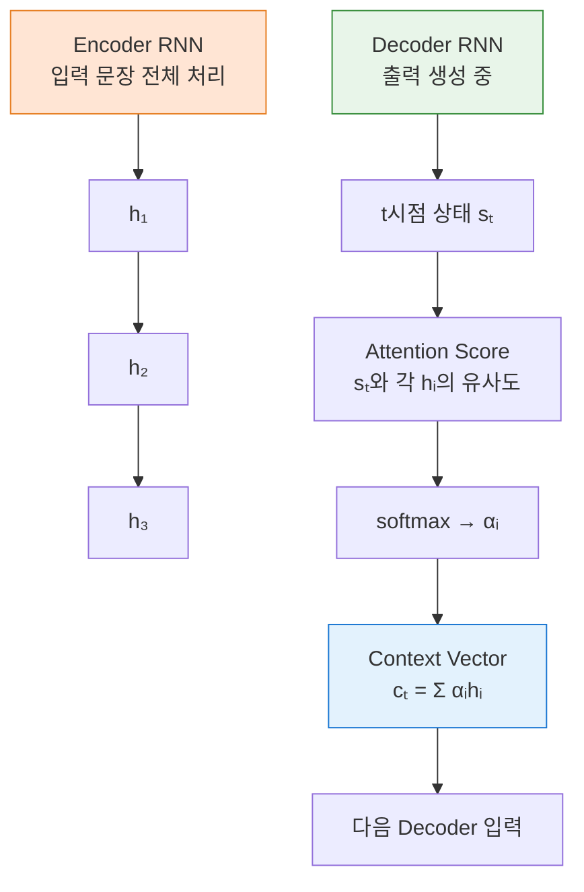
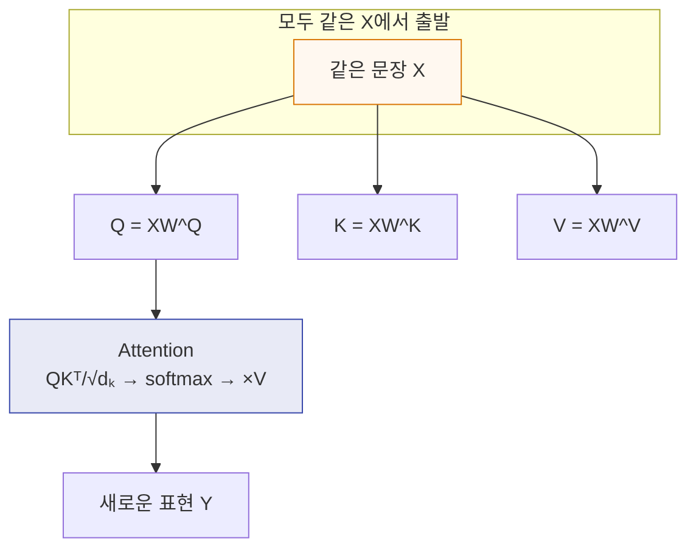
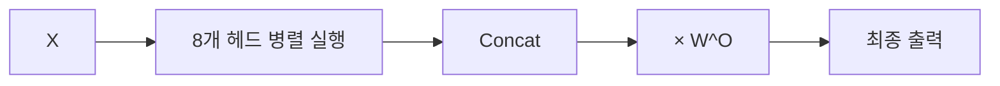

# 1. 오리지널 Attention (2014, Bahdanau ver.)
- [[RNN]]이 긴 문장을 번역할 때 “이전 단어들 다 기억 못 해” → 문제를 해결한 아이디어

## 핵심 수식
$$
\begin{align}
e_{t,i} &= v^T\tanh(W[s_t ; h_i]) \quad \text{(점수계산)} \\
\alpha_{t,i} &= \dfrac{\exp(e_{t,i})}{\sum_j\exp(e_{t,i})} \quad \text{(softmax)} \\
c_t &= \sum_i\alpha_{t,i}h_i \quad \text{(가중합 = context vector)}
\end{align}
$$
> Decoder가 매번 Encoder의 어느 부분을 봐야 할지 스스로 결정

# 2. Dot-Product Attention (2017, Transformer ver.)
- "RNN 없애고 바로 계산하자"가 모토

## 핵심 수식
$$
\text{Attention}(Q,K,V) = \text{softmax}\left( \dfrac{QK^T}{\sqrt{d_k}} \right) V
$$
- Scaled Dot-Product Attention 이라 함
- $\sqrt{d_k}$ : 차원이 커져도 softmax 전에 값이 폭발하지 않게 스케일링
- 행렬곱만으로 $O(n^2)$ 안에 계산 가능 → RNN보다 훨씬 빠름
# 3. Self-Attention (2017, Attention is all you need)
- 입력 문장 안에서 단어끼리 서로 얼마나 관련이 있는가?를 계산

## 핵심 수식
$$
\text{Self-Attention}(X) = \text{softmax}\left( \dfrac{(XW^Q)(XW^K)^T}{\sqrt{d_k}} \right)(XW^V)
$$
- 문장 속 모든 단어가 동시에 서로를 바라봄
- 문장의 문법과 의미 관계를 학습 가능해짐
# 4. Multi-Head Self-Attention (최근 LLM ver.)
- 8 ~ 32개의 head가 각각 self-attention 시행

## 핵심 수식
$$
\begin{align}
\text{head}_i &= \text{Attention}(XW_i^Q, XW_i^K, XW_i^V) \\
\text{Multi-Head}(X) &= \text{Concat}(\text{head}_1, \text{head}_2, ... , \text{head}_n)W^O
\end{align}
$$
- 한 헤드는 문법, 다른 헤드는 의미, 다른 헤드는 긴 거리의 문장간 관계 학습 등 다양하게 학습
# 5. 요약 비교
|종류|Q, K, V 출처|언제 쓰이나?|대표 논문|
|---|---|---|---|
|Bahdanau Attention|Q=Decoder, K,V=Encoder|Seq2Seq 번역 (RNN 시절)|Bahdanau et al., 2014|
|Dot-Product Attention|모두 같은 입력|Transformer 기본 구성|Vaswani et al., 2017|
|Self-Attention|모두 같은 입력 X|문장 내부 관계 이해|Transformer Encoder|
|Multi-Head Attention|Self-Attention × h개|실제 모든 LLM (Llama, GPT 등)|Transformer 표준|
## 한 줄 요약
> Attention = “어디를 봐야 할지 스스로 결정해서 중요한 정보만 모으는 메커니즘”
> Self-Attention = “문장 속 단어끼리 서로를 직접 바라보게 한 것” → 이게 2017년 이후 모든 LLM의 기본 뼈대가 됨