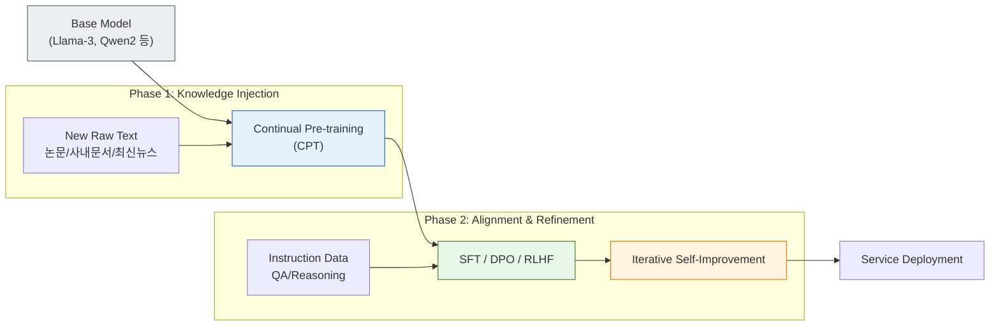
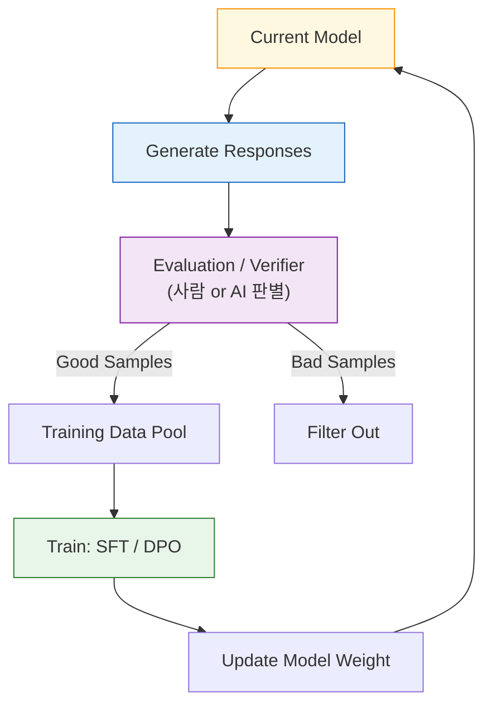

# Continual Learning Pipeline

## 1. 개요
LLM을 실제 서비스 수준으로 끌어올리기 위한 필수적인 두 단계다. 이미 학습된 Base Model을 기반으로 **새로운 지식을 주입(CPT)**하고, **원하는 대로 행동하게 교정(Post-training)**하는 과정이다.

> [!abstract] 핵심 파이프라인
> **Base Model $\xrightarrow{\text{Knowledge}}$ CPT Model $\xrightarrow{\text{Alignment}}$ Service Model**

## 2. 전체 프로세스 흐름
과거에는 Pre-training이 끝나면 학습이 종료되었으나, 최신 트렌드(2024-2025)는 서비스 배포 후에도 지속적으로 데이터를 주입하고 피드백을 반영하는 **Loop** 구조를 띤다.

## 3. Continual Pre-training (CPT) 
이미 잘 학습된 모델에 **새로운 도메인 지식(New Knowledge)**을 추가로 학습시키는 단계다. "모델의 세계관을 확장하는 과정"이라 할 수 있다. 
### 3.1. 목적 및 특징
- **도메인 적응**: 의학, 법률, 금융, 코딩 등 일반 모델이 잘 모르는 전문 용어와 맥락을 주입한다. 
- **최신 정보 반영**: Knowledge Cutoff 이후의 정보(최신 논문, 뉴스)를 업데이트한다. 
- **언어 확장**: 영어나 중국어 모델에 한국어/일본어 데이터를 대량으로 학습시켜 언어 능력을 탑재한다. 
- **비용 효율성**: 처음부터 학습하는(Training from scratch) 비용의 **1/10 ~ 1/50** 수준이다. 
### 3.2. 핵심 수식 (Causal Language Modeling) 
CPT는 기본적으로 Pre-training과 동일한 **다음 토큰 예측(Next Token Prediction)** 태스크를 수행한다. 
$$ \mathcal{L}_{\text{CPT}}(\theta) = - \sum_{t=1}^{T} \log P(x_t \mid x_{<t}; \theta) $$
- $x_{<t}$: 현재 시점 이전의 모든 맥락. 
- 기존 지식을 잊어버리는 **Catastrophic Forgetting**을 방지하기 위해, 기존 데이터의 일부(Replay Buffer, 0.5~2%)를 섞거나 [[04_LoRA_Overview|LoRA]]를 사용한다. 
### 3.3. 데이터 전략 
- **소스**: arXiv 논문, 위키피디아, 사내 문서(Confluence/Notion), 코드 저장소(GitHub Enterprise). 
- **품질**: 단순 수집보다 중복 제거(Deduplication)와 고품질 필터링이 훨씬 중요하다.

## 4. Continual Post-training
지식 주입이 끝난 모델을 **사용자가 원하는 방식대로 대답하게 만드는(Alignment)** 단계다. 최근에는 단순 SFT를 넘어 모델이 스스로 데이터를 생성하고 검증하는 **Iterative Loop**가 대세다.

### 4.1. 주요 기법 및 트렌드 (2025)
1.  **SFT (Supervised Fine-Tuning)**: "질문엔 이렇게 대답해"라고 예시를 보여주는 기초 단계.
2.  **Preference Learning (DPO/ORPO/KTO)**: RLHF의 복잡함 없이 "A 답변이 B보다 낫다"는 선호도 데이터만으로 학습한다.
3.  **Iterative Self-Improvement**: Llama 3, DeepSeek-Math 등 최신 모델의 핵심. 모델이 생성한 답변 중 좋은 것만 골라 다시 학습 데이터로 쓴다.

### 4.2. 핵심 수식 (DPO Loss)
최근 Post-training의 표준이 된 **DPO(Direct Preference Optimization)**의 수식이다. 보상 모델(Reward Model) 없이 선호도를 직접 최적화한다.
$$
\mathcal{L}_{\text{DPO}}(\pi_\theta; \pi_{\text{ref}}) = - \mathbb{E}_{(x, y_w, y_l) \sim \mathcal{D}} \left[ \log \sigma \left( \beta \log \frac{\pi_\theta(y_w|x)}{\pi_{\text{ref}}(y_w|x)} - \beta \log \frac{\pi_\theta(y_l|x)}{\pi_{\text{ref}}(y_l|x)} \right) \right]
$$
-   $y_w$: 선택된(Won) 답변, $y_l$: 버려진(Lost) 답변.
-   $\pi_{\text{ref}}$: 학습 전 참조 모델 (급격한 변화 방지).
-   **의미**: Reference 모델에서 멀어지지 않으면서, $y_w$의 확률은 높이고 $y_l$의 확률은 낮춘다.
## 5. CP vs Post-training 비교 
| 구분        | Continual Pre-training (CPT) | Continual Post-training                   |
| :-------- | :--------------------------- | :---------------------------------------- |
| **주 목적**  | **지식(Knowledge) 확장**         | **행동(Behavior) 정교화**                      |
| **비유**    | 전공 서적 읽기 (지식 습득)             | 모의고사 풀이 및 오답 노트 (실전 대비)                   |
| **데이터**   | Unlabeled Raw Text (TB 단위)   | Labeled / Preference / Synthetic          |
| **주요 기법** | Causal LM + LoRA / Replay    | SFT $\to$ DPO $\to$ Iterative Self-Refine |
| **실무 예시** | 사내 규정/코드 무작위 학습              | "JSON 포맷으로만 출력해" 강제 학습                    |
## 6. 한 줄 요약
> **CPT는 "모델에게 새로운 책을 읽혀 똑똑하게 만드는 과정"이고, Post-training은 "그 지식을 얼마나 예의 바르고 정확하게 설명할지 가르치는 과정"이다.**