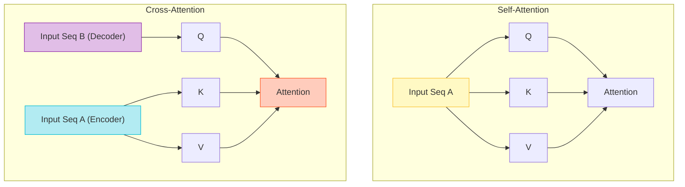
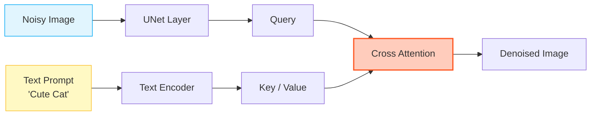

# Cross-Attention (Encoder-Decoder Attention)

## 1. 개요
**Self-Attention**이 "내가 내 안의 단어들을 보는 것"이라면, **Cross-Attention**은 **"내가 다른 시퀀스(외부 정보)를 참조하는 것"** 이다.

> [!abstract] 핵심 정의
> - **Self-Attention**: Query, Key, Value가 모두 **같은 출처($X$)**에서 온다.
> - **Cross-Attention**: Query는 **타겟($Y$)**에서 오고, Key와 Value는 **소스($X$)**에서 온다.

## 2. 구조적 차이 비교
두 어텐션은 수식은 같지만, **입력 소스(Source)** 가 다르다.

| 구분 | Query ($Q$) | Key ($K$) | Value ($V$) | 비유 |
| :--- | :--- | :--- | :--- | :--- |
| **Self-Attention** | 입력 $X$ | 입력 $X$ | 입력 $X$ | "문장 내에서 문법적 관계 찾기" |
| **Cross-Attention** | **Decoder ($Y$)** | **Encoder ($X$)** | **Encoder ($X$)** | "번역할 때 원문(Source) 참고하기" |

## 3. 작동 원리 및 수식 
Cross-Attention은 서로 다른 두 도메인(예: 텍스트 $\leftrightarrow$ 이미지, 한국어 $\leftrightarrow$ 영어)을 연결하는 **다리(Bridge)** 역할을 한다. 
### 3.1. 수식 
기본 어텐션 수식과 동일하지만, 들어가는 $Q, K, V$의 주인이 다르다. 
$$ \text{CrossAttention}(Q_{\text{dec}}, K_{\text{enc}}, V_{\text{enc}}) = \text{softmax}\left( \frac{Q_{\text{dec}} K_{\text{enc}}^T}{\sqrt{d_k}} \right) V_{\text{enc}} $$
1. **Query ($Q_{\text{dec}}$)**: "나 지금 'Apple'이라는 단어 만들 건데..." (Decoder의 현재 상태) 
2. **Key ($K_{\text{enc}}$)**: "원문에 '사과'라는 단어 여기 있어." (Encoder의 모든 출력) 
3. **Score ($QK^T$)**: Decoder의 현재 토큰이 Encoder의 어느 부분과 연관되는지 계산. 
4. **Value ($V_{\text{enc}}$)**: 연관된 만큼 원문 정보($V$)를 가져와서 섞음. 
### 3.2. 차원(Shape) 변화 
- Query: $(Batch, L_{\text{target}}, d)$ 
- Key/Value: $(Batch, L_{\text{source}}, d)$
- **Output**: $(Batch, L_{\text{target}}, d)$ 
	- 길이는 Query(타겟)를 따라가고, 내용은 Key/Value(소스)를 참조한다.

## 4. 어디에 쓰이나? (Killer Applications)

### 4.1. Transformer (기계 번역)
가장 오리지널 사용처다.
-   **상황**: 영어(Encoder)를 한국어(Decoder)로 번역할 때.
-   **역할**: 한국어 단어를 하나 생성할 때마다 영어 문장 전체(Encoder Output)를 훑어보고 힌트를 얻는다.

### 4.2. Stable Diffusion (Text-to-Image)
텍스트 프롬프트로 이미지를 생성하는 핵심 원리다.
-   **Query**: 생성 중인 노이즈 이미지 (UNet의 Visual Feature).
-   **Key/Value**: 사용자 프롬프트 텍스트 ("A cute cat").
-   **작동**: "이미지의 이 부분($Q$)을 그릴 때, 텍스트($K, V$)의 'Cat' 정보를 참조해라."

### 4.3. VLM (Flamingo, BLIP-2)
이미지를 보고 텍스트를 생성할 때.
-   **Query**: LLM의 텍스트 토큰.
-   **Key/Value**: ViT가 추출한 이미지 패치 정보.
-   **작동**: "다음 단어를 말하려고 하는데($Q$), 이미지($K, V$) 좀 보여줘."

## 5. 한 줄 요약
> **"Self-Attention이 '자기 성찰'이라면, Cross-Attention은 '외부 조언 구하기(Consulting)'이다."**