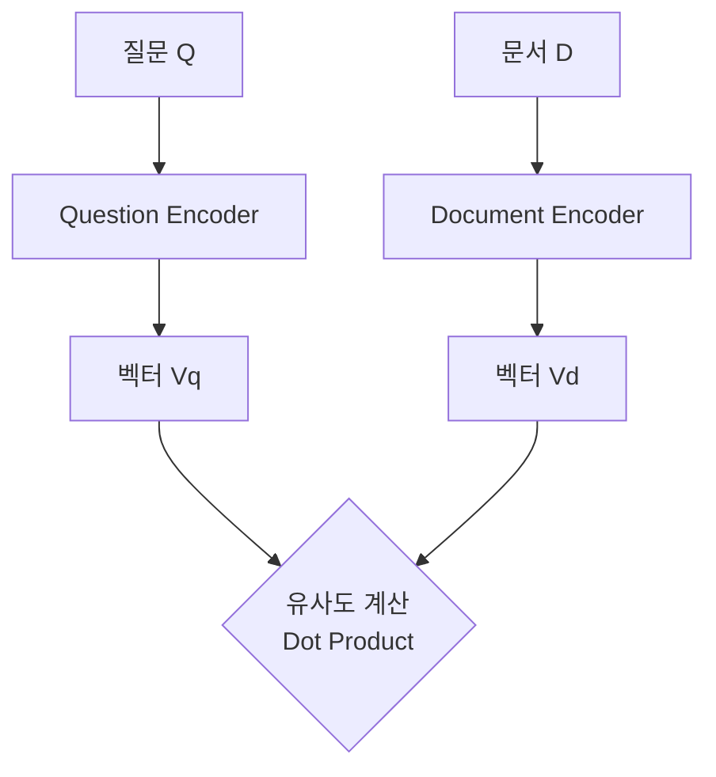

RAG(Retrieval-Augmented Generation) 시스템을 구축할 때 가장 먼저 마주치는 고민은 **"데이터를 어떻게 찾을 것인가?"** 입니다. LLM이 아무리 똑똑해도, 엉뚱한 참고 자료를 가져다주면 엉뚱한 대답을 할 수밖에 없기 때문입니다.

검색(Retrieval) 시장을 양분하고 있는 두 가지 거대한 축, **Sparse Embedding(키워드)** 과 **Dense Embedding(의미)**, 그리고 이를 구현하는 **Bi-encoder**에 대해 정리해 봅니다.
# 1. Sparse Embedding
> "정확히 그 단어가 있는가?"

가장 전통적이고 직관적인 검색 방식입니다. 문장을 구성하는 단어(Token)들의 등장 빈도를 기반으로 벡터를 만듭니다. 벡터의 대부분이 0으로 채워지기 때문에 **'희소(Sparse)하다'** 고 표현합니다.

## 1.1. BM25 (Best Matching 25)

TF-IDF의 개념을 개선한 알고리즘으로, 현재도 엘라스틱서치(Elasticsearch) 등의 검색 엔진에서 기본값으로 사용될 만큼 강력합니다.

- **원리**:
	- **TF (Term Frequency)**: 문서 내에 검색어(키워드)가 많이 등장할수록 점수 $\uparrow$
    - **IDF (Inverse Document Frequency)**: 'the', 'a', '있다' 처럼 너무 흔한 단어는 가중치 $\downarrow$ (희귀한 단어일수록 중요함)
    - **문서 길이 보정**: 문서가 너무 길면(단어가 많이 나올 확률이 높으므로) 패널티 부여.

## 1.2. 장점과 단점

- **장점 (Lexical Match)**:
    - **정확한 매칭**: "iPhone 15 Pro Max" 같은 특정 제품명이나 고유명사를 찾을 때 매우 강력합니다.
    - **속도**: 별도의 딥러닝 모델 추론 없이 통계적 계산만으로 가능하므로 매우 빠릅니다.
- **단점 (Lexical Gap)**:
    - **동의어 처리 불가**: 사용자가 "휴대폰"을 검색했는데 문서에 "스마트폰"만 있다면 찾지 못합니다. (단어의 모양이 다르니까요!)
    - **문맥 무시**: "Apple이 만든 배(ship)"와 "먹는 배(pear)"를 구별하지 못합니다.

# 2. Dense Embedding
> "의미가 통하는가?"

단어의 모양이 아니라 **'의미(Semantics)'** 를 벡터로 변환하는 방식입니다. 문장을 고정된 크기(예: 768차원)의 실수 벡터로 압축합니다. 벡터가 0이 아닌 실수값으로 빽빽하게 채워져 있어 **'밀집(Dense)하다'** 고 표현합니다.

## 2.1. 핵심 아키텍처: Bi-encoder

^f0d2cc

Dense Embedding을 만들기 위해 가장 널리 쓰이는 구조가 바로 **Bi-encoder**입니다.

> **Bi-encoder**: 질문과 문서를 **각각 독립적인 인코더(BERT 등)** 에 통과시켜 두 개의 벡터를 만들고, 이 둘의 유사도를 계산하는 구조.

1. **Question Encoder**: 질문($Q$) $\rightarrow$ 벡터($V_q$)
2. **Document Encoder**: 문서($D$) $\rightarrow$ 벡터($V_d$)
3. **Similarity**: 두 벡터의 내적(Dot Product) 또는 코사인 유사도 계산.

## 2.2. 왜 Bi-encoder인가?

- **Transformer의 활용**: BERT와 같은 Transformer 모델은 **Self-Attention** 메커니즘을 통해 문맥을 파악합니다. 따라서 "배"가 먹는 배인지 타는 배인지 문맥을 보고 구분하여 서로 다른 벡터 값을 만들어냅니다.
    
- **미리 계산 가능 (Pre-indexing)**: 문서 벡터($V_d$)는 사용자가 질문하기 전에 미리 다 계산해서 DB(Vector DB)에 저장해둘 수 있습니다. 질문이 들어오면 $V_q$만 계산해서 빠르게 비교하면 됩니다.

## 2.3. 장점과 단점

- **👍 장점 (Semantic Match)**:
    - **의미 검색**: "배고플 때 먹는 거"라고 검색해도 "사과", "피자" 등의 문서를 찾아줍니다. (단어가 하나도 안 겹쳐도 가능!)
    - **다국어 확장**: 학습만 잘 시키면 영어 질문으로 한국어 문서를 찾을 수도 있습니다.
        
- **👎 단점**:
    
    - **학습 필요**: 도메인에 맞는 데이터로 모델을 학습(Fine-tuning)시켜야 성능이 나옵니다.
    - **정확한 키워드 무시**: 가끔 "Galaxy S24"를 검색했는데 의미가 비슷한 "Galaxy S23"을 가져오는 실수를 범하기도 합니다.

## 3. 요약: 승자는 없다 (Hybrid Search)

결국 현대의 RAG 시스템은 두 방식의 장단점을 상호 보완하기 위해 **하이브리드 검색(Hybrid Search)** 을 채택합니다.

|**특징**|**Sparse Embedding (BM25)**|**Dense Embedding (Bi-encoder)**|
|---|---|---|
|**핵심**|**키워드** 일치 (Lexical)|**의미** 유사성 (Semantic)|
|**장점**|고유명사, 정확한 모델명 검색|동의어, 문맥 파악, 자연어 질문|
|**단점**|단어 불일치 시 검색 불가|학습 데이터 편향, 유사하지만 틀린 정보|
|**비유**|"Ctrl+F의 진화형"|"사서에게 물어보는 느낌"|
