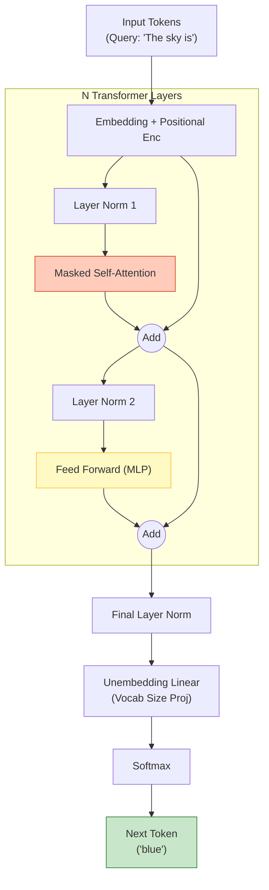
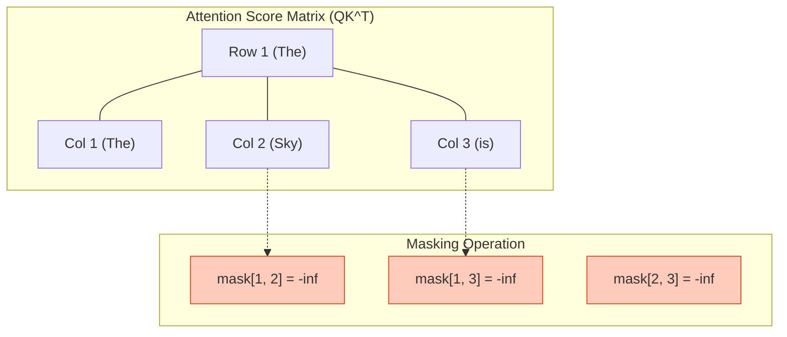

# GPT Architecture (Decoder-only)

## 1. 개요
OpenAI의 GPT 시리즈(GPT-1 ~ GPT-4)는 Transformer의 **Decoder** 블록만을 쌓아 올린 모델이다. BERT(Encoder-only)가 문장의 빈칸을 맞추는 데 특화되었다면, GPT는 **"다음에 올 단어를 예측(Next Token Prediction)"** 하는 데 특화된 **Causal LM (인과적 언어 모델)** 이다.

> [!abstract] 핵심 철학
> **"Auto-regressive Generation"**
> 입력된 문맥($x_{1:t}$)을 바탕으로 $x_{t+1}$을 예측하고, 이를 다시 입력에 포함시켜 $x_{t+2}$를 예측하는 과정을 반복한다.

## 2. 전체 아키텍처
Encoder가 없기 때문에 Cross-Attention이 존재하지 않는다. 오직 **Masked Self-Attention**과 **FFN**만으로 구성된다.

## 3. 추론 프로세스 (Mathematical Flow) 
사용자가 쿼리 "The sky is"를 입력했을 때, 모델 내부에서 일어나는 수식적 변화다. 
### Step 1: Embedding 입력 
토큰 시퀀스 $X = [x_1, x_2, \dots, x_t]$ ( $t$: 현재 길이 ) 
$$ H_0 = X W_E + W_P $$
- $W_E$: 단어 임베딩 행렬
- $W_P$: 위치 임베딩 행렬 (Learned or RoPE) 
- $H_0 \in \mathbb{R}^{t \times d_{model}}$ 
- ### Step 2: Decoder Block ($N$번 반복) 
- 각 레이어 $l$에서 입력 $H_{l-1}$을 받아 $H_l$을 출력한다. (Pre-Norm 기준) 
1. **Masked Self-Attention**: 
$$ A_l = \text{MaskedAttention}(\text{LN}(H_{l-1})) + H_{l-1} $$
2. **Feed-Forward Network**: 
$$ H_l = \text{FFN}(\text{LN}(A_l)) + A_l $$
- 최신 GPT는 FFN에서 ReLU 대신 GELU나 SwiGLU를 사용한다. 
### Step 3: Next Token Prediction 
마지막 층의 출력 $H_L$ 중, **가장 마지막 토큰($t$번째 벡터)** 인 $h_t^L$만 사용하여 다음 단어를 예측한다. 
$$ z = \text{LN}(h_t^L) W_{vocab} \quad (z \in \mathbb{R}^{|V|}) $$
$$ P(x_{t+1} | x_{1:t}) = \text{Softmax}(z) $$
- $W_{vocab}$: 임베딩 행렬의 역행렬(Transpose)을 공유하거나 별도로 둔다. 
- $z$: Logits (다음 단어가 될 후보들의 점수).

## 4. 핵심: Masked Self-Attention
GPT가 "미래를 보지 못하게" 만드는 결정적인 장치다.

### 4.1. 왜 마스킹하는가? (Causality)
BERT는 `sky`를 맞추기 위해 `The`와 `is`를 모두 볼 수 있다(Bidirectional).
하지만 GPT는 `is`를 예측할 때 `The`, `sky`만 봐야지, 뒤에 나올 단어를 미리 보면(Cheating) 생성 능력을 학습할 수 없다.

### 4.2. Masking 수식
Attention Score 행렬($S = QK^T$)에 **Causal Mask ($M$)** 를 더한다.
$$
\text{Attention}(Q, K, V) = \text{softmax}\left( \frac{QK^T}{\sqrt{d_k}} + M \right) V
$$

마스크 행렬 $M$은 상삼각행렬(Upper Triangular) 부분이 $-\infty$인 행렬이다.
$$
M_{ij} = \begin{cases} 
0 & \text{if } i \ge j \quad (\text{과거는 볼 수 있음}) \\
-\infty & \text{if } i < j \quad (\text{미래는 가림})
\end{cases}
$$
### 4.3. Softmax 결과
$-\infty$가 더해진 부분은 Softmax를 거치면 $0$이 된다.
$$
\text{softmax}([3.5, 2.1, -\infty]) \approx [0.8, 0.2, 0]
$$
즉, $t$번째 단어는 $t+1, t+2 \dots$ 위치의 단어에 어떤 Attention(가중치)도 줄 수 없다.

## 5. Encoder-Decoder(BERT)와의 비교 
| 구분            | GPT (Decoder-only)        | BERT (Encoder-only)   |
| :------------ | :------------------------ | :-------------------- |
| **Attention** | **Masked** Self-Attention | (Full) Self-Attention |
| **방향성**       | 단방향 (Left-to-Right)       | 양방향 (Bidirectional)   |
| **목적**        | 생성 (Generation)           | 이해 (Understanding)    |
| **학습**        | Next Token Prediction     | Masked LM (빈칸 맞추기)    |
## 6. KV Cache와의 연관성 
인퍼런스 시에는 매번 $x_{1:t}$ 전체를 다시 계산하지 않고, 이전 단계에서 계산해둔 $K, V$ 값들을 저장해둔다. 이를 [[KV Cache Optimization|KV Cache]]라 하며, GPT 구조에서 추론 속도를 높이는 핵심이다. 
## 7. 한 줄 요약 
> **"GPT는 미래의 정답지(Mask)를 가린 채, 오직 과거의 단어들(Context)만 보고 다음 단어의 확률 분포(Softmax)를 맞추는 과정을 무한 반복하는 거대한 조건부 확률 머신이다."**