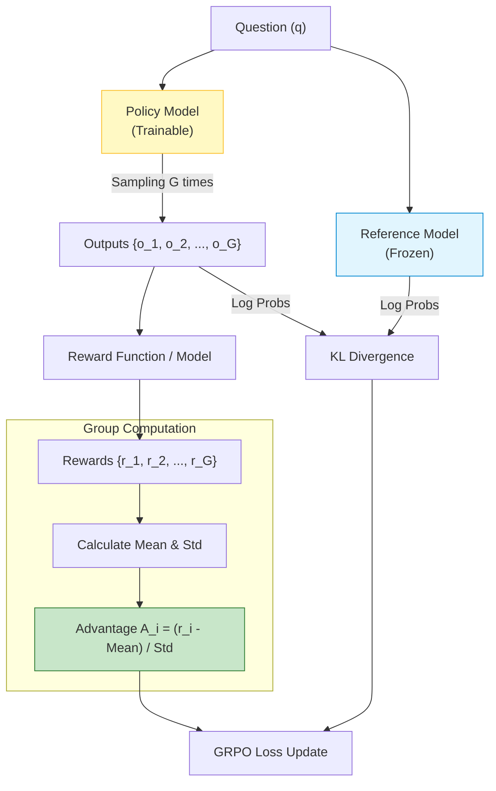

# GRPO (Group Relative Policy Optimization)

## 1. 개요
DeepSeek-R1(DeepSeek-V3)의 강화학습(Post-training) 단계에서 사용된 핵심 알고리즘이다. 기존의 PPO(Proximal Policy Optimization)가 가진 메모리 비효율성을 해결하기 위해 제안되었다.

> [!abstract] 핵심 아이디어
> **"비평가(Critic/Value Model)를 없애고, 같은 문제에 대해 여러 개의 답변을 생성한 뒤 그들끼리의 '상대적 점수'로 우열을 가린다."**

## 2. PPO vs GRPO 차이점
제공된 자료의 비교 도식을 기반으로 정리했다.

| 특징        | PPO (기존)                          | GRPO (DeepSeek)                                         |
| :-------- | :-------------------------------- | :------------------------------------------------------ |
| **구성 요소** | Actor(Policy) + **Critic(Value)** | **Actor(Policy) Only**                                  |
| **학습 방식** | 가치 함수 $V(s)$로 Advantage 추정 (GAE)  | 그룹 내 **상대적 보상(Z-score)**으로 Advantage 추정                 |
| **메모리**   | 모델 2개 로드 필요 (메모리 2배)              | 모델 1개만 로드 (메모리 절약, 학습 속도 향상)                            |
| **KL 제약** | Reward에 페널티를 주거나 복잡한 제약 사용        | Loss 항에 **$D_{KL}(\pi_{\theta} \|\| \pi_{ref})$** 직접 추가 |


## 3. 핵심 수식

### 3.1. 그룹 샘플링 (Group Sampling)
하나의 질문 $q$에 대해 정책 모델 $\pi_{\theta_{old}}$로부터 $G$개의 답변 $\{o_1, o_2, \dots, o_G\}$를 샘플링한다.

### 3.2. 어드밴티지 계산 (Advantage Estimation)
비평가(Critic) 모델 없이, 그룹 내의 보상 평균과 표준편차를 이용해 정규화한다.
$$
A_i = \frac{r_i - \text{mean}(\{r_1, \dots, r_G\})}{\text{std}(\{r_1, \dots, r_G\})}
$$
-   에 따르면, $r_i$가 그룹 평균보다 높으면 $A_i > 0$ (강화), 낮으면 $A_i < 0$ (약화)가 된다.

### 3.3. 목적 함수 (Objective Function)
PPO의 클리핑(Clipping) 방식에 KL 발산 항을 추가하여 학습 안정성을 확보한다.
$$
J_{GRPO}(\theta) = \mathbb{E} \left[ \frac{1}{G} \sum_{i=1}^{G} \left( \min \dots \right) - \beta D_{KL}(\pi_{\theta} || \pi_{ref}) \right]
$$
-   **KL Term**: 학습된 정책 $\pi_{\theta}$가 참조 모델 $\pi_{ref}$(초기 모델 복사본)에서 너무 멀어지지 않도록 규제한다

### 3.4. 생략된 clip 항 풀어쓰기
위 식의 $\min(\dots)$ 부분을 [[PPO]]와 동일한 표기로 정확히 쓰면 다음과 같다. $o_t^{(i)}$는 $i$번째 응답의 $t$번째 토큰, $r_t$는 [[Policy Gradient]]에서 정의한 것과 같은 시점별 importance ratio다.
$$
\mathcal J^\text{GRPO-CLIP}(\theta)=\frac 1G\sum_{i=1}^G\frac 1T\sum_{t=1}^T\min\left(r_tA^{(i)},\operatorname{clip}(r_t,1-\epsilon,1+\epsilon)A^{(i)}\right),\quad r_t=\frac{\pi_\theta(o_t\mid s_t)}{\pi_{\theta_\text{old}}(o_t\mid s_t)}
$$
- 어드밴티지 $A^{(i)}$는 응답 내 모든 토큰에 대해 동일한 값이다 (토큰별이 아니라 응답별로 하나씩 계산됨).

### 3.5. GRPO가 결합하는 세 가지 아이디어
1. **off-policy policy gradient** ([[Policy Gradient]]): $\pi_{\theta_\text{old}}$로 샘플링한 rollout을 importance ratio $r_t$로 재사용
2. **클리핑 메커니즘** ([[PPO]]): $r_t$를 $[1-\epsilon,1+\epsilon]$로 잘라 안정성 확보
3. **그룹 정규화로 계산한 advantage** (DeepSeek R1): critic 없이 그룹 내 상대 보상 $A^{(i)}$로 advantage를 대체

### 3.6. 알고리즘 개요
- 정책 모델 $\pi_\theta\leftarrow\pi_{\theta_\text{init}}$으로 초기화
- 각 스텝(`n_grpo_steps`)마다
  1. 배치 $\mathcal D_b\subset\mathcal D$ 샘플링
  2. old 정책 갱신: $\pi_{\theta_\text{old}}\leftarrow\pi_\theta$
  3. 각 질문 $q\in\mathcal D_b$마다 $\pi_{\theta_\text{old}}(\cdot\mid q)$에서 $G$개의 응답 $\{o^{(i)}\}_{i=1}^G$ 샘플링
  4. 각 응답의 보상 $\{r^{(i)}\}_{i=1}^G$ 계산, 그룹 정규화로 $A^{(i)}$ 계산
  5. 각 학습 스텝(`n_train_steps_per_rollout_batch`)마다 GRPO 목적함수를 최대화하도록 $\pi_\theta$ 업데이트

### 3.7. Dr. GRPO가 지적한 두 가지 편향
1. **그룹 표준편차 정규화의 편향**: $\text{std}(\mathbf r)$이 작은(너무 쉽거나 너무 어려운) 그룹일수록 $A^{(i)}=\frac{r^{(i)}-\text{mean}(\mathbf r)}{\text{std}(\mathbf r)}$이 증폭되어, 그 그룹을 과도하게 중요하게 취급하게 된다.
2. **응답 길이로 나누는 정규화의 편향**: 목적함수가 $\frac{1}{|o_i|}$로 정규화되면서, 정답 중에서는 짧은 응답일수록 gradient가 커져 더 강하게 강화되고, 오답 중에서는 긴 응답일수록 gradient가 작아져 덜 벌점을 받는다. 그 결과 모델이 "답을 못 맞출 바엔 길게 써서 벌점을 줄이자"는 방향으로 학습될 위험이 있다.

## 4. GRPO Implementation Code
최근 Hugging Face의 `trl` 라이브러리에 `GRPOTrainer`가 정식 추가되었다. 이를 사용하면 복잡한 수식을 직접 구현하지 않아도 된다.

> [!abstract] 코드 개요
> 1.  모델과 토크나이저 로드 (DeepSeek-R1-Distill 등)
> 2.  보상 함수(Reward Function) 정의 (예: 정답 포맷 준수 여부, 수학 정답 일치 여부)
> 3.  `GRPOConfig` 설정 (그룹 사이즈 $G$ 설정)
> 4.  `GRPOTrainer` 실행

### 4.1. 보상 함수 정의 (Example)
```python
# 보상 함수: 모델이 <think> 태그를 썼는지, 정답이 맞는지 등을 평가
def accuracy_reward_func(completions, target, **kwargs):
    rewards = []
    for completion, gt in zip(completions, target):
        # 간단한 예시: 정답(gt)이 생성된 텍스트에 포함되어 있으면 +1.0
        if gt in completion:
            rewards.append(1.0)
        else:
            rewards.append(0.0)
    return rewards

def format_reward_func(completions, **kwargs):
    rewards = []
    for completion in completions:
        # DeepSeek R1 스타일: <think>...</think> 구조를 지켰는가?
        if "<think>" in completion and "</think>" in completion:
            rewards.append(0.5)
        else:
            rewards.append(0.0)
    return rewards
```
### 4.2. 학습 실행 코드
```python
import torch
from transformers import AutoTokenizer, AutoModelForCausalLM
from trl import GRPOTrainer, GRPOConfig
from datasets import load_dataset

# 1. 모델 및 데이터 준비
model_id = "deepseek-ai/DeepSeek-R1-Distill-Qwen-1.5B"
model = AutoModelForCausalLM.from_pretrained(model_id, torch_dtype=torch.bfloat16, device_map="auto")
tokenizer = AutoTokenizer.from_pretrained(model_id)

# 데이터셋 로드 (예: 수학 문제 데이터셋)
dataset = load_dataset("gsm8k", "main", split="train")

# 2. GRPO 설정
training_args = GRPOConfig(
    output_dir="grpo_results",
    num_train_epochs=1,
    per_device_train_batch_size=1, # 질문(q) 1개당 G개의 답변 생성
    gradient_accumulation_steps=4,
    learning_rate=1e-6,
    num_generations=4,             # 중요: 그룹 사이즈 G = 4 (하나의 질문에 4개 생성)
    max_completion_length=512,
    logging_steps=10,
    beta=0.04,                     # KL Divergence 계수 (논문의 beta)
)

# 3. 트레이너 초기화
trainer = GRPOTrainer(
    model=model,
    reward_funcs=[accuracy_reward_func, format_reward_func], # 여러 보상 함수 결합 가능
    args=training_args,
    train_dataset=dataset,
    tokenizer=tokenizer,
)

# 4. 학습 시작
trainer.train()
```

### 4.3. 코드 설명
- **`num_generations=4`**: 이것이 바로 $G$다. 하나의 질문(Prompt)에 대해 모델이 4개의 서로 다른 답변을 생성하고, 그 안에서 평균과 표준편차를 구해 Advantage를 계산한다
- **`reward_funcs`**: Critic 모델을 별도로 학습시키는 대신, 규칙 기반(Rule-based) 보상 함수나 별도의 가벼운 보상 모델을 사용하여 $r_i$를 즉시 계산한다.
## 5. 요약
1. **Critic 제거**: Value Model 학습에 드는 비용과 메모리를 절감했다.
    
2. **그룹 상대 평가**: "절대적인 점수"보다 "지금 생성한 답변들 중 누가 제일 나은가?"에 집중한다.
    
3. **효율성**: DeepSeek가 적은 비용으로 추론(Reasoning) 성능을 극대화할 수 있었던 비결이다.