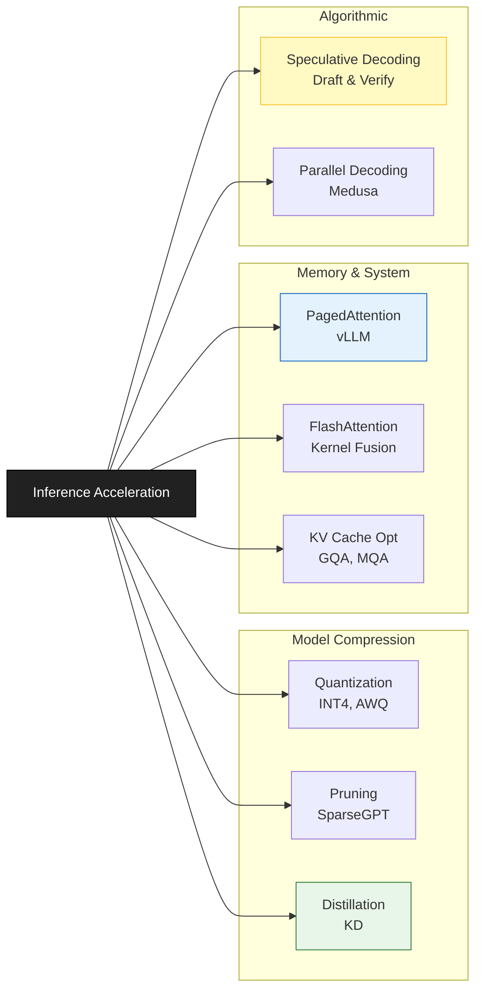

# Inference Acceleration

## 1. 개요
LLM 서비스의 비용과 사용자 경험을 결정짓는 **추론 속도(Latency)** 와 **처리량(Throughput)** 을 극대화하는 기술들의 집합이다.

> [!abstract] 핵심 목표
> 1.  **TTFT (Time To First Token)**: 첫 글자가 나올 때까지의 시간 $\downarrow$ (반응성)
> 2.  **TPS (Tokens Per Second)**: 초당 생성되는 토큰 수 $\uparrow$ (생성 속도)
> 3.  **VRAM Usage**: 메모리 점유율 $\downarrow$ (비용 절감)

## 2. 가속화 기법의 분류 (Taxonomy)
최적화는 크게 **모델 압축**, **메모리 관리**, **알고리즘 개선** 세 가지 축으로 나뉜다.

### 2.1. 모델 압축 (Model Compression)
모델의 크기 자체를 줄여 연산량과 메모리 접근을 최소화한다.
-   **Quantization (양자화)**: FP16(16bit) 가중치를 INT8, INT4로 줄임. (AWQ, GPTQ)
    -   *관련 노트*: [[LoRA#^53fa32|QLoRA]] (학습 관점의 양자화지만 원리는 동일)
-   **Pruning (가지치기)**: 중요하지 않은 가중치를 0으로 만들거나 삭제.
-   **Distillation (지식 증류)**: 큰 모델의 지식을 작은 모델로 옮김.
    -   *관련 노트*: [[Knowledge Distillation]]

### 2.2. 메모리 & I/O 최적화 (System Level)
LLM 추론의 병목인 **Memory Bandwidth**를 해결하는 기술이다.
-   **PagedAttention**: OS 페이징 기법으로 KV Cache 단편화 해결.
    -   *관련 노트*: [[KV Cache Optimization#^5d3d51|Paged Attention & KV Cache]]
-   **FlashAttention**: GPU SRAM을 활용해 $O(N^2)$ 메모리 접근을 줄임.
    -   *관련 노트*: [[Long-sequence Handling|FlashAttention]] (Long Context 노트 참조)

### 2.3. 알고리즘 가속 (Algorithmic Level)
생성 방식(Decoding) 자체를 바꿔 속도를 높인다.
-   **Speculative Decoding**: 작은 모델로 초안을 쓰고 큰 모델이 검수.
    -   *관련 노트*: [[Speculative Decoding]]
-   **Parallel Decoding**: 여러 토큰을 한 번에 생성 (Medusa 등).

## 3. 배치 전략 (Batching & Packing)
여러 요청을 한 번에 GPU에 올려 처리량을 극대화하는 방법들. 핵심 관찰은 생성되는 토큰 수가 요청마다 제각각이라는 점이다.

>[!attention] 용어 정리
> - **Latency**: 요청 하나를 끝내는 데 걸리는 시간 (초)
> - **Throughput**: 전체 요청을 통틀어 초당 처리하는 토큰(또는 요청) 수

- **전통적 배치 (Static Batching)**: $N$개 요청을 모아 동시에 처리 시작, **배치 전체가 끝날 때까지** 기다렸다가 다음 배치를 받는다.
  - 한 시퀀스가 500토큰, 다른 시퀀스가 10토큰을 생성한다면, 짧은 쪽은 이미 끝났는데도 GPU 슬롯을 비운 채 나머지가 끝나기를 기다려야 한다 → GPU 유휴 시간 발생.
- **Continuous Batching**: 시퀀스 하나가 끝나는 즉시, 기다리고 있던 새 요청을 그 자리에 바로 채워 넣는다. 배치가 항상 꽉 찬 상태로 유지되어 GPU 유휴 시간이 사라진다. vLLM, TGI 등 현대 서빙 엔진의 기본 동작 방식.
- **Selective Batching**: prefill 단계(연산량 위주, compute-bound)와 decode 단계(메모리 대역폭 위주, memory-bound)의 특성이 다르다는 점을 이용해, 두 단계에 있는 시퀀스들을 영리하게 섞어서 배치한다.
- **Sequence Packing**: 짧은 예시 여러 개를 최대 시퀀스 길이까지 이어붙이고, attention mask로 서로 다른 예시끼리 섞여 보이지 않게 막는다. 패딩 낭비를 줄인다.
- **Token-budget Batching**: (주로 파인튜닝에서) 배치 내 "패딩 포함한 총 토큰 수"가 특정 예산을 넘지 않도록 배치를 구성한다. GPU 메모리 사용량이 `batch_size × sequence_length`에 비례하기 때문에, 시퀀스 길이가 들쭉날쭉할 때 배치 크기를 고정하는 것보다 훨씬 효율적이다.

## 4. 대표적인 서빙 프레임워크
이 기술들을 집대성하여 실무에서 사용하는 엔진들이다.

| 프레임워크                 | 특징                   | 주요 기술                                  |
| :-------------------- | :------------------- | :------------------------------------- |
| **vLLM**              | 현재 가장 대중적인 고성능 서빙 엔진 | PagedAttention, Continuous Batching    |
| **TensorRT-LLM**      | NVIDIA 최적화, 압도적인 속도  | FP8, In-flight Batching, Kernel Fusion |
| **TGI (HuggingFace)** | 배포 편의성, 생태계 호환성      | FlashAttention, Quantization           |
| **SGLang**            | 복잡한 프롬프트 처리 최적화      | RadixAttention (KV Cache 재사용)          |

## 5. 최적화 전략 가이드
상황에 따라 어떤 기술을 먼저 적용해야 할까?

1.  **메모리가 부족하다?** $\to$ **Quantization (INT4/AWQ)**, GQA
2.  **동시 접속자가 많다?** $\to$ **PagedAttention (vLLM)**, Continuous Batching
3.  **한 명의 응답 속도가 느리다?** $\to$ **Speculative Decoding**, FlashAttention

## 6. 샘플링 전략
디코딩 시 다음 토큰을 확률 분포에서 어떻게 뽑을지(temperature, top-k, top-p)도 응답 속도·품질에 영향을 준다. 자세한 내용은 [[Sampling Strategies]] 참고.
