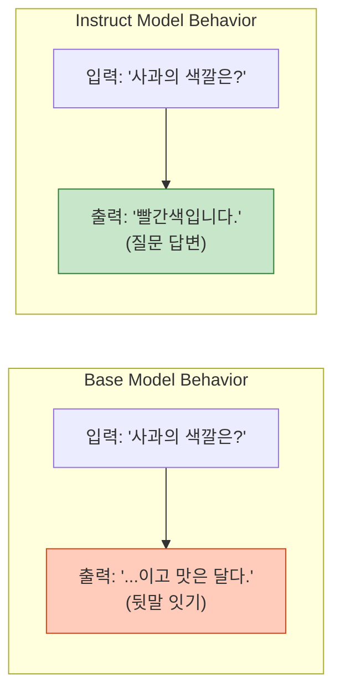
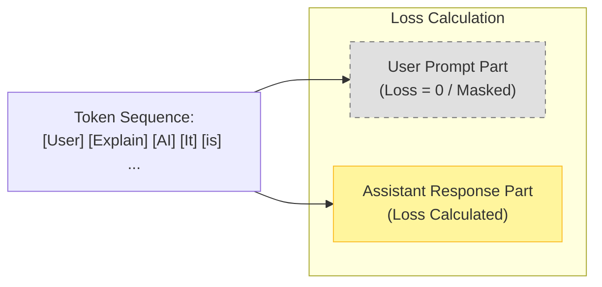
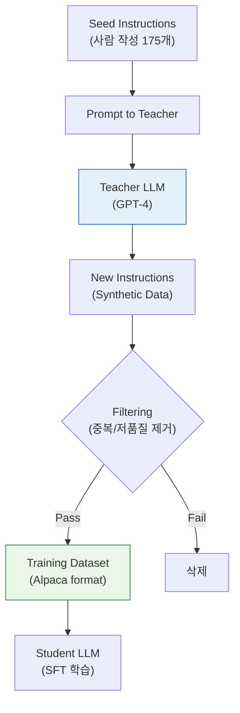

# Instruction Tuning (SFT)

## 1. 개요
사전 학습(Pre-training)된 LLM을 **사용자의 지시(Instruction)에 따라 적절하게 행동하도록 미세 조정(Fine-tuning)**하는 과정이다. 주로 **SFT (Supervised Fine-Tuning)**라고도 불린다.

> [!abstract] 핵심 비유
> - **Pre-trained Model**: 백과사전을 다 외웠지만, 말을 걸면 뒷말을 앵무새처럼 따라 하기만 하는 천재 (Next Token Prediction).
> - **Instruction Tuned Model**: 질문을 던지면 그 의도를 파악하고 정답을 알려주는 비서.

## 2. 왜 필요한가? (Misalignment)
Base Model은 "프랑스의 수도는?"이라고 물으면 "그리고 인구는..."이라며 문장을 이어 쓰려 한다(Completion). 
Instruction Tuning을 통해 "파리입니다."라고 대답하도록(Chat) 패턴을 바꾼다.


## 3. 학습 파이프라인
일반적으로 **LLM 학습의 2단계**에 해당한다.
1.  **Pre-training**: 대규모 텍스트로 언어 능력 습득.
2.  **Instruction Tuning (SFT)**: (지시, 답변) 쌍으로 행동 양식 교정.
3.  **Alignment (RLHF/DPO)**: 사람의 선호도에 맞춰 안전성 및 품질 강화.

# Instruction Data & Loss

## 1. 데이터 구조 (Prompt Templates)
단순한 텍스트 나열이 아니라, **System - User - Assistant**의 역할을 구분하는 특수 토큰(Special Tokens)을 사용해 학습한다.

### 1.1. 포맷 예시 (ChatML 스타일)
```text
<|im_start|>system
당신은 도움이 되는 AI 비서입니다.<|im_end|>
<|im_start|>user
양자 역학을 설명해줘.<|im_end|>
<|im_start|>assistant
양자 역학은 미시 세계에서...<|im_end|>
```

- 모델은 이 포맷 자체를 문법으로 학습하여, `<|im_start|>assistant`가 나오면 답변을 시작하고 `<|im_end|>`에서 멈추는 법을 배운다.
# 2. 핵심 수식 (Loss Masking)
기본적으로 Causal Language Modeling(다음 단어 예측)과 같지만, **질문(Instruction) 부분은 Loss 계산에서 제외**한다.
$$
\mathcal{L}=-\sum_{t\in\text{Response}}\log P(x_t | x_{<t}, \text{Instruction})
$$
- **의미**: 모델이 "질문을 복사하는 법"을 배우는 게 아니라, **"질문에 대해 답변하는 법"** 만 집중적으로 학습하게 만든다. 이를 **Loss Masking** 이라 한다.



# Self-Instruct & Evol-Instruct

## 1. 데이터 부족 문제
사람이 직접 (질문, 답변) 쌍을 수만 개 작성하는 것은 비용이 매우 비싸다. (초기 InstructGPT는 사람이 작성함)

## 2. Self-Instruct (Alpaca 방식)
**"똑똑한 선생 모델(GPT-4)이 멍청한 학생 모델(7B)을 가르칠 교재를 직접 만든다."**

1.  사람이 씨앗(Seed) 지시문 몇 개를 작성한다.
2.  Teacher LLM(GPT-4)에게 "이것과 비슷한 새로운 질문과 답을 만들어줘"라고 시킨다.
3.  생성된 데이터를 필터링하여 학습 데이터로 쓴다.
-   **대표 모델**: Stanford Alpaca, Vicuna.

## 3. Evol-Instruct (WizardLM 방식)

단순히 비슷한 질문만 만들면 난이도가 평이해진다. 질문을 **점진적으로 어렵게 진화(Evolution)**시킨다.
-   **Deepening**: "더 복잡하게 만들어", "제약 조건을 추가해".
-   **Broadening**: "전혀 다른 주제로 변형해".



## 4. 모델 유형 비교

| 구분 | Base Model | Instruction Tuned (Chat) |
| :--- | :--- | :--- |
| **대표 모델** | Llama-3-Base, GPT-4-Base | Llama-3-Instruct, GPT-4-Chat |
| **입력 방식** | 문장 일부 (Completion) | 대화형 프롬프트 (Dialogue) |
| **주요 능력** | 텍스트 생성, Few-shot Learning | 질문 답변, 코딩, 요약, 추론 |
| **학습 데이터** | Raw Text (Web, Books) | (Instruction, Output) Pairs |
| **사용처** | Fine-tuning용 재료 | 실제 챗봇 서비스, RAG |

## 5. 한 줄 요약
> **"Instruction Tuning은 인터넷 글을 읽기만 하던 모델에게, '사람의 말(명령)을 듣고 대답하는 법'과 '말할 때의 예절(포맷)'을 가르치는 과정이다."**