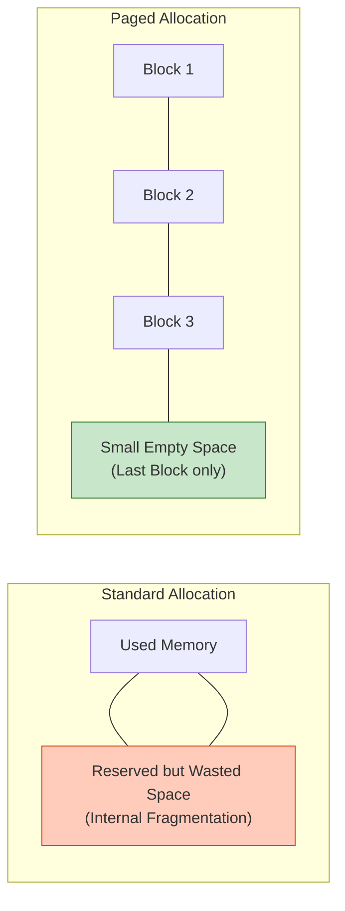
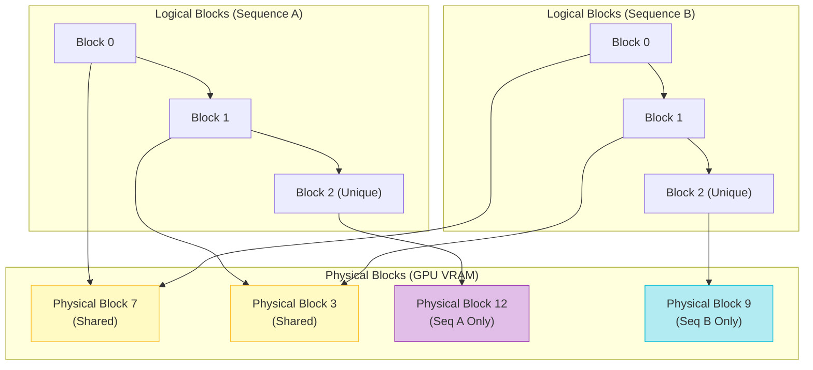

## 1. 개요
2023년 UC Berkeley 연구팀이 발표한 **vLLM**의 핵심 알고리즘이다. 운영체제(OS)의 **페이징(Paging)** 및 **가상 메모리(Virtual Memory)** 기법을 차용하여, LLM 서빙 시 발생하는 KV Cache의 메모리 단편화 문제를 해결했다.

> [!abstract] 핵심 성과
> 기존 방식 대비 메모리 낭비를 거의 0에 가깝게 줄여, 동일한 GPU에서 **2~4배 더 많은 배치(Batch Size)**를 처리할 수 있게 함.

## 2. 문제점: 기존 KV Cache의 메모리 낭비
기존 프레임워크는 최대 길이(Max Length)만큼 미리 메모리를 잡아둔다(Contiguous Allocation).

### 2.1. 수학적 낭비 분석
모델이 최대 $L_{max}$ 길이까지 생성할 수 있고, 현재 $t$ 시점까지 생성했다고 하자.
예약된 메모리 공간 $M_{reserved}$와 실제 사용 공간 $M_{used}$는 다음과 같다.
$$
M_{reserved} \propto L_{max} \cdot H \cdot L_{layers}
$$
$$
M_{used}(t) \propto t \cdot H \cdot L_{layers}
$$
이때 낭비되는 메모리 비율 $R_{waste}$는:
$$
R_{waste} = 1 - \frac{t}{L_{max}}
$$
-   **Internal Fragmentation**: 미리 잡았지만 아직 쓰지 않은 공간. (대부분 여기서 낭비됨, 심하면 90% 이상)
-   **External Fragmentation**: 메모리 할당/해제로 인해 생기는 자투리 공간.

## 3. PagedAttention의 수학적 원리
KV Cache를 연속적인 공간에 두지 않고, 고정된 크기의 **블록(Block)** 단위로 쪼개서 비연속적(Non-contiguous)으로 저장한다.

### 3.1. 블록(Block)과 페이지 테이블
-   **Block Size ($B$)**: 하나의 블록에 저장할 토큰 수 (예: $B=16$).
-   **Logical Block**: 입력 토큰의 순서상 인덱스 $(0, 1, 2 \dots)$.
-   **Physical Block**: 실제 GPU 메모리상의 주소.
-   **Block Table**: 논리 블록을 물리 블록으로 매핑하는 함수 $T$.

### 3.2. 주소 변환 (Addressing Formula)
$i$번째 토큰의 KV 벡터를 찾기 위한 주소 계산 과정이다.
1.  **Block Index ($b$)**: 해당 토큰이 몇 번째 블록에 있는가?
    $$
    b = \left\lfloor \frac{i}{B} \right\rfloor
    $$
2.  **Block Offset ($r$)**: 블록 내에서 몇 번째 위치인가?
    $$
    r = i \pmod B
    $$
3.  **Physical Address ($A$)**:
    $$
    A = T[b] \times \text{Size}_{\text{block}} + r \times \text{Size}_{\text{vector}}
    $$

### 3.3. 어텐션 연산의 변형 (Block-wise Attention)
기존 Attention은 $QK^T$를 한 번에 계산했지만, PagedAttention은 블록 단위로 부분 계산 후 합친다.
$$
\text{Attention}(q, K, V) = \text{Softmax}\left( \frac{q K^T}{\sqrt{d}} \right) V
$$
여기서 $K$와 $V$가 여러 블록 $B_1, B_2, \dots, B_n$에 흩어져 있다.
$$
q K^T = \sum_{j=1}^{n} \underbrace{q K_{B_j}^T}_{\text{Block-wise Score}}
$$
-   CUDA 커널 레벨에서 각 블록의 Score를 계산하고, 마지막에 **Reduction**을 통해 전체 Softmax를 완성한다.

## 4. 메모리 효율성 증명
PagedAttention을 사용하면 **Internal Fragmentation**은 오직 **'마지막 블록'** 에서만 발생한다.

### 4.1. 낭비량 비교
-   **기존 방식 낭비**: $O(L_{max} - t)$ (시퀀스 길이에 비례, 매우 큼)
-   **Paged 방식 낭비**: $O(B - 1)$ (블록 크기 미만, 매우 작음)
    $$
    \text{Waste}_{max} < \frac{B}{L_{max}} \approx 0 \quad (\text{if } L_{max} \gg B)
    $$
-   결과적으로 GPU 메모리 낭비가 **4% 미만**으로 줄어든다.
## 5. 메모리 공유 (Memory Sharing)
PagedAttention의 진가는 **Parallel Sampling**이나 **Beam Search** 같은 디코딩 전략에서 나타난다.

### 5.1. Copy-on-Write 메커니즘
같은 프롬프트("안녕")에서 시작해 다른 답변 A, B를 생성할 때, 앞부분("안녕")의 KV Cache를 복사하지 않고 **물리 블록을 공유**한다.

-   **Process**:
    1.  초기 프롬프트 블록은 모든 시퀀스가 공유 (Reference Count > 1).
    2.  새로운 토큰이 생성되어 블록에 쓰려고 할 때, Reference Count를 확인.
    3.  Count > 1이면 새로운 물리 블록을 할당하여 복사 후 쓰기 (Copy-on-Write).
    4.  Count = 1이면 그냥 쓴다.

### 5.2. 성능 이득
-   **메모리 절감**: 공통된 접두사(Prefix)의 메모리 사용량 $\approx 50\%$ 감소.
-   **속도 향상**: 메모리 복사 연산 제거로 인한 처리량 증대.

## 6. 요약

| 구분 | 기존 방식 (Contiguous) | PagedAttention (vLLM) |
| :--- | :--- | :--- |
| **메모리 할당** | Max Length만큼 미리 예약 (Pre-allocation) | 필요할 때마다 블록 단위 할당 (On-demand) |
| **주소 체계** | 물리적 연속 = 논리적 연속 | 페이지 테이블 매핑 (물리적 불연속) |
| **단편화(Fragmentation)** | 매우 큼 (Internal) | 거의 없음 (Last Block only) |
| **공유 기능** | 불가능 (데이터 복사 필수) | 가능 (블록 포인터만 공유) |

> [!abstract] 결론
> **"OS의 가상 메모리 아이디어를 가져와서, GPU VRAM의 빈 공간(Hole)을 블록 단위로 꽉꽉 채워 씀으로써 배치 사이즈를 극대화한 기술."**
