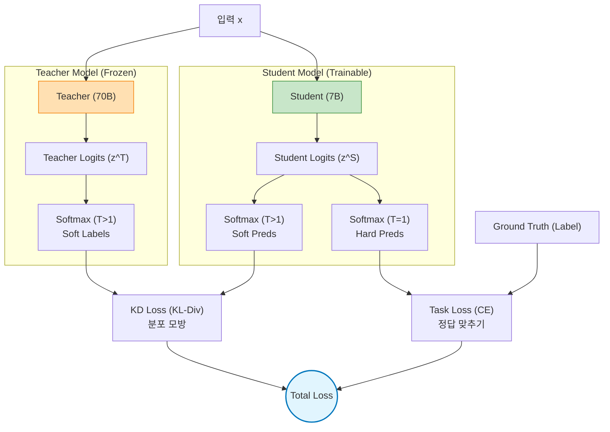

# Knowledge Distillation (KD)

## 1. 개요
거대한 모델(Teacher)이 학습한 지식을 작은 모델(Student)에게 압축하여 전달하는 기술이다. 주로 추론 속도 향상과 메모리 경량화를 위해 사용된다.

> [!abstract] 핵심 비유
> **"대학원생(Teacher)이 수년 걸려 깨우친 노하우를 학부생(Student)에게 족집게 과외로 빠르게 전수하는 과정"**

## 2. 왜 필요한가? (Motivation)
-   **문제점**: 70B 파라미터급 모델은 추론 비용이 높고 온디바이스 탑재가 불가능하다.
-   **한계**: 7B 모델을 처음부터(Scratch) 학습시키면 70B만큼의 성능이 나오지 않는다.
-   **해결책**: Teacher의 출력 분포를 모방하게 하여, 작은 모델이 스스로 학습할 때보다 더 높은 성능(Generalization)을 내게 만든다.

## 3. 핵심 아이디어: Dark Knowledge
Teacher 모델은 정답(Hard Label)뿐만 아니라, 오답들 사이의 미묘한 관계(Soft Label)까지 알고 있다. 힌튼(Hinton) 교수는 이를 **"Dark Knowledge"**라 명명했다.

| 클래스 | Hard Label (정답) | Soft Label (Teacher) | 의미 |
| :--- | :--- | :--- | :--- |
| **강아지** | 1.0 | 0.85 | 정답이라고 확신 |
| **고양이** | 0.0 | **0.12** | 강아지와 꽤 비슷함 (중요 정보) |
| **자동차** | 0.0 | 0.0001 | 전혀 관련 없음 |

-   Student는 "고양이가 자동차보다는 강아지와 더 비슷하다"는 지식까지 함께 배운다.
## 4. 구조 (Architecture)
KD는 기본적으로 Teacher와 Student가 동시에 입력을 받아 출력을 비교하는 구조다.

### 프로세스
1.  **입력**: 같은 이미지나 텍스트($x$)가 Teacher와 Student에 들어간다.
2.  **Teacher (Frozen)**: 학습되지 않고 추론만 수행하여 로짓($z^T$)을 뱉는다.
3.  **Student (Trainable)**: 학습되면서 로짓($z^S$)을 뱉는다.
4.  **Softmax-T**: 두 로짓을 높은 온도($T$)로 부드럽게 펴준다.
5.  **Loss 계산**:
    -   **KD Loss**: Teacher와 Student의 분포 차이를 줄임 (KL Divergence).
    -   **Student Loss**: 실제 정답(Label)과 비교 (Cross Entropy).
## 5. 핵심 수식 
KD의 핵심은 확률 분포를 부드럽게 만드는 **Temperature Scaling**이다. 
### 5.1. Temperature Softmax 
기존 Softmax는 1등만 너무 강조하므로, $T$를 나눠주어 분포를 평탄하게 만든다. 
$$ q_i = \frac{\exp(z_i / T)}{\sum_j \exp(z_j / T)} $$
- $T=1$: 일반적인 Softmax (Hard). 
- $T > 1$: 분포가 완만해짐 (Soft). 보통 실무에서 $T=3 \sim 20$ 사용. 
### 5.2. Loss Function 
전체 손실함수는 두 가지 Loss의 가중합이다. 
$$ \mathcal{L}_{\text{total}} = \alpha \cdot T^2 \cdot \mathcal{L}_{\text{KD}} + (1-\alpha) \cdot \mathcal{L}_{\text{CE}} $$
1. **Distillation Loss ($\mathcal{L}_{\text{KD}}$)**: Teacher의 지식 모방 
$$ \mathcal{L}_{\text{KD}} = \text{KL}(p^T || p^S) = \sum_i p_i^T \log \left( \frac{p_i^T}{p_i^S} \right) $$
	- **왜 $T^2$를 곱하는가?**: Softmax에 $T$가 들어가면 역전파 시 그래디언트 크기가 $1/T^2$로 줄어든다. 이를 보정하기 위해 $T^2$를 곱해준다. 
2. **Student Loss ($\mathcal{L}_{\text{CE}}$)**: 정답(Ground Truth) 학습 
$$ \mathcal{L}_{\text{CE}} = - \sum_i y_i \log p_i^S(T=1) $$
## 6. KD 종류 비교

| 종류 | 설명 | 특징 | 대표 논문 |
| :--- | :--- | :--- | :--- |
| **Response-based** | 최종 출력(Softmax)만 따라함 | 가장 기본적이고 구현 쉬움 | Hinton et al. (2015) |
| **Feature-based** | 중간 레이어의 Feature Map을 따라함 | 더 풍부한 정보 전달 가능 | FitNet, Attention Transfer |
| **Relation-based** | 데이터 간의 관계(유사도 행렬 등)를 모방 | 구조적 지식 학습에 유리 | RKD, CRD |

## 7. 2024-2025 LLM 트렌드
단순 분류 문제를 넘어 생성형 모델(LLM)에 특화된 기법들이 사용된다.

-   **Logits Matching + Continued Pre-training**: LLM 시대의 표준. 다음 토큰 예측 분포 자체를 따라 하게 만든다. (MiniLLM 등)
-   **Self-Distillation**: 더 큰 Teacher 없이, 자기 자신을 Teacher로 삼거나(과거 체크포인트 등), 자신의 출력 중 신뢰도 높은 것만 다시 학습한다. (Gemma-2, Phi-3에서 사용)
-   **Synthetic Data KD**: Teacher(GPT-4 등)가 생성한 고품질 합성 데이터를 Student가 학습하는 방식. 사실상 가장 널리 쓰이는 KD 형태다. (Alpaca, Vicuna 등)
-   **Speculative Decoding**: 작은 모델(Drafter)이 큰 모델의 생성을 보조할 때, Drafter를 학습시키는 데 KD가 쓰인다.

## 8. 한 줄 요약
> **"Knowledge Distillation은 Teacher의 '부드러운 확률 분포(Soft Label)'를 통해, 정답 그 이상의 통찰력을 Student에게 이식하는 기술이다."**