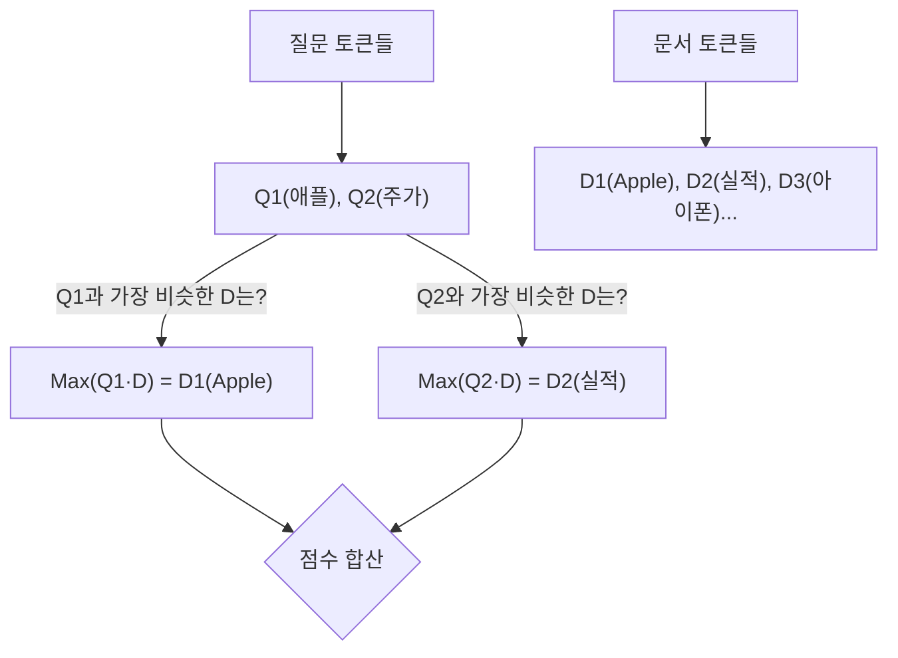

# 차세대 검색 아키텍처: Late Interaction (ColBERT)

 [[Dense Sparse Embedding]]와 [[Reranking]]를 통해 우리는 검색 기술의 양대 산맥을 확인했습니다.

1. **Bi-encoder**: 문서를 벡터 하나로 압축한다. $\rightarrow$ **엄청 빠르지만, 디테일을 놓친다.**
2. **Cross-encoder**: 문서를 통째로 읽고 채점한다. $\rightarrow$ **매우 정확하지만, 너무 느리다.**

"빠르면서도 정확할 수는 없을까?" 이 난제를 해결하기 위해 등장한 제3의 아키텍처, **Late Interaction(후기 상호작용)** 과 이를 구현한 **ColBERT** 모델에 대해 알아봅니다.

## 1. 딜레마: "압축하느냐, 다 읽느냐"

기존 방식들의 근본적인 문제는 **'언제(When)'** 상호작용하느냐에 있었습니다.

- **Bi-encoder (No Interaction)**: 질문과 문서가 서로 만나지 못합니다. 각자 방에서 요약문(단일 벡터)만 써서 제출하면, 중앙에서 요약문끼리만 비교합니다.
- **Cross-encoder (Early Interaction)**: 처음부터 질문과 문서가 한 방에 들어가서 토론합니다. 토론 과정이 너무 길어서 실시간 처리가 어렵습니다.
    
**Late Interaction**의 아이디어는 간단합니다. **"요약하지 말자. 대신, 만나는 시간을 최대한 늦추자."**

## 2. ColBERT: "토큰 하나하나가 살아있다"

ColBERT(Contextualized Late Interaction over BERT)는 문서를 하나의 벡터로 뭉개버리지 않습니다. 대신 문서 내의 **모든 토큰(단어)을 각각 독립적인 벡터로 저장**합니다.

## 2.1. Multi-Vector Representation

- **기존**: 문서 $\rightarrow$ `[0.1, 0.5, ...]` (1개의 벡터)
- **ColBERT**: 문서 $\rightarrow$ `{[0.1, ...], [0.3, ...], [0.9, ...]}` (N(=토큰 갯수)개의 벡터 리스트)
    

이렇게 하면 "Apple"이라는 단어가 문맥에 따라 가질 수 있는 의미가 희석되지 않고 그대로 보존됩니다.
## 2.2. 핵심 연산: MaxSim (최대 유사도)

검색 시점에는 **MaxSim**이라는 독특한 연산을 수행합니다.

1. 질문의 각 토큰(예: '애플', '주가')이 문서의 **모든 토큰**을 훑어봅니다.
    
2. 각 질문 토큰 입장에서 **가장 친한(유사도가 높은) 문서 토큰 하나**만 찾습니다. ('애플' $\leftrightarrow$ 'Apple', '주가' $\leftrightarrow$ '실적')
    
3. 이 최고 점수들을 다 더해서 최종 관련성 점수를 냅니다.
    
이 방식은 Cross-encoder처럼 모든 토큰을 깊게 보면서도, 행렬 연산으로 처리 가능해 속도가 훨씬 빠릅니다.

# 3. 비교
|**구분**|**Bi-encoder**|**Cross-encoder**|**Late Interaction (ColBERT)**|
|---|---|---|---|
|**벡터 형태**|문서당 1개|(없음)|**문서당 N개 (Multi-vector)**|
|**저장 공간**|적음 (수십 MB)|(없음)|**매우 큼 (수십 GB)**|
|**검색 속도**|0.01초 (즉시)|수 초 (느림)|**0.1초 (쾌적함)**|
|**정확도**|낮음|최상|**상 (Cross-encoder에 근접)**|
## 3.1. 단점은 없나요? (Storage Cost)

세상에 공짜는 없습니다. ColBERT는 문서를 요약하지 않고 토큰 벡터를 다 저장하기 때문에, **벡터 DB 용량이 Bi-encoder 대비 수십 배에서 백 배까지 커집니다.** (디스크 공간과 맞바꾼 성능)