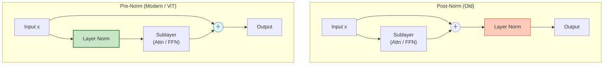

# 18. Layer Normalization (LN) & Pre-Norm

## 1. 개요
데이터의 분포를 정규화(Normalize)하여 학습 속도를 높이고 안정화하는 기법이다.
Batch Normalization(BN)이 **"전체 배치의 평균"** 을 쓴다면, Layer Normalization(LN)은 **"개별 샘플 안에서의 평균"** 을 쓴다.

> [!abstract] 핵심 비유
> - **Batch Norm**: "반 전체의 평균 점수로 내 등급 매기기" (다른 친구들 점수에 영향받음)
> - **Layer Norm**: "국영수 내 과목들의 평균 점수로 내 성향 파악하기" (나만의 기준으로 정규화, 독립적임)

## 2. 왜 쓰는가? (Motivation)
-   **RNN/Transformer 특성**: 문장 길이나 배치 크기가 들쭉날쭉해도, 샘플 하나하나 독립적으로 계산할 수 있어야 한다.
-   **학습 안정성**: 입력값이 너무 커지거나 작아지는 것(Covariate Shift)을 방지해, 깊은 모델도 학습이 잘 되게 돕는다.

## 3. 핵심 수식
입력 벡터 $x$가 $d$차원일 때 ($x \in \mathbb{R}^d$), 하나의 샘플 내에서 평균($\mu$)과 분산($\sigma^2$)을 구한다.

### 3.1. 통계량 계산
$$
\mu = \frac{1}{d} \sum_{i=1}^{d} x_i, \quad \sigma^2 = \frac{1}{d} \sum_{i=1}^{d} (x_i - \mu)^2
$$

### 3.2. 정규화 및 스케일링
$$
\hat{x} = \frac{x - \mu}{\sqrt{\sigma^2 + \epsilon}}
$$
$$
y = \gamma \cdot \hat{x} + \beta
$$
-   $\epsilon$ (epsilon): 분모가 0이 되는 것을 막는 아주 작은 수 (보통 $1e-5$).
-   **$\gamma, \beta$ (Learnable Parameters)**: 모델이 학습하는 파라미터. 정규화된 값을 모델이 원하는 만큼 다시 늘리거나(Scale, $\gamma$) 이동(Shift, $\beta$)시킬 수 있게 해준다.

## 4. Pre-Norm vs Post-Norm
질문했던 "각 블록 앞단에 적용(Pre-Norm)"의 의미는 **LN의 위치**에 있다.

### 4.1. Post-Norm (Original Transformer)
$$
x_{t+1} = \text{Norm}(x_t + \text{Sublayer}(x_t))
$$
-   연산 결과를 더한 뒤(Residual) 정규화한다.
-   **문제점**: 모델이 깊어지면 그라디언트가 터지거나 소실되어 학습이 어렵다 (Warm-up 필수).

### 4.2. Pre-Norm (ViT, Llama, GPT-3)
$$
x_{t+1} = x_t + \text{Sublayer}(\text{Norm}(x_t))
$$
-   **입력을 먼저 정규화**하고 연산한 뒤, 원본 $x_t$에 더한다.
-   **의미**: $x_t$가 정규화 과정을 거치지 않고 **'고속도로(Identity Path)'** 처럼 끝까지 흘러갈 수 있다.
-   **장점**: 100층 이상 깊게 쌓아도 학습이 매우 안정적이다. (최신 LLM의 표준)

## 5. BN vs LN 비교

| 구분 | Batch Normalization (BN) | Layer Normalization (LN) |
| :--- | :--- | :--- |
| **계산 방향** | **Vertical** (배치 전체) | **Horizontal** (샘플 1개 내부) |
| **의존성** | 배치 사이즈(Batch Size)에 민감 | 배치 사이즈와 **무관** (독립적) |
| **주 사용처** | CNN (이미지 분류) | **RNN, Transformer (NLP, ViT)** |
| **학습/추론** | 학습/추론 통계량이 다름 (Moving Avg 필요) | 학습과 추론 방식이 **동일함** |
