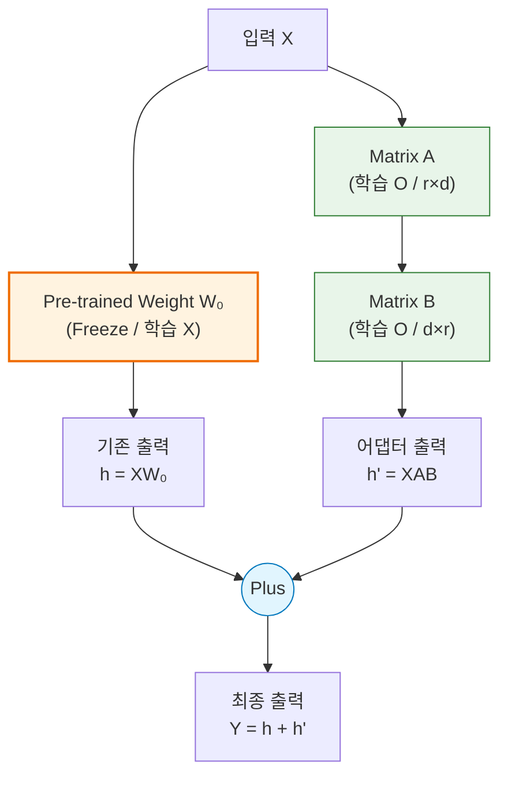
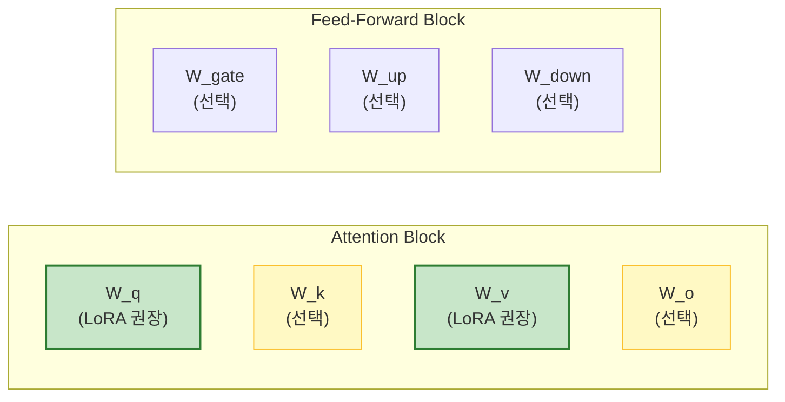

# LoRA (Low-Rank Adaptation)

## 1. 개요
2021년 Microsoft에서 제안한 효율적인 미세조정(Fine-tuning) 기법이다. 대형 언어 모델(LLM) 전체를 다시 학습시키는 대신, **기존 가중치는 고정(Freeze)하고, 아주 작은 파라미터(Rank Decomposition Matrices)만 추가하여 학습**한다.

> [!abstract] 핵심 비유
> **"전공 서적(Pre-trained Model)의 내용을 고치려고 책 전체를 다시 인쇄하는 대신, 옆에 포스트잇(Adapter)을 붙여서 내용을 수정하는 것과 같다."**

## 2. 등장 배경
-   **문제점**: GPT-3(175B) 같은 모델을 Full Fine-tuning 하려면 수백 GB의 VRAM이 필요하여 개인이나 중소기업은 접근조차 불가능했다.
-   **해결책**: 가중치 업데이트 행렬($\Delta W$)이 사실은 "Low-Rank(저랭크)" 특성을 가진다는 점에 착안, 이를 두 개의 작은 행렬곱($B \times A$)으로 분해하여 파라미터 수를 획기적으로(1/10,000 수준) 줄였다.

## 3. 구조적 특징
기존의 학습 파이프라인 옆에 **Bypass 경로**를 하나 더 뚫는 형태이다.

## 4. 핵심 수식 (Mathematical Formulation) 
기존 가중치 행렬 $W_0$에 변화량 $\Delta W$를 더하는 과정이다. 
### 4.1. Matrix Decomposition 
$$ W_{\text{new}} = W_0 + \Delta W = W_0 + \frac{\alpha}{r} (B A) $$

- $W_0 \in \mathbb{R}^{d \times k}$: 사전학습된 가중치 (고정). 
- $B \in \mathbb{R}^{d \times r}$: 0으로 초기화된 학습 행렬. 
- $A \in \mathbb{R}^{r \times k}$: 정규분포로 초기화된 학습 행렬. 
- $r \ll \min(d, k)$: **Rank**. 보통 4~64 사이의 매우 작은 값을 사용한다. 
- $\alpha$ (Alpha): 스케일링 상수. 학습 안정성을 위해 $\Delta W$의 반영 비율을 조절한다. 
### 4.2. Inference Optimization (추론 최적화) 
학습이 끝난 후, 배포할 때는 굳이 두 갈래 길을 유지할 필요가 없다. 행렬 덧셈의 성질을 이용해 하나로 합친다. 
$$ W_{\text{merged}} = W_0 + B A $$
이렇게 병합(Merge)하면, **추론 속도는 원본 모델과 100% 동일**하다. (Latency 증가 0ms) 
### 4.3. 파라미터 효율성 
만약 $d=4096$, $r=4$라면: 
- 기존 $\Delta W$: $4096 \times 4096 \approx 16,000,000$개 파라미터 
- LoRA $(A, B)$: $2 \times 4096 \times 4 \approx 32,000$개 파라미터 
- $\rightarrow$ **약 500배 효율적**

## 5. 적용 위치 (Target Modules)
Transformer의 모든 레이어에 적용할 수도 있지만, 효율을 위해 선택적으로 적용한다.

### 실무 권장 사항 (Best Practices)
-   **필수 적용**: $W_q$ (Query), $W_v$ (Value). 이 둘에 적용하는 것이 가성비가 가장 좋다.
-   **전체 적용**: 최근에는 $W_q, W_k, W_v, W_o$ 및 FFN의 $W_{gate}, W_{up}, W_{down}$ 모두에 적용하는 것이 성능상 이점이 크다고 보고된다 (QLoRA 논문 등).

## 6. 하이퍼파라미터 팁
-   **Rank ($r$)**: 보통 8, 16, 32, 64 중 선택. (일반적으론 8~32면 충분)
-   **Alpha ($\alpha$)**: 보통 $r$과 같거나 2배로 설정 ($1 \times r$ or $2 \times r$).
-   **Dropout**: 0.05 ~ 0.1 (과적합 방지).
## 7. LoRA vs Full Fine-tuning 
| 비교 항목        | Full Fine-tuning    | LoRA (PEFT)              |
| :----------- | :------------------ | :----------------------- |
| **학습 파라미터**  | 전체 (100%)           | 극소수 (0.01% ~ 1%)         |
| **VRAM 요구량** | 매우 높음 (모델 크기의 3~4배) | 낮음 (모델 크기와 비슷하거나 약간 상회)  |
| **저장 용량**    | 모델 전체 복사본 (수십 GB)   | 어댑터 파일 (수 MB ~ 수백 MB)    |
| **모델 관리**    | 태스크마다 거대 모델 필요      | Base 모델 1개 + 태스크별 어댑터 N개 |
| **성능**       | 기준점 (Upper Bound)   | Full FT의 99% 수준 달성 가능    |
## 8. 발전된 형태: [[QLoRA]] 

^53fa32

2023년 등장한 기법으로, Base 모델을 **4-bit로 양자화(Quantization)**한 상태에서 LoRA를 수행한다. 
- **장점**: 48GB GPU 1장으로 65B 모델 미세조정 가능. 
- **현황**: 2025년 기준, 오픈소스 LLM 미세조정의 **사실상 표준(De Facto Standard)이다.** 
## 9. 한 줄 요약 

>**"LoRA는 거대 모델의 지식은 그대로 둔 채(Freeze), 얇은 어댑터만 끼워 넣어 가성비와 성능을 모두 잡은 미세조정 혁명이다."**