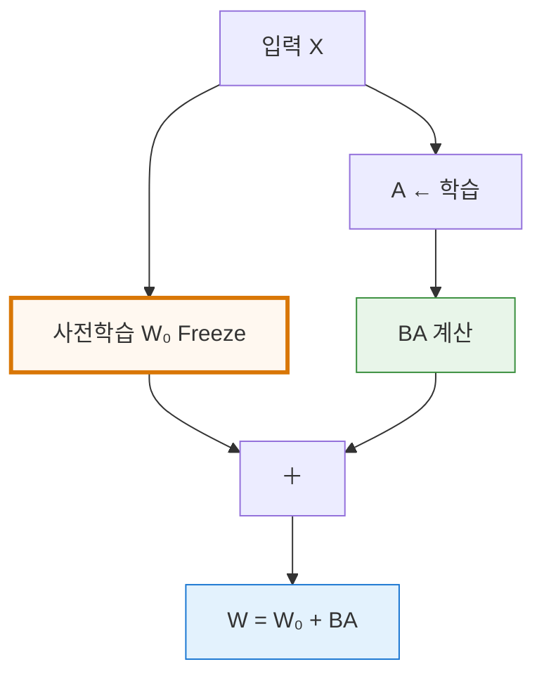
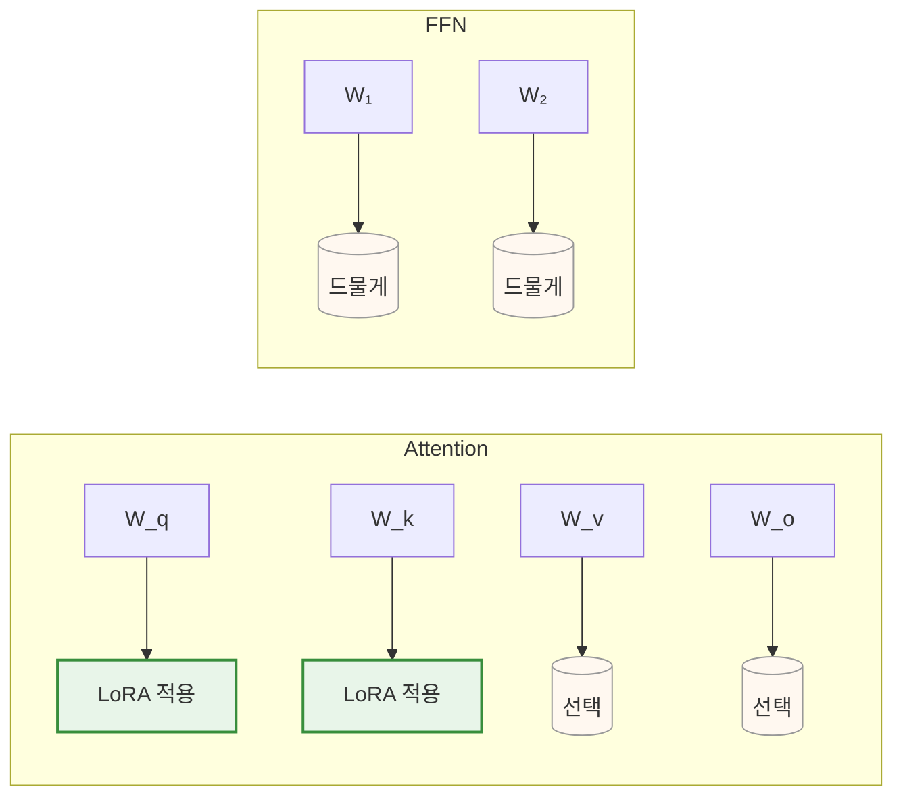

# LoRA: Low-Rank Adaptation (2021)

- 대형 언어 모델(LLM)을 내 데이터에 맞춰 학습시키고 싶지만  
- 파라미터 전부를 건드리면 메모리 터지고 시간 너무 오래 걸림  
- LoRA는 **기존 가중치를 그대로 두고, 아주 작은 행렬만 추가**해서 빠르고 효능 좋게 미세조정하는 기법

## 1. 기본 구조
기존 가중치 W₀는 고정하고, 저랭크(low-rank) 업데이트 ΔW만 학습한다. 
→ 추가 파라미터가 전체의 0.1% 미만

- W₀ : 원래 70B 파라미터 → **학습 안 함**
- B ∈ ℝ^{d × r}, A ∈ ℝ^{r × d} → **이것만 학습** (r은 보통 4~64)
- 추가 파라미터 수 = 2 × d × r → 전체 파라미터의 0.01~0.1% 수준

## 2. 핵심 수식

$$ W = W_0 + \Delta W = W_0 + B A $$

- $W_0 \in \mathbb{R}^{d \times d}$ : 사전학습 가중치 (학습 안 함) 
- $B \in \mathbb{R}^{d \times r}$, $A \in \mathbb{R}^{r \times d}$ : 학습 대상 (r ≪ d) 
- r (rank) : 보통 4~64

전방 전달 시 계산 최적화:

$$ h = X W_0 + X (B A) = X W_0 + (X A) B $$

→ 메모리 절약을 위해 (XA)를 먼저 계산
## 3. 어디에 적용?

실제로 성능이 좋은 곳만 선택 (보통 Attention만)

일반적인 선택: 
- Query와 Key projection ($W_q$, $W_k$)에 주로 적용 
- 때로는 Value, Output projection도 포함 
- FFN 레이어에도 가능하지만 효과는 덜함

## 4. LoRA vs Full Fine-tuning 비교
| 항목       | Full Fine-tuning | LoRA                |
| -------- | ---------------- | ------------------- |
| 학습 파라미터  | 70B (100%)       | 수십만~수백만 (0.03~0.3%) |
| 저장 크기    | 280GB (fp16)     | 수 MB (adapter만 저장)  |
| 여러 작업 가능 | 불가능              | 여러 adapter 저장 가능    |
| 모델 병합    | 불가능              | W₀ + BA로 간단 병합 가능   |
| 성능       | 최고               | 거의 동일 (99% 이상)      |
## 5. [[QLoRA]] (2023) — 더 극단적으로 줄인 버전

- 4-bit 양자화 + LoRA + paged optimizer
- 70B 모델을 48GB GPU 하나로 미세조정 가능
- 성능 손실 거의 없음 → 현재 개인·기업 미세조정 표준

## 6. 한 줄 요약

> “거대한 모델은 그대로 두고, 아주 얇은 저랭크 어댑터만 학습시켜서  
> 빠르고 저렴하게 모델을 훈련하는 기법”

→ 2025년 기준 모든 개인·기업 미세조정의 기본 선택

**실무 팁**
- r = 8~64
- alpha = 16~32 (스케일링 파라미터)
- dropout = 0.05
- $W_q, W_k$만 적용해도 충분
- 작업별로 adapter 파일만 저장하면 여러 모델 동시에 관리 가능