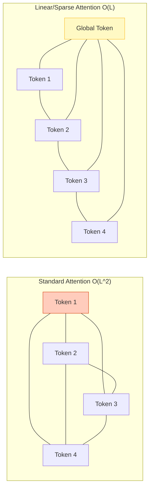

# Long Context & Efficient Attention

## 1. 개요
Transformer의 가장 큰 약점은 입력 길이($L$)가 길어질수록 메모리와 연산량이 **제곱($O(L^2)$)으로 폭증**한다는 것이다. 이를 해결하고 100k~1M 토큰 이상의 긴 문맥을 처리하기 위한 기술들을 통칭한다.

> [!abstract] 핵심 문제
> **"책 한 권(100k 토큰)을 다 읽으려면, 메모리는 책 두께의 제곱만큼 필요하다."**

## 2. 왜 어려운가? (Quadratic Bottleneck)
Self-Attention의 수식 $\text{Softmax}(QK^T)$를 보면, 길이 $L$인 문장의 모든 토큰이 서로를 쳐다봐야 한다.
-   $Q \in \mathbb{R}^{L \times d}$, $K \in \mathbb{R}^{L \times d}$
-   $QK^T \in \mathbb{R}^{L \times L}$ (Attention Matrix)

만약 $L$이 2배가 되면, 행렬 크기는 **4배**가 된다.
-   4k 토큰 $\to$ 16M 연산
-   100k 토큰 $\to$ 10B 연산 (메모리 폭발 OOM)

## 3. 위치 인코딩의 확장 (RoPE Scaling) 
모델이 학습할 때 보지 못한 긴 길이(Extrapolation)를 처리하기 위한 기법이다. 
Llama 계열 모델이 4k에서 128k로 늘어난 비결이다. 
### 3.1. RoPE (Rotary Positional Embedding) 
벡터를 2차원 평면에서 회전시켜 위치 정보를 표현한다. 절대 위치와 상대 위치의 장점을 모두 가진다. $$ \begin{pmatrix} x'_1 \\ x'_2 \end{pmatrix} = \begin{pmatrix} \cos m\theta & -\sin m\theta \\ \sin m\theta & \cos m\theta \end{pmatrix} \begin{pmatrix} x_1 \\ x_2 \end{pmatrix} $$ 
### 3.2. RoPE Scaling (NTK-Aware, YaRN) 
학습된 주파수 범위를 넘어가면 모델이 고장 난다. 
이를 해결하기 위해 **"고무줄을 늘리듯이"** 위치 정보를 보간(Interpolation)한다. 
- **Linear Scaling**: 위치 인덱스 $m$을 $m/s$로 나누어 촘촘하게 배치한다. (해상도를 높임) 
- **NTK-Aware**: 고주파수(세부 정보)는 놔두고 저주파수(전체 흐름)만 늘려서 성능 저하를 막는다. 
- **YaRN**: NTK를 개선하여 128k까지 성능 손실 없이 확장한다. 

> [!tip] 비유 
> 10cm 자(Ruler)만 가지고 1m를 재야 할 때, 자의 눈금을 **1mm 단위에서 0.1mm 단위로 쪼개서(Interpolation)** 10cm 자 안에 1m 정보를 욱여넣는 방식이다.

## 4. Attention 최적화 기법 (Engineering)
수학적 모델을 바꾸지 않고, 하드웨어(GPU) 접근 방식을 최적화하여 속도를 높이는 기술이다.

### 4.1. FlashAttention (v1, v2, v3)
"GPU 메모리(HBM)와 연산 유닛(SRAM) 사이의 통신이 너무 느리다"는 점에 착안했다.

-   **핵심**: $N \times N$ 행렬을 다 만들지 않고, 블록(Block) 단위로 쪼개서 SRAM 안에서만 계산한다 (Tiling).
-   **효과**: 메모리 사용량을 $O(N^2)$에서 **선형 $O(N)$** 으로 줄이고, 속도는 2~4배 빨라진다.
-   **현황**: 사실상 모든 LLM 학습/추론의 기본 옵션이다.

#### 왜 표준 Attention이 느린가: Memory-bound 문제
표준 구현은 연산량이 부족해서가 아니라, **$N\times N$ attention 행렬을 HBM(GPU 메인 메모리)에 썼다 읽었다를 반복**해서 느리다.
1. $QK^\top$ 결과를 HBM에 씀
2. Softmax를 계산하려고 다시 HBM에서 읽음
3. Softmax 결과를 다시 HBM에 씀
4. $V$와 곱하려고 또 HBM에서 읽음

예를 들어 `seq_len=8192`, 32개 헤드, FP16이면 attention 행렬 하나만 $8192^2\times 32\times 2\text{byte}\approx 4\text{GB}$ — 이걸 여러 번 왕복하니 GPU 연산 유닛은 놀고 메모리 대역폭만 병목이 된다(Memory Bandwidth Bound).

#### 동작 방식: Online Softmax + Tiling
FlashAttention은 $Q,K,V$를 SRAM에 들어갈 만큼 작은 블록(타일)으로 쪼개서, **$N\times N$ 행렬을 아예 HBM에 만들지 않고** 블록 단위로 계산한다.
1. $Q$의 한 블록(예: 64행)을 로드
2. $K,V$의 한 블록(예: 64열)을 로드
3. 해당 타일의 attention score, softmax, $\times V$까지 전부 SRAM 안에서 계산 (이때 아직 전체 행에 대한 softmax 정규화 상수를 모르므로, 블록을 지나갈 때마다 정규화 상수를 점진적으로 업데이트하는 **online softmax** 기법을 사용)
4. 최종 출력만 HBM에 씀
5. 모든 타일에 대해 반복

`batch × num_heads`개의 조합이 서로 완전히 독립적이므로, 이 단위로 병렬화된다.
- **정확한(exact) 방법이다** — 근사가 아니라 표준 attention과 수학적으로 동일한 값을 산출하면서 메모리 접근만 최적화한 것.
- **Causal masking도 커널에 융합(fuse)**되어, 마스크 행렬을 따로 만들지 않고 필요한 타일만 계산한다 (`F.scaled_dot_product_attention(q, k, v, is_causal=True)`).

### 4.2. Ring Attention
FlashAttention을 여러 GPU로 확장한 것이다.

-   **상황**: 1M 토큰을 처리하려면 GPU 1장 메모리로는 부족하다.
-   **해결**: 긴 문장을 여러 GPU에 나누고, Query/Key/Value 블록을 **반지(Ring) 돌리듯이 옆 GPU로 넘기면서** 계산한다.
-   **결과**: 이론상 GPU만 무한하면 **무한한 길이(Infinite Context)** 처리가 가능하다.

### 4.3. Sliding Window Attention (Mistral)
모든 토큰을 다 보는 대신, 최근 $W$개(예: 4096개)의 토큰만 본다.

-   **장점**: 연산량이 $O(N \times W)$로 선형이다.
-   **단점**: 아주 멀리 있는 정보는 직접 참조 못 함 (레이어를 쌓아서 간접 참조).

## 5. 평가: Needle In A Haystack (NIAH)
모델이 긴 문맥을 진짜 이해하는지 테스트하는 표준 방법이다.

1.  **Haystack**: 수십만 토큰의 무작위 문서(건초더미).
2.  **Needle**: 그 사이에 "상파울루의 비밀번호는 1234다" 같은 뜬금없는 문장(바늘)을 숨김.
3.  **Test**: "상파울루 비밀번호가 뭐야?"라고 물어봤을 때 찾아내는지 확인.

-   **Lost in the Middle**: 많은 모델이 문장 **처음과 끝**은 잘 기억하지만, **중간 내용**은 까먹는 현상.

## 6. Long Context vs [[RAG]]
긴 문맥을 처리하는 두 가지 접근법 비교.

| 구분     | Long Context LLM (Gemini 1.5) | RAG (Retrieval)          |
| :----- | :---------------------------- | :----------------------- |
| **방식** | 100만 토큰을 **한방에** 입력           | 필요한 청크만 **검색해서** 입력      |
| **장점** | 전체 문맥의 뉘앙스/관계 파악 가능           | 비용 저렴, 속도 빠름, 최신 정보      |
| **단점** | 엄청난 비용, 느린 속도, 중간 망각          | 검색 실패 시 답 못함 (Recall 이슈) |
| **추천** | "이 책 전체 요약해줘", "코드 전체 분석해줘"   | "회사 규정 알려줘", "특정 사실 찾아줘" |

## 7. 한 줄 요약
> **"RoPE Scaling으로 좌표계를 늘리고, FlashAttention으로 메모리 병목을 뚫어서, 책 수십 권을 통째로 읽게 만드는 기술."**