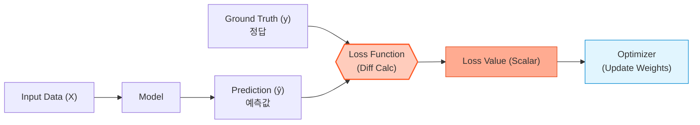
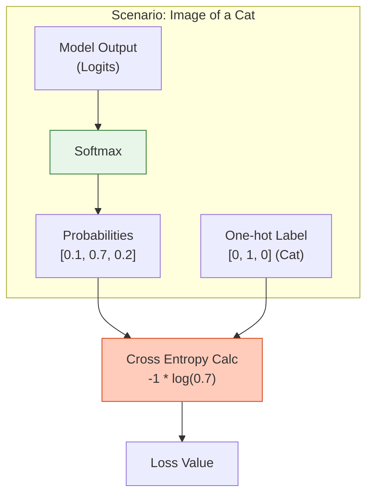

# 08. Loss Functions (손실 함수)

## 1. 개요
모델의 예측값($\hat{y}$)과 실제 정답($y$) 사이의 **'차이(Error)'를 수치화**하는 함수다. 학습의 목표는 이 Loss 값을 최소화하는 것이다.

> [!abstract] 핵심 역할
> **"Loss Function은 모델에게 '너 지금 얼마나 틀렸어'라고 알려주는 채점표이자, 가중치를 어디로 수정해야 할지 알려주는 나침반(Gradient)이다."**

## 2. 학습 파이프라인
Loss는 역전파(Backpropagation)의 시작점이다.

## 3. 회귀 (Regression) 
손실 함수 결과값이 **연속적인 숫자**(예: 주택 가격, 온도, 주식 가격)일 때 사용한다. 
### 3.1. MSE (Mean Squared Error) 
가장 기본적이고 널리 쓰이는 함수다. 오차를 제곱해서 평균을 낸다. 
$$ \text{MSE} = \frac{1}{N} \sum_{i=1}^{N} (y_i - \hat{y}_i)^2 $$
- **특징**: 제곱을 하기 때문에 **큰 오차(Outlier)에 매우 민감**하게 반응한다. (큰 실수를 더 엄하게 처벌함) 
- **용도**: 일반적인 회귀 문제 표준. ### 3.2. MAE (Mean Absolute Error) 오차의 절댓값 평균이다. 
$$ \text{MAE} = \frac{1}{N} \sum_{i=1}^{N} |y_i - \hat{y}_i| $$
- **특징**: 이상치(Outlier)에 덜 민감하다. 하지만 0 지점에서 미분 불가능하여 수렴이 불안정할 수 있다. 
- **용도**: 데이터에 노이즈(튀는 값)가 많을 때. ### 3.3. Huber Loss MSE와 MAE의 장점을 합친 하이브리드 방식이다. 
$$ L_{\delta}(y, \hat{y}) = \begin{cases} \frac{1}{2}(y - \hat{y})^2 & \text{if } |y - \hat{y}| \le \delta \\ \delta |y - \hat{y}| - \frac{1}{2}\delta^2 & \text{otherwise} \end{cases} $$

- **특징**: 오차가 작을 땐 MSE처럼 부드럽게 미분되고, 오차가 클 땐 MAE처럼 선형적으로 증가해 이상치에 강하다. 
- **용도**: Object Detection(Bounding Box 회귀) 등에서 자주 쓰임.

## 4. 분류 (Classification) 손실 함수
결과값이 **카테고리/클래스**(예: 개 vs 고양이, MNIST 숫자)일 때 사용한다. 확률 분포의 차이를 계산한다.

### 4.1. Binary Cross Entropy (BCE)
이진 분류(True/False) 문제에 사용된다.
$$
\text{BCE} = - \frac{1}{N} \sum_{i=1}^{N} \left[ y_i \log(\hat{y}_i) + (1-y_i) \log(1-\hat{y}_i) \right]
$$
-   **구조**: 정답이 1이면 $\log(\hat{y})$를, 0이면 $\log(1-\hat{y})$를 최대화한다.
-   **용도**: 스팸 메일 분류, 질병 유무 진단.

### 4.2. Categorical Cross Entropy (CCE)
클래스가 3개 이상인 다중 분류에 사용된다. (보통 Softmax 출력과 결합)
$$
\text{CCE} = - \sum_{i=1}^{C} y_i \log(\hat{y}_i)
$$
-   **특징**: One-hot Encoding된 정답($y$)과 Softmax 확률($\hat{y}$) 간의 정보량 차이(Entropy)를 계산한다.
-   **용도**: MNIST, ImageNet, 텍스트 생성(다음 단어 예측).

## 5. 특수 목적 및 심화 손실 함수 
최신 딥러닝 및 LLM 분야에서 자주 등장하는 손실 함수들이다. 
### 5.1. KL Divergence (Kullback-Leibler) 
두 확률 분포 $P$와 $Q$가 얼마나 다른지 측정한다. 
$$ D_{KL}(P || Q) = \sum P(x) \log \frac{P(x)}{Q(x)} $$
- **용도**: 
	- **VAE (Variational Autoencoder)**: 잠재 벡터 분포를 정규분포로 근사시킬 때. 
	- **[[Knowledge Distillation]]**: Teacher 모델의 분포를 Student가 모방할 때. 
	- **RL(PPO)**: 정책이 너무 급격하게 변하지 않도록 제약할 때. 
### 5.2. Focal Loss 
데이터 불균형(Class Imbalance)이 심할 때 사용한다. (RetinaNet 논문) 
$$ \text{FL}(p_t) = - (1 - p_t)^\gamma \log(p_t) $$
- **아이디어**: 쉬운 예제(이미 잘 맞추는 것)의 Loss 가중치는 줄이고, **어려운 예제(Hard Example)에 집중**하게 만든다. 
- **용도**: 객체 탐지(배경이 99%, 물체가 1%인 상황). 
### 5.3. Contrastive Loss (InfoNCE) 
데이터 간의 유사도를 학습한다. 
- **아이디어**: 같은 클래스(Positive)끼리는 가깝게, 다른 클래스(Negative)끼리는 멀게 벡터 공간을 조정한다. 
- **용도**: SimCLR, CLIP (이미지와 텍스트 매칭), RAG 임베딩 모델 학습.

## 6. 요약 비교

| 구분     | 함수명                      | 수식 특징                     | 주요 사용처                      |
| :----- | :----------------------- | :------------------------ | :-------------------------- |
| **회귀** | **MSE**                  | 제곱 $(\text{diff})^2$      | 주가 예측, 좌표 예측 (일반적)          |
| **회귀** | **MAE**                  | 절댓값 $\|\|\text{diff}\|\|$ | 이상치가 많은 데이터                 |
| **분류** | **Binary Cross Entropy** | $-y \log(\hat{y}) \dots$  | O/X 문제, 스팸 분류               |
| **분류** | **Categorical CE**       | $-\sum y \log(\hat{y})$   | 다중 클래스 분류, LLM 학습           |
| **심화** | **KL Divergence**        | 분포 차이 측정                  | VAE, Knowledge Distillation |
| **심화** | **Focal Loss**           | 어려운 예제 가중치 $\uparrow$     | 객체 탐지 (불균형 데이터)             |

## 7. 한 줄 요약
> **"회귀는 MSE로 거리 좁히기, 분류는 Cross Entropy로 정답 확률 높이기, 분포 모방은 KL Divergence."**