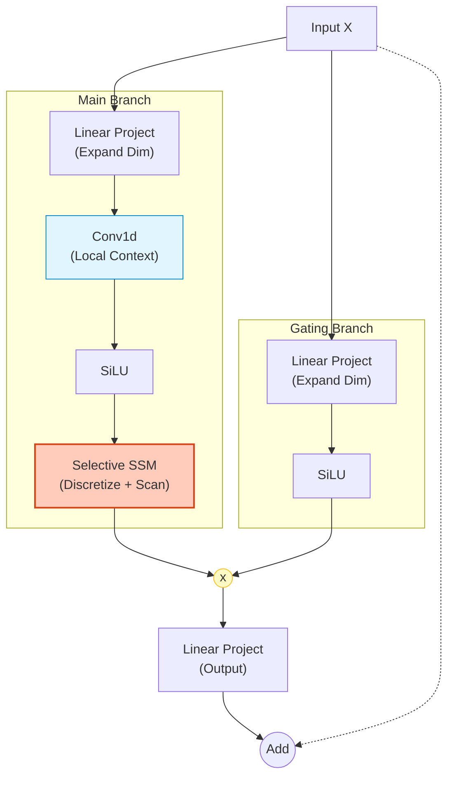

# Mamba Architecture (Selective SSM)

## 1. 개요
2023년 말 *Gu & Dao*가 제안한 아키텍처로, Transformer의 **Attention 메커니즘을 제거**하고 **SSM (State Space Model)**  기반으로 설계되었다.
입력 길이에 대해 **선형적인 시간 복잡도 $O(N)$** 를 가지면서도, Transformer급의 성능을 보여주는 것이 특징이다.

> [!abstract] 핵심 혁신
> 1.  **Selection Mechanism**: 입력에 따라 정보를 선별적으로 기억하거나 망각한다. (기존 SSM의 약점 해결)
> 2.  **Hardware-aware Algorithm**: GPU 메모리 계층을 고려한 **Parallel Scan** 구현으로 학습/추론 속도를 극대화했다.

## 2. 배경: State Space Model (SSM)
Mamba의 뿌리는 제어 공학의 상태 공간 모델이다. 연속적인 신호를 처리하는 미분방정식에서 출발한다.

### 2.1. 연속 시간 (Continuous-time) 수식
$$
\begin{align}
h'(t) &= \mathbf{A}h(t) + \mathbf{B}x(t) \\
y(t) &= \mathbf{C}h(t)
\end{align}
$$
-   $x(t)$: 입력 신호 (1D)
-   $h(t)$: 잠재 상태 (Latent State, $N$차원)
-   $y(t)$: 출력 신호 (1D)
-   $\mathbf{A}$: State Matrix ($N \times N$) - 시스템의 고유 특성 (HiPPO 행렬 등 사용)
-   $\mathbf{B}, \mathbf{C}$: Projection Matrices

### 2.2. 이산화 (Discretization)
컴퓨터 처리를 위해 연속 신호를 이산 신호(Time step $k$)로 바꾼다. 이때 **Zero-Order Hold (ZOH)** 방식을 주로 사용하며, 간격 파라미터 $\mathbf{\Delta}$가 핵심 역할을 한다.

$$
\begin{align}
h_t &= \bar{\mathbf{A}}h_{t-1} + \bar{\mathbf{B}}x_t \\
y_t &= \mathbf{C}h_t
\end{align}
$$
여기서 변환된 행렬 $\bar{\mathbf{A}}, \bar{\mathbf{B}}$는 다음과 같다.
$$
\begin{align}
\bar{\mathbf{A}} &= \exp(\mathbf{\Delta} \mathbf{A}) \\
\bar{\mathbf{B}} &= (\mathbf{\Delta} \mathbf{A})^{-1}(\exp(\mathbf{\Delta} \mathbf{A}) - \mathbf{I}) \cdot \mathbf{\Delta} \mathbf{B}
\end{align}
$$
-   **RNN View**: 위 식대로 $h_{t-1} \to h_t$ 순차 계산 (추론 시 $O(1)$).
-   **Convolution View**: 학습 시에는 병렬화를 위해 커널 $K$를 이용한 합성곱($y = x * K$)으로 변환 가능 (단, Selection 적용 전까지만).

## 3. The "Selective" SSM
기존 SSM(S4 등)의 가장 큰 문제는 행렬 $\mathbf{A, B, C}$가 시간 $t$에 상관없이 고정(Time-Invariant)되어 있다는 점이었다. 즉, 모든 토큰을 똑같은 방식으로 처리했다.

Mamba는 파라미터를 **입력 $x_t$에 따라 변하는 함수**로 만들었다.

### 3.1. 수식적 변화 (Algorithm S6)
$$
\begin{align}
\mathbf{B} &= s_B(x_t) \\
\mathbf{C} &= s_C(x_t) \\
\mathbf{\Delta} &= \text{Softplus}(\text{Parameter} + s_\Delta(x_t))
\end{align}
$$
-   $s_B, s_C, s_\Delta$는 모두 입력 $x$를 받는 **Linear Projection Layer**다.
-   이제 $\bar{\mathbf{A}}, \bar{\mathbf{B}}$도 매 시점 $t$마다 달라진다 ($\bar{\mathbf{A}}_t, \bar{\mathbf{B}}_t$).

### 3.2. 의미: Content-Awareness
-   **$\mathbf{\Delta}_t$의 역할**: 정보의 흐름을 제어하는 **게이트(Gate)** 역할을 한다.
    -   $\Delta_t$가 크면: 현재 입력 $x_t$를 많이 받아들이고, 과거 상태 $h_{t-1}$은 많이 잊는다. (**Focus**)
    -   $\Delta_t$가 작으면: 현재 입력을 무시하고, 과거 기억을 유지한다. (**Ignore/Memory**)
-   이 메커니즘 덕분에 불필요한 정보(Stopword 등)는 걸러내고 중요한 정보만 장기 기억(Long-term Memory)에 남길 수 있다.

> [!warning] Trade-off
> 파라미터가 시시각각 변하므로, 더 이상 **Convolution(합성곱) 형태로 병렬화할 수 없다**. 이를 해결하기 위해 **Parallel Scan** 알고리즘을 사용한다.## 4. Mamba Block Architecture
Transformer의 Self-Attention Layer를 대체하는 **Mamba Layer**의 내부 구조다. H3 모델과 Gated MLP 구조를 결합했다.

### 4.1. 상세 흐름
입력 벡터 $X$ (Batch, Seq, Model_Dim)가 들어오면 두 갈래로 나뉜다.

1.  **Main Branch (SSM Path)**:
    -   **Linear Expansion**: 차원을 $E$배(보통 2배) 늘림.
    -   **Conv1d**: 로컬 컨텍스트 포착을 위한 가벼운 합성곱 (Kernel size=4).
    -   **SiLU**: 활성화 함수.
    -   **SSM (Selective Scan)**: 위의 수식 $\Delta, B, C$를 계산하고 상태 업데이트. ($O(N)$ 연산의 핵심)
    -   **Output**: 시퀀스 변환 결과.
2.  **Gating Branch**:
    -   **Linear Expansion**: 차원 확대.
    -   **SiLU**: 활성화 함수.
3.  **Combination**:
    -   Main Branch의 출력과 Gating Branch의 출력을 **원소별 곱(Element-wise Multiplication)**한다.
    -   **Linear Projection**: 원래 차원으로 복원.

### 4.2. 특징
-   **No Attention**: $N \times N$ 행렬이 없다. 메모리는 $O(N)$으로 선형 증가한다.
-   **KV Cache 불필요**: RNN처럼 마지막 hidden state $h_t$만 있으면 다음 토큰 생성이 가능하다.
## 5. Hardware-Aware Parallel Scan 
Selection Mechanism 때문에 Convolution을 못 쓰게 되자, Mamba는 **Scan(Prefix Sum)** 연산을 GPU에 최적화했다. 
### 5.1. Parallel Scan 
순차적인 재귀 연산 $h_t = \bar{A}_t h_{t-1} + \bar{B}_t x_t$를 병렬로 처리하기 위해 **결합 법칙(Associativity)** 을 이용한다. 
- 트리 구조로 연산을 묶어서 $O(N)$이 아닌 $O(\log N)$ 단계에 수행한다. 
- **Kernel Fusion**: HBM(GPU 메모리)에 중간 상태 $h$를 기록하지 않고, **SRAM(캐시)** 안에서만 Scan을 수행하여 메모리 대역폭 병목을 제거했다. (FlashAttention의 아이디어와 유사) 
## 6. Transformer vs Mamba 비교 
| 구분         | Transformer             | Mamba (SSM)            |
| :--------- | :---------------------- | :--------------------- |
| **핵심 연산**  | Attention ($QK^T$)      | Selective Scan         |
| **학습 복잡도** | $O(N^2)$ (Quadratic)    | **$O(N)$ (Linear)**    |
| **추론 복잡도** | $O(N)$ (KV Cache 필요)    | **$O(1)$ (Constant)**  |
| **메모리**    | 시퀀스 길이에 비례              | 고정된 State 크기           |
| **컨텍스트**   | 이론상 무한, 현실은 Window 제한   | 이론상 무한, State 압축 손실 존재 |
| **강점**     | "Copy & Paste" (검색, 참조) | "Reasoning", 긴 문맥 요약   |
## 7. 한 줄 요약 
> **"입력에 따라 '기억할 것'과 '버릴 것'을 스스로 결정하는 미분방정식 모델을, GPU에서 병렬로 돌릴 수 있게 만든 아키텍처."**