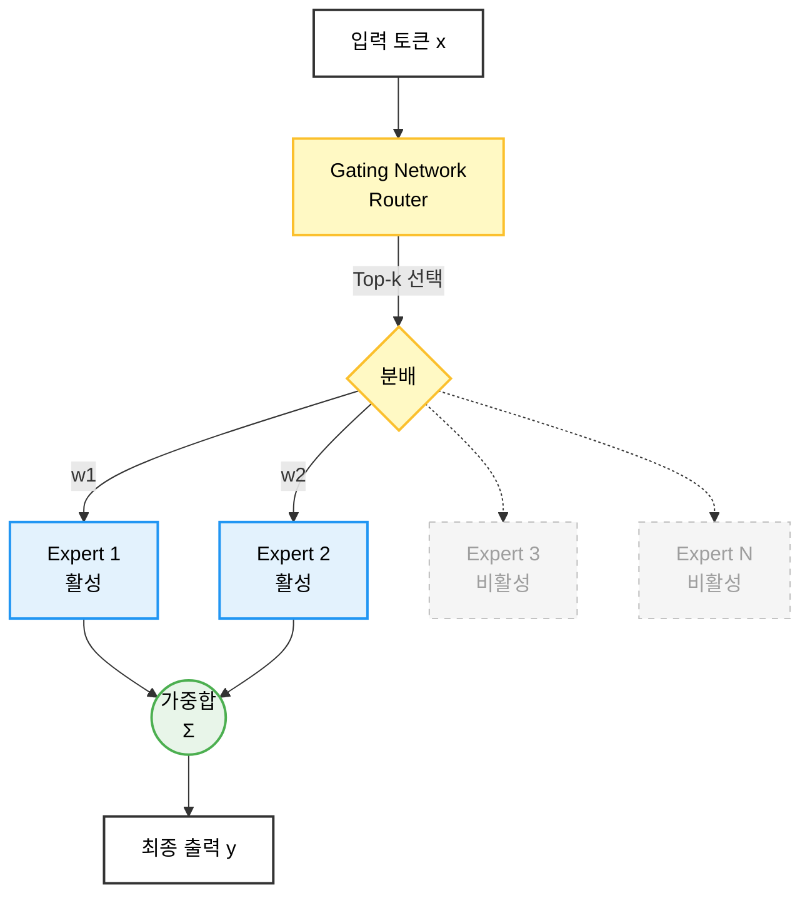

# Mixture of Experts (MoE)
> 대규모 파라미터를 유지하면서 실제 활성 파라미터는 최소화하여  
> 비용과 속도를 획기적으로 개선한 현재 가장 효율적인 스케일링 기법

## 1. 핵심 동기

| 항목                | Dense 모델                     | MoE 모델의 해결 방식                              |
|---------------------|---------------------------------|---------------------------------------------------|
| 파라미터 효율       | 405B → 405B 전부 활성화         | 405B MoE → 추론 시 ~30~70B만 활성화              |
| 전문화              | 모든 토큰에 동일한 뉴런 사용    | 토큰별로 적합한 전문가만 선택                     |
| 추론 속도           | 느림                            | 활성 파라미터 감소로 2~4× 빠름                    |

대표 모델 (2025년 11월 기준)
- DeepSeek-V3 671B MoE (활성 ~37B)
- Grok-2 314B MoE (활성 ~70B)
- Qwen2.5-72B-MoE (활성 ~16B)
- Mixtral 8×22B (141B → 활성 ~39B)
## 2. 기본 구조

## 3. 핵심 수식

### 1. Gate logits 및 Softmax
$$ G(x)_i = \text{Softmax}(x W_g + \text{noise})_i $$

### 2. Top-k Sparse Routing
$$ \text{selected} = \text{TopK}(G(x), k) $$

### 3. MoE 레이어 출력
$$ y = \sum_{i \in \text{selected}} G(x)_i \cdot E_i(x) $$

### 4. Load-Balancing Auxiliary Loss (필수)
$$ \mathcal{L}_{\text{aux}} = \alpha \sum_{i=1}^{E} f_i P_i \quad (\alpha \approx 0.01) $$
- $f_i$: i번째 전문가가 선택된 비율  
- $P_i$: i번째 전문가가 처리한 토큰 비율

## 4. 주요 MoE 변종 비교

| 변종                  | Router 위치          | Top-k | 전문가 수   | 대표 모델                     | 특징                              |
|-----------------------|----------------------|-------|-------------|-------------------------------|-----------------------------------|
| Switch Transformer    | 모든 레이어          | 1     | 수천        | Google Switch 1.6T            | 학습 안정성 최고                  |
| GShard / V-MoE        | 모든 레이어          | 2     | 수백        | 초기 Google MoE               | Top-2 원조                        |
| Mixtral Style (현 표준) | 짝수 레이어만 MoE   | 2     | 8~32        | Mixtral, Grok-2, Qwen2.5-MoE  | 메모리·속도 최적                  |
| DeepSeek-V3 Style     | 모든 FFN → MoE       | 2     | 256~1024    | DeepSeek-V3 671B              | 전문가 수 극대화                  |
| Shared + Sparse       | 일부 Expert 공유     | 2     | 16 + shared | GLaM, Snowflake Arctic        | 메모리 추가 절감                  |

## 5. 실무에서 반드시 적용하는 안정화 기법

- Noisy Top-k Gating (uniform/Gumbel noise)
- Router z-loss: $\lambda \cdot \text{mean}(\text{logits}^2)$
- Capacity Factor 1.25~2.0
- Auxiliary balancing loss 0.01
- Expert Parallelism + Tensor Parallelism

## 6. 한 줄 요약

> 토큰마다 적합한 소수의 전문가만 활성화함으로써  
> 파라미터는 대폭 늘리면서 실제 연산량은 기존 Dense 모델 수준으로 유지