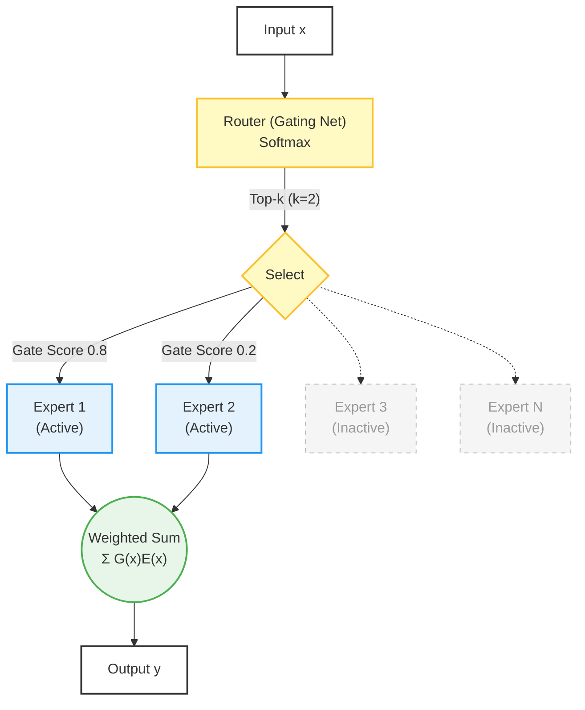

# 03. Mixture of Experts (MoE)

## 1. 개요
대규모 파라미터를 보유하면서도, 실제 추론 시에는 **일부분만 활성화(Sparse Activation)**하여 비용과 속도를 획기적으로 개선한 스케일링 기법이다.

> [!abstract] 핵심 개념
> **"모든 것을 다 아는 한 명의 천재 대신, 각 분야의 전문가(Expert) 수백 명을 두고 필요한 사람만 부른다."**

## 2. Dense 모델 vs MoE 모델
기존 Dense 모델은 입력이 들어올 때마다 모델 전체가 연산에 참여하지만, MoE는 '선택된 전문가'만 연산한다.

| 항목 | Dense 모델 (기존) | MoE 모델 (Sparse) |
| :--- | :--- | :--- |
| **파라미터 활성화** | 405B 전체가 매번 활성화 | 405B 중 **약 10~20%**만 활성화 |
| **전문화(Specialization)** | 모든 토큰에 동일한 뉴런 사용 | 토큰의 성격에 따라 **적합한 전문가**가 처리 |
| **추론 속도** | 파라미터 수에 비례하여 느림 | 활성 파라미터가 적어 **2~4배 빠름** |
| **대표 모델** | Llama-3 405B | DeepSeek-V3, Mixtral 8x22B, Grok-2 |

## 3. 최신 트렌드 (2024-2025)
-   **DeepSeek-V3**: 671B 파라미터 중 토큰당 37B만 사용 (극단적 효율)
-   **Mixtral 8x22B**: 141B 파라미터 중 토큰당 39B 사용
-   **Qwen2.5-MoE**: 작은 모델에서도 MoE를 적용하여 온디바이스 효율성 증대
## 4. 기본 구조 (Architecture)
MoE는 크게 **Router(Gating Network)**와 **Experts(FFN Layers)**로 구성된다.

### 작동 원리
1.  **Router (Gating Network)**: 입력 토큰($x$)을 보고 어떤 전문가가 처리에 적합한지 확률을 계산한다.
2.  **Top-k Selection**: 확률이 가장 높은 $k$개(보통 2개)의 전문가만 선택한다.
3.  **Experts Processing**: 선택된 전문가들만 연산을 수행한다. (선택받지 못한 전문가는 연산량 0)
4.  **Weighted Sum**: 전문가들의 출력을 Router가 계산한 가중치(확률)에 따라 합쳐 최종 출력을 만든다.
## 5. 핵심 수식 
MoE의 핵심은 **미분 가능한 라우팅(Routing)**과 **로드 밸런싱(Load Balancing)**이다. 
### 5.1. Gating & Routing 어떤 전문가를 고를지 결정하는 과정이다. 
$$ \begin{align} g(x) &= \text{Softmax}(\text{TopK}(x \cdot W_g, k)) \\ y &= \sum_{i \in \text{selected}} g_i(x) \cdot E_i(x) \end{align} $$ 
- $W_g$: Router가 학습하는 가중치 행렬 
- $E_i(x)$: $i$번째 전문가(FFN)의 출력값
- Top-K에 들지 못한 전문가의 $g_i(x)$는 0이 되어 연산에서 제외된다. 
### 5.2. Load Balancing Loss (학습 안정화) 
특정 전문가에게만 일이 몰리는 **'쏠림 현상(Collapse)'**을 막기 위해 보조 손실함수(Auxiliary Loss)를 추가한다. 
$$ \mathcal{L}_{\text{aux}} = \alpha \cdot N \sum_{i=1}^N f_i \cdot P_i $$
- $f_i$: 해당 배치(Batch)에서 전문가 $i$가 실제로 선택된 비율 (Fraction) 
- $P_i$: Router가 전문가 $i$에게 할당한 평균 확률값 (Probability)
- **목표**: $f_i$와 $P_i$가 균등하게 퍼지도록 하여 모든 전문가가 골고루 학습되게 강제한다. 
### 5.3. Final Loss Function 
$$ \mathcal{L}_{\text{total}} = \mathcal{L}_{\text{CE}} + \mathcal{L}_{\text{aux}} + \lambda \|\text{logits}\|^2 $$
- $\mathcal{L}_{\text{CE}}$: 기본 언어 모델 손실 (Cross Entropy) 
- $\mathcal{L}_{\text{aux}}$: 로드 밸런싱 - Router z-loss: 라우터의 값이 너무 커지지 않게 규제 (안정성 확보)
## 6. 주요 MoE 변종 비교
Google의 초기 모델부터 최신 오픈소스 모델까지의 발전 흐름이다.

| 변종 | Router 위치 | Top-k | 전문가 수 | 특징 |
| :--- | :--- | :--- | :--- | :--- |
| **Switch Transformer** | 모든 레이어 | 1 | 수천 개 | Google 초기 모델, Top-1이라 빠르지만 불안정했음 |
| **Mixtral Style** | 짝수 레이어 등 | 2 | 8~32개 | **현재 업계 표준**. 적절한 전문가 수로 메모리/속도 최적화 |
| **DeepSeek Style** | 모든 FFN 대체 | 2~6 | 256~1024개 | **Fine-Grained MoE**. 전문가는 매우 많게, 활성은 아주 적게 하여 효율 극대화 |
| **Shared Expert** | (공유 + 전용) | 2 | 16 + Shared | 공통 지식은 Shared Expert가, 특수 지식은 MoE가 담당 |

## 7. 안정화 기법 (Stabilization)
MoE는 학습이 매우 까다롭다(학습 발산, 특정 전문가 과부하 등). 이를 해결하기 위한 기법들이다.

1.  **Noisy Top-k**: Gating Logit에 노이즈를 섞어 탐험(Exploration)을 유도함.
2.  **Router z-loss**: 라우터의 출력이 너무 발산하지 않도록 $logit^2$ 패널티를 줌 (DeepSeek, Mixtral 채용).
3.  **Capacity Factor (CF)**: 한 전문가가 처리할 수 있는 토큰 수의 상한선을 두어 강제로 오버플로우 토큰을 드롭하거나 다른 곳으로 보냄.

## 8. 한 줄 요약
> **MoE = "토큰마다 Top-2 전문가만 골라서 가중합(Weighted Sum)하고 나머지는 버림으로써, 파라미터는 671B지만 실제 연산은 37B 수준으로 줄이는 기술"**