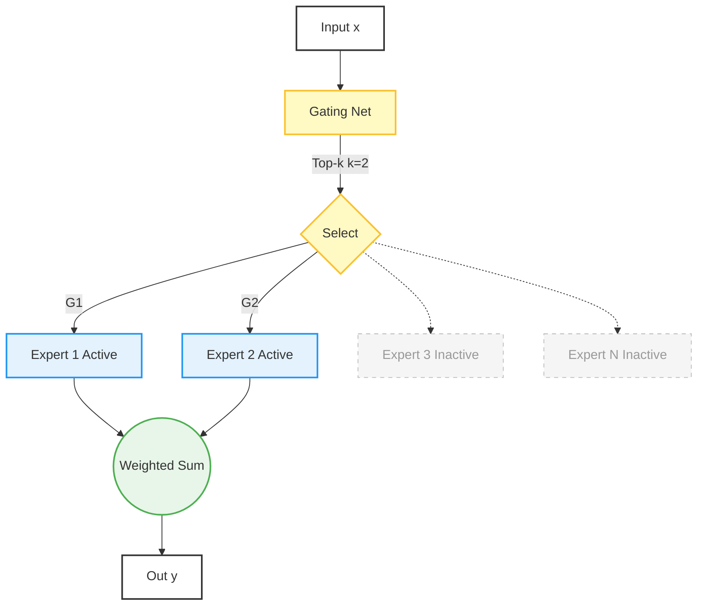

# Mixture of Experts (MoE)
> 대규모 파라미터를 유지하면서 실제 활성 파라미터는 최소화하여  
> 비용과 속도를 획기적으로 개선한 현재 가장 효율적인 스케일링 기법

## 1. 핵심 동기

| 항목                | Dense 모델                     | MoE 모델의 해결 방식                              |
|---------------------|---------------------------------|---------------------------------------------------|
| 파라미터 효율       | 405B → 405B 전부 활성화         | 405B MoE → 추론 시 ~30~70B만 활성화              |
| 전문화              | 모든 토큰에 동일한 뉴런 사용    | 토큰별로 적합한 전문가만 선택                     |
| 추론 속도           | 느림                            | 활성 파라미터 감소로 2~4× 빠름                    |

**대표 모델**
- DeepSeek-V3 671B MoE (활성 ~37B)
- Grok-2 314B MoE (활성 ~70B)
- Qwen2.5-72B-MoE (활성 ~16B)
- Mixtral 8×22B (141B → 활성 ~39B)
## 2. 기본 구조

## 3. 핵심 수식
$$ 
\begin{align} 
&\text{1. Gating Network (Router) – 토큰별 점수 계산} \\[0.5em] 
&\quad g_i(x) = x W_g + b_g \qquad (\text{logits, 보통 Linear + Softmax}) \\[1.2em]

&\text{2. Top-k Routing + Noisy (실무 표준)} \\[0.5em] 
&\quad G_i(x) = \frac{\exp(g_i(x) + \text{noise}_i)}{\sum_j \exp(g_j(x) + \text{noise}_j)} \\[0.3em] 
&\quad \text{selected experts} = \text{TopK}(G(x), k) \quad (k=2가 대세) \\[1.2em]

&\text{3. MoE 레이어 출력 (Sparse Weighted Sum)} \\[0.5em] 
&\quad \text{MoE}(x) = \sum_{i \in \text{selected}} G_i(x) \cdot E_i(x) \\[0.5em] 
&\quad \text{(나머지 N-k개 전문가는 완전 0 → 연산량 폭감)} \\[1.2em]

&\text{4. Load-Balancing Auxiliary Loss (학습 안정성 핵심!)} \\[0.5em] 
&\quad \mathcal{L}_{\text{aux}} = \alpha \cdot \sum_{i=1}^N f_i \cdot P_i \qquad (\alpha \approx 0.01) \\[0.5em] 
&\quad f_i = \text{비율 of tokens routed to expert } i \\ 
&\quad P_i = \text{평균 gating score of expert } i \\[0.5em] 
&\quad \rightarrow \text{모든 전문가가 골고루 쓰이게 강제} \\[1.2em]

&\text{5. 최종 Loss (실무에서 쓰는 형태)} \\[0.5em] 
&\quad \mathcal{L} = \mathcal{L}_{\text{CE}} + \mathcal{L}_{\text{aux}} + \lambda \cdot \underbrace{\|z\|^2}_{\text{Router z-loss}} 
\end{align}
$$
## 4. 주요 MoE 변종 비교

| 변종                  | Router 위치          | Top-k | 전문가 수   | 대표 모델                     | 특징                              |
|-----------------------|----------------------|-------|-------------|-------------------------------|-----------------------------------|
| Switch Transformer    | 모든 레이어          | 1     | 수천        | Google Switch 1.6T            | 학습 안정성 최고                  |
| GShard / V-MoE        | 모든 레이어          | 2     | 수백        | 초기 Google MoE               | Top-2 원조                        |
| Mixtral Style (현 표준) | 짝수 레이어만 MoE   | 2     | 8~32        | Mixtral, Grok-2, Qwen2.5-MoE  | 메모리·속도 최적                  |
| DeepSeek-V3 Style     | 모든 FFN → MoE       | 2     | 256~1024    | DeepSeek-V3 671B              | 전문가 수 극대화                  |
| Shared + Sparse       | 일부 Expert 공유     | 2     | 16 + shared | GLaM, Snowflake Arctic        | 메모리 추가 절감                  |

## 5. 안정화 기법
| 기법                    | 수식 추가 항목                          | 대표 모델                |
| --------------------- | --------------------------------- | -------------------- |
| Noisy Top-k Gating    | noise ~ Uniform(-∞,0) or Gumbel   | Switch, GShard       |
| Router z-loss         | λ·mean(logits²)                   | Mixtral, DeepSeek-V3 |
| Capacity Factor       | drop tokens if > CF × batch/token | 초기 Google MoE        |
| Expert Choice Routing | expert가 토큰 선택 (reverse)           | V-MoE v2             |
## 6. 한 줄 요약

> “토큰마다 Top-2 전문가만 골라서 weighted sum하고, 나머지는 버림 → 파라미터는 671B지만 실제 활성 파라미터는 37B 수준”
