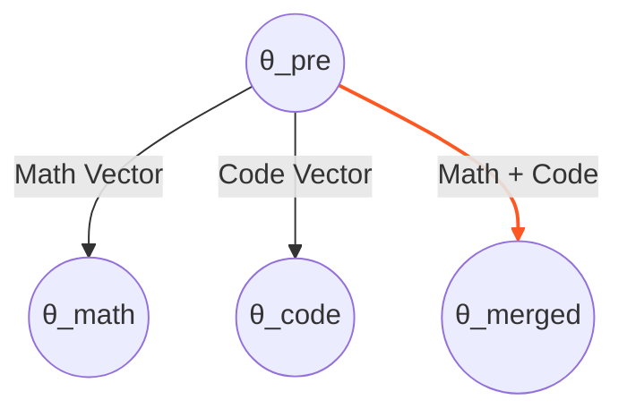

# Model Merging (Weight Merging)

## 1. 개요
동일한 뿌리(Pre-trained Model)에서 파생된 여러 개의 Fine-tuned 모델들의 **가중치(Weights)를 직접 연산하여 하나로 합치는 기술**이다.

> [!abstract] 핵심 차별점: vs Ensemble
> -   **Ensemble**: 모델 N개를 모두 메모리에 띄우고 실행해서 평균 냄. (비용 $N$배)
> -   **Merging**: 가중치를 더하고 빼서 모델 1개를 만듦. (비용 $1$배, 성능은 $N$배 효과)
> -   **Key Insight**: "학습된 모델의 가중치 변화량은 **Task Vector**로 볼 수 있다."

## 2. 기본 원리: Task Arithmetic
2022년 *Ilharco et al.* 이 제안한 개념이다.
Fine-tuning이란 결국 고차원 파라미터 공간에서 **특정 방향으로의 이동**이다.
### 2.1. Task Vector 정의
-   $\theta_{pre}$: 사전 학습 모델 (Base)
-   $\theta_{ft}$: 파인튜닝된 모델
-   **Task Vector $\tau$**:
    $$
    \tau = \theta_{ft} - \theta_{pre}
    $$

### 2.2. 벡터 연산
수학, 코딩, 채팅을 다 잘하는 모델을 만들고 싶다면, 각 특화 모델의 벡터를 더하면 된다.
$$
\theta_{merged} = \theta_{pre} + \lambda (\tau_{math} + \tau_{code} + \tau_{chat})
$$
-   $\lambda$: Scaling factor (가중치 조절).

## 3. 고급 알고리즘: 간섭(Interference) 해결
단순 평균(Average)이나 합(Sum)은 **서로 다른 모델들이 충돌(Interference)** 하여 성능을 깎아먹는 문제가 있다. 이를 해결하는 최신 기법들이다.
### 3.1. TIES-Merging (Trim, Elect Sign, Merge)
"대부분의 파라미터 변화는 노이즈다"라는 가정 하에, **충돌하는 부호(Sign)를 정리**한다.

1.  **Trim (가지치기)**: 변화량($\tau$)의 크기가 작은 하위 80%는 0으로 만든다. (Sparsification)
2.  **Elect Sign (부호 투표)**: 각 파라미터 위치에서, 여러 모델들이 `+` 방향인지 `-` 방향인지 투표한다.
    -   모델 A는 `+0.5`, 모델 B는 `-0.2`라면? $\to$ **Total Sign은 `+`**.
3.  **Disjoint Merge (선별 병합)**:
    -   Total Sign과 **같은 방향**인 값만 남기고, 반대 방향인 값(Disagreement)은 0으로 무시한다.
    -   살아남은 값들의 평균을 구한다.

> [!tip] 직관
> "수학 모델은 이 뉴런을 키우자고 하고, 코딩 모델은 줄이자고 하네? 싸우지 말고 **다수결로 정한 방향**만 인정하자."

### 3.2. DARE (Drop And REscale)
LLM의 파라미터가 매우 많다는 점(Over-parameterized)을 이용한다.
1.  **Drop**: Task Vector의 90%를 랜덤하게 0으로 만든다 (Dropout과 유사).
2.  **Rescale**: 살아남은 10%의 값을 $1 / (1-p)$ 배로 키운다.
3.  **Merge**: 이걸 더한다.
-   놀랍게도 TIES보다 더 간단하면서 성능이 잘 나와서 최근 많이 쓰인다.
### 3.3. Frankenmerging (Passthrough / Stacking)
이건 가중치 연산이 아니라 **레이어 조립**이다.
-   예: 32층짜리 Llama 두 개를 가져와서,
    -   모델 A의 1~24층 + 모델 B의 8~32층 = **48층짜리 모델** 생성.
-   **Solar-10.7B** 모델이 이 방식으로 만들어져 유명해졌다. (Up-scaling)
## 4. 왜 이게 가능한가? (Linear Mode Connectivity)

일반적으로 딥러닝의 Loss Landscape는 Non-convex(비볼록)하다.
따라서 서로 다른 두 모델 $\theta_A, \theta_B$를 평균 내면($\frac{\theta_A + \theta_B}{2}$), 그 사이 어딘가에 있는 모델은 **Loss가 높은 산봉우리(High Loss Barrier)** 위에 있을 확률이 높다. (성능 망함)

### 4.1. 같은 Basin 안에서는 가능하다
하지만 **"같은 Pre-trained 모델에서 출발한"** Fine-tuned 모델들은, 파라미터 공간상에서 **동일한 Basin(골짜기)** 안에 머물러 있다는 가설이다.
-   이 골짜기 안에서는 선형 보간(Linear Interpolation)을 해도 Loss가 급격히 튀지 않는다.
-   Model Merging은 이 Basin 안에서 **최적의 최저점(Global Minima for Multi-task)** 을 찾아가는 과정이다.
## 5. 요약

| 기법 | 방식 | 특징 |
| :--- | :--- | :--- |
| **Simple Averaging** | $\sum \theta_i / N$ | 기본 방식, 간섭 발생 높음 |
| **Task Arithmetic** | $\theta_{pre} + \lambda \sum \tau_i$ | 벡터 관점, 직관적 |
| **TIES** | 부호(Sign) 충돌 제거 | 성능 보존율 높음 |
| **DARE** | 랜덤 Drop + 스케일링 | LLM에 매우 효과적 |
| **Frankenmerge** | 레이어 이어 붙이기 | 모델 크기(Size)가 커짐 |

> [!abstract] 결론
> Model Merging은 GPU 없이도 **"수학적 연산만으로 SOTA 모델을 조립"**할 수 있는 강력한 기법이다. (일명 'GPU-poor'를 위한 연금술)