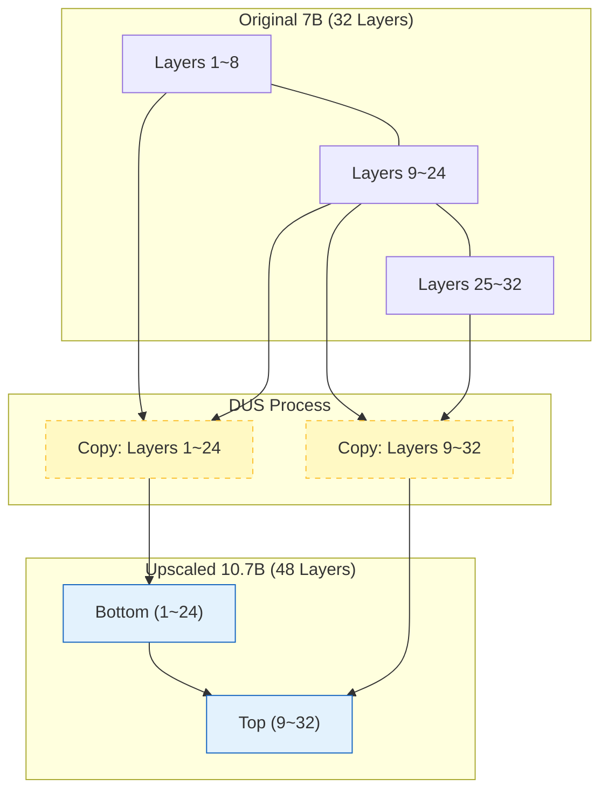
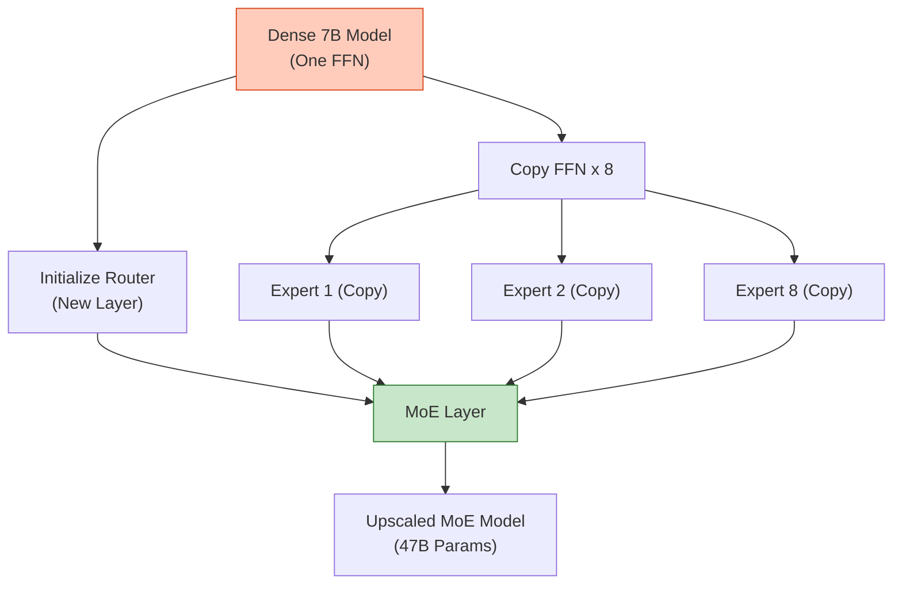

# Model Upscaling Techniques

## 1. 개요
처음부터 거대 모델을 학습(Train from scratch)하는 것은 비용이 너무 많이 든다. 따라서 **이미 성능이 검증된 작은 모델(Small LLM)의 가중치를 복사하거나 구조를 확장**하여, 더 큰 모델로 만드는 기법을 말한다.

> [!abstract] 핵심 질문
> **"Llama-3-8B가 이렇게 똑똑한데, 이걸 여러 개 합치거나 늘려서 70B급 지능을 갖게 할 순 없을까?"**

## 2. 대표적인 두 가지 방식

| 구분 | **Depth Up-Scaling (DUS)** | **Sparse Upcycling (MoE)** |
| :--- | :--- | :--- |
| **방식** | 레이어를 위로 쌓아 **깊게(Deep)** 만듦 | 레이어를 옆으로 복사해 **넓게(Wide)** 만듦 |
| **구조 변화** | 32층 $\to$ 48층 (Dense 모델 유지) | FFN 1개 $\to$ Expert 8개 (MoE로 변환) |
| **대표 사례** | **Solar-10.7B** (Llama-2 7B 확장) | **Mixtral 8x7B** (Mistral 7B 확장) |
| **특징** | 논리적 추론 능력 강화, 7B $\to$ 10~13B 확장에 유리 | 파라미터 뻥튀기에 유리 (7B $\to$ 47B), 추론 속도 빠름 |
## 3. Depth Up-Scaling (DUS)
Upstage의 **Solar-10.7B**가 사용해 유명해진 방식이다. 
7B 모델의 레이어를 복제해서 층수를 늘린 뒤, **[[Continual Training#^52c1d6|Continued Pre-training]]** 을 통해 봉합 부위를 치료한다.

### 3.1. 구조적 원리 (Layer Stacking)
단순히 레이어를 1번부터 끝까지 두 번 쌓으면 모델이 망가진다. 대신 **중간 부분을 겹치게(Overlap)** 이어 붙인다.
-   예: 32층짜리 Llama-2-7B를 확장할 때,
    1.  **하부**: 1층 ~ 24층 (Bottom 24 layers)
    2.  **상부**: 9층 ~ 32층 (Top 24 layers)
    3.  **결합**: 총 48층 모델 생성 ($24+24=48$)
    4.  **재학습**: 이어 붙인 경계면이 어색하므로 추가 학습 수행.

### 3.2. 핵심 수식
새로운 모델의 레이어 집합 $L_{\text{new}}$는 기존 레이어 $L_{\text{old}}$의 슬라이싱 결합이다.
$$
L_{\text{new}} = [L_{\text{old}}^{(1 \dots M)}, L_{\text{old}}^{(N-M \dots N)}]
$$
-   $N$: 원래 층수 (32)
-   $M$: 잘라낸 크기 (24)
-   초기화 후 $\mathcal{L}_{\text{CPT}}$(Next Token Prediction)로 미세 조정하여 $W$를 최적화한다.

## 4. Sparse Upcycling (Dense-to-MoE) 
잘 만든 Dense 모델(7B)을 베이스로 **[[MoE|Mixture of Experts]]** 구조로 변환하여 70B급 사이즈로 키우는 방법이다. 
### 4.1. 원리 
1. **복사 (Duplicate)**: 기존 모델의 FFN(Feed-Forward Network) 레이어를 $N$개(예: 8개) 복사한다. 
2. **전문가 할당**: 복사된 FFN들을 각각 'Expert'로 명명한다. 
3. **라우터 추가**: 입력 토큰을 어느 Expert로 보낼지 결정하는 Gating Network를 추가한다. (초기화는 랜덤 혹은 평균) 
4. **학습**: 이미 FFN들은 똑똑하므로, 라우터(Router) 위주로 빠르게 학습된다. 

### 4.2. 장점 
- **초기 성능 우수**: 백지 상태에서 MoE를 학습하는 것보다 훨씬 빠르게 수렴한다. 
- **확장성**: 7B 모델 하나로 8x7B(약 47B) 모델을 즉시 구성할 수 있다. 

## 5. 요약 및 선택 가이드
| 상황                   | 추천 기법                      | 결과물 예시                                        |
| :------------------- | :------------------------- | :-------------------------------------------- |
| **7B $\to$ 10B~13B** | **Depth Up-Scaling (DUS)** | 7B의 논리력을 유지하며 깊이만 확장. (추론 속도 약간 느려짐)          |
| **7B $\to$ 40B~70B** | **Sparse Upcycling (MoE)** | 7B를 여러 벌 복사해 전문가 그룹 형성. (추론 속도 빠름, 메모리 많이 먹음) |
## 6. 한 줄 요약 
> **"DUS는 키를 키우는 성장판 수술(Layer Stacking)이고, Sparse Upcycling은 그림자 분신술(MoE)이다."**