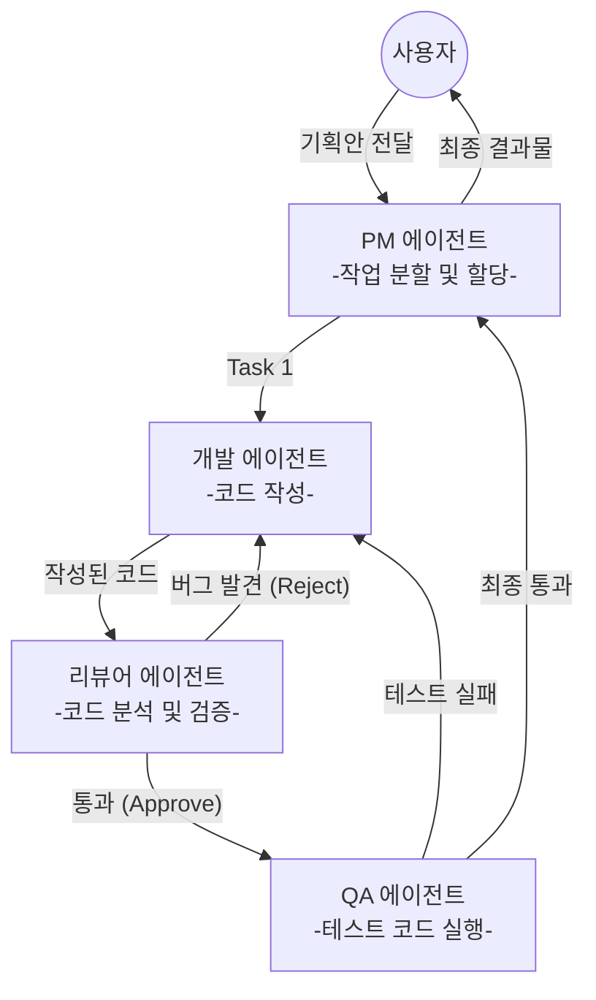

연관 노트: [[AI Agent의 탄생]], [[Agent는 어떻게 생각하는가]], [[Agent는 어떻게 행동하는가]]
# 혼자서 안 되면 같이 한다 (Multi-Agent)
에이전트 하나만 있어도 많은 일을 할 수 있지만, 프로젝트가 복잡해지면 문제가 발생합니다. 한 명의 똑똑한 직원이 기획, 개발, 디자인, 테스트를 모두 완벽하게 해낼 수는 없는 것과 같은 이치입니다. 

이번 글에서는, AI 에이전트 기술의 최전선이자 미래인 **Multi-Agent(다중 에이전트) 시스템**에 대해 알아봅니다.

## 1. 단일 에이전트의 한계
모든 역할을 혼자 수행하는 단일 에이전트(Single Agent)는 복잡한 작업에서 다음과 같은 한계에 부딪힙니다. 
1. **페르소나의 충돌**: "너는 창의적인 작가이면서 동시에 깐깐한 팩트 체커야"라고 지시하면, LLM은 혼란을 겪고 이도 저도 아닌 결과물을 냅니다. 
2. **컨텍스트 오버플로우 (Context Overflow)**: 한 에이전트가 리서치 자료, 작성 중인 코드, 에러 로그를 모두 한 번에 기억하려다 보면 중요한 정보를 잊어버리거나 환각(Hallucination)에 빠집니다. 
3. **무한 루프의 위험**: 혼자 생각하고 혼자 행동하다 보니, 자신이 틀린 방향으로 가고 있다는 것을 인지하지 못하고 삽질만 반복하는 경우가 생깁니다.
## 2. Multi-Agent: "AI 어벤져스 구성하기"
이 문제를 해결하는 방법은 단순합니다. **관심사의 분리(Separation of Concerns)**, 즉 에이전트를 여러 개 만들어서 역할을 쪼개주는 것입니다. 
### 2.1. 어떻게 협업하는가? (작동 방식) 
소프트웨어 개발을 예로 들면, 다음과 같이 각자의 페르소나(역할)를 가진 에이전트들이 상호작용합니다.

1. **비판과 피드백**: 개발 에이전트가 코드를 짜면, 리뷰어 에이전트가 깐깐하게 비판합니다. 서로 대화(Prompting)하며 결과물을 깎고 다듬습니다. 
2. **전문 도구의 분리**: 데이터 수집 에이전트에게는 '웹 검색 API'만 주고, 실행 에이전트에게는 '코드 실행기'만 주어 권한과 역할을 명확히 분리합니다.
## 3. 대표적인 Multi-Agent 프레임워크 
이런 복잡한 에이전트 간의 대화와 워크플로우를 쉽게 구현할 수 있도록 도와주는 강력한 프레임워크들이 이미 생태계를 장악하고 있습니다.
### 3.1. LangGraph (랭그래프) 
* **특징**: LangChain을 만든 곳에서 개발한 프레임워크로, 에이전트의 흐름을 **그래프(노드와 엣지) 구조**로 제어합니다. 
* **장점**: 에이전트가 엉뚱한 길로 빠지지 않도록 상태(State)를 엄격하게 관리하고, 개발자가 원할 때 흐름을 끊고 인간이 개입(HITL)하기 매우 좋습니다. (엔터프라이즈 환경에서 선호) 
### 3.2. CrewAI (크루에이아이) 
* **특징**: "에이전트들이 모인 하나의 크루(팀)를 만든다"는 직관적인 개념을 사용합니다. 
* **장점**: 개발 코드가 매우 사람의 언어와 비슷합니다. 각 에이전트의 `Role(역할)`, `Goal(목표)`, `Backstory(배경 설정)`를 적어주고 묶어버리면 알아서 회의를 하며 일을 처리합니다. (빠른 프로토타이핑에 선호)
### 3.3. AutoGen (오토젠 - Microsoft) 
* **특징**: 마이크로소프트에서 만든 프레임워크로, 여러 에이전트가 단톡방에 모여 대화(Conversation)를 통해 문제를 푸는 데 특화되어 있습니다. 코딩 및 자동화 작업 성능이 뛰어납니다.