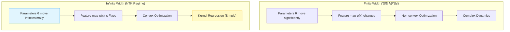

# Neural Tangent Kernel (NTK)

## 1. 개요
2018년 *Jacot et al.* 이 제안한 이론으로, **"신경망의 폭(Width)이 무한대로 넓어지면(Infinite Width), 학습 과정은 [[Kernel Regression|커널 회귀(Kernel Regression)]]와 수학적으로 동치다"** 라는 것을 증명했다.

> [!abstract] 핵심 의미
> 비선형적이고 복잡한 딥러닝 학습 과정을, 우리가 잘 아는 **선형 대수와 커널 머신(SVM 등)의 영역**으로 끌고 와서 분석할 수 있게 해준다.

## 2. Lazy Training Regime
신경망의 파라미터 수가 매우 많으면(Over-parameterized), 초기화 상태에서 아주 조금만 움직여도($\Delta \theta \approx 0$) Loss가 0인 지점에 도달할 수 있다.
이 영역에서는 신경망이 **선형 모델(Linear Model)** 처럼 동작한다.

## 3. 수학적 정의

### 3.1. 선형화 (Linearization)
입력 $x$, 파라미터 $\theta$를 가진 신경망 함수 $f(x; \theta)$를 초기 파라미터 $\theta_0$ 근처에서 **테일러 급수(Taylor Series)**로 1차 근사해보자.

$$
f(x; \theta) \approx f(x; \theta_0) + \nabla_\theta f(x; \theta_0)^T (\theta - \theta_0)
$$

이 식을 자세히 보면 선형 회귀 형태($y = w^T \phi(x)$)와 같다.
-   **특징 벡터(Feature Map)**: $\phi(x) = \nabla_\theta f(x; \theta_0)$ (초기 그래디언트)
-   **가중치(Weight)**: $w = (\theta - \theta_0)$ (파라미터 변화량)

### 3.2. 커널 정의 (The Kernel)
커널 기법에서 커널 함수는 두 입력 사이의 내적이다: $K(x, x') = \langle \phi(x), \phi(x') \rangle$.
이를 신경망에 적용하면 **Neural Tangent Kernel**이 된다.

$$
\Theta(x, x') = \langle \nabla_\theta f(x; \theta_0), \nabla_\theta f(x'; \theta_0) \rangle
$$

> [!tip] 의미
> "데이터 $x$와 $x'$가 **파라미터 공간에서의 그래디언트 방향**이 얼마나 유사한가?"
> 두 데이터의 그래디언트 방향이 비슷하면, $x$에 대해 학습했을 때 $x'$의 출력값도 같이 많이 변한다.

### 3.3. 학습 동역학 (Training Dynamics)
Gradient Descent를 연속 시간(Gradient Flow)으로 보면, 출력 함수 $f_t(x)$의 변화율은 다음과 같다.

$$
\frac{d f_t(x)}{dt} = - \eta \sum_{(x_i, y_i) \in D} \Theta_t(x, x_i) (f_t(x_i) - y_i)
$$

**무한 너비(Infinite Width) 극한**에서는 $\theta$가 거의 변하지 않으므로, 커널 $\Theta_t$도 초기 상태 $\Theta_0$로 **고정(Constant)** 된다.
따라서 이 미분방정식은 **닫힌 해(Closed-form Solution)** 를 가지며, 수렴성을 완벽하게 보장할 수 있다.

## 4. LLM에서의 응용: NTK-Aware Scaling 
이론적인 도구였던 NTK가 **LLM의 Context Length 확장**에 결정적인 기여를 했다. (RoPE 확장) 
### 4.1. 스펙트럼 편향 (Spectral Bias) 
NTK 이론에 따르면, 신경망은 **고주파(High Frequency) 성분보다 저주파(Low Frequency) 성분을 더 빨리 학습**한다. 
- 고유값 분해(Eigendecomposition)를 했을 때, 큰 고유값(주요 패턴) 방향으로 수렴이 빠르다. 
### 4.2. RoPE Scaling 문제와 해결 
- **문제**: RoPE의 길이를 늘리기 위해 선형 보간(Linear Interpolation)을 하면, 고주파 성분들이 뭉개져서 모델이 혼란스러워한다. 
- **NTK-Aware 해결책**: 
	- NTK 이론에 기반하여, **"고주파수는 건드리지 말고(Interpolation X), 저주파수만 늘리자(Interpolation O)"** 는 전략을 사용. 
	- 이렇게 하면 모델이 파인튜닝 없이도(Zero-shot) 늘어난 길이에 적응할 수 있다. 왜냐하면 고주파수(세밀한 정보)의 특징 맵이 보존되기 때문이다. 
## 5. 요약 및 한계

| 특징     | 내용                                                                                           |
| :----- | :------------------------------------------------------------------------------------------- |
| **장점** | 딥러닝의 수렴성, 일반화 성능을 수학적으로 증명 가능.                                                               |
| **한계** | 실제 모델(Finite Width)은 Feature Learning(특징 학습)을 하는데, NTK(Infinite)는 특징을 고정해버림. 실제 성능과는 괴리가 있음. |
| **의의** | "딥러닝은 왜 잘 되는가?"에 대한 수학적 단초 제공 + **RoPE/LoRA 등의 초기화 전략에 영향**.                                 |
> [!abstract] 한 줄 요약 
> **"신경망이 너무 거대해지면, 학습 중에 내부 구조(Feature Map)는 변하지 않고 가중치만 살짝 조정되는 '선형 커널 머신'처럼 행동한다는 이론."**

