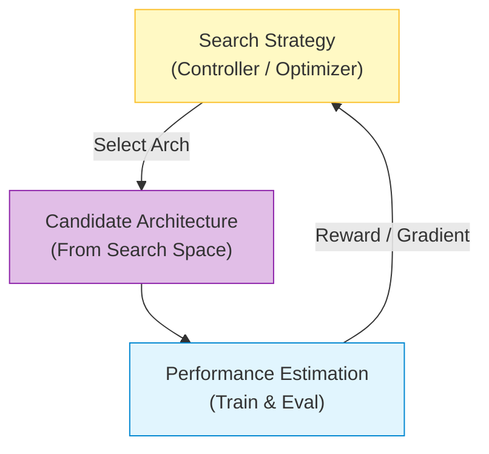

# Neural Architecture Search (NAS)

## 1. 개요
사람의 직관이나 시행착오(Heuristics)에 의존하던 신경망 아키텍처 설계를 **자동화(AutoML)** 하는 기술이다.
최적화 알고리즘을 사용하여, 주어진 데이터셋과 제약 조건(Latency, Memory) 하에서 최고의 성능을 내는 모델 구조를 찾아낸다.

> [!abstract] 핵심 철학
> **"모델의 가중치(Weight)만 학습할 게 아니라, 모델의 뼈대(Architecture) 자체도 학습하자."**

## 2. 왜 중요한가? (Edge AI와의 연결)
-   **SOTA 달성**: EfficientNet, MobileNetV3 등 효율성 끝판왕 모델들은 사람이 아닌 NAS가 만들었다.
-   **하드웨어 최적화**: "갤럭시 S24의 NPU에 딱 맞는 구조를 찾아줘"라는 식의 **Hardware-aware NAS**가 가능하다. (퓨리오사AI 같은 칩 제조사에 필수 기술)

## 3. NAS의 3대 요소 (The Trinity)
NAS는 크게 세 가지 질문으로 구성된다.

1.  **Search Space**: "무엇을 탐색할 것인가?" (블록 레고 조각 정의)
2.  **Search Strategy**: "어떻게 탐색할 것인가?" (탐색 알고리즘)
3.  **Performance Estimation**: "좋은지 나쁜지 어떻게 아나?" (평가 방법)

## 4. 탐색 전략 (Search Strategy)

### 4.1. 강화학습 (Reinforcement Learning)
초기 NAS(Zoph & Le, 2017) 방식이다.
-   **Controller (RNN)**: 아키텍처(하이퍼파라미터)를 생성하는 에이전트.
-   **Reward**: 생성된 모델을 수렴할 때까지 학습시킨 후 나온 **정확도(Accuracy)**.
-   **단점**: 모델 하나 검증하는 데 학습이 필요하므로 GPU 수천 개가 필요함 (비효율적).

### 4.2. 진화 알고리즘 (Evolutionary Algorithm)
-   **방식**: 여러 모델(개체)을 만들고, 성능 좋은 놈끼리 교배(Crossover)하거나 돌연변이(Mutation)를 일으켜 다음 세대를 만든다.
-   **장점**: 미분 불가능한 목적함수도 최적화 가능.

### 4.3. Differentiable NAS (DARTS)
수학과 출신이 가장 좋아할 만한 방식이다. 이산적인(Discrete) 선택 문제를 **연속적인(Continuous) 최적화 문제**로 바꿨다.
-   **아이디어**: 레이어 $i$와 $j$ 사이에 가능한 연산(Conv3x3, MaxPool 등)을 모두 놓고, **가중치 합(Weighted Sum)** 으로 연결한다.
-   **수식**:
    $$
    \bar{o}^{(i,j)}(x) = \sum_{o \in \mathcal{O}} \frac{\exp(\alpha_o^{(i,j)})}{\sum_{o' \in \mathcal{O}} \exp(\alpha_{o'}^{(i,j)})} o(x)
    $$
    -   $\mathcal{O}$: 후보 연산 집합 (예: Conv3x3, Conv5x5, Identity...)
    -   $\alpha_o$: 연산 $o$를 선택할 확률(가중치 파라미터).
-   **학습**: $\alpha$가 연속변수이므로, **경사 하강법(Gradient Descent)** 으로 모델 가중치($w$)와 아키텍처 파라미터($\alpha$)를 동시에 학습할 수 있다.
-   **결과**: 학습이 끝나면 가장 $\alpha$값이 큰 연산 하나만 남기고 나머지는 잘라낸다(Pruning).
## 5. 평가 전략 (Performance Estimation)
모든 후보 모델을 처음부터 끝까지 학습(Train from Scratch)시키는 것은 너무 느리다. 이를 해결하는 기법들이다.

### 5.1. Weight Sharing (가중치 공유)
-   **One-Shot NAS**: 거대한 **Supernet** 하나를 정의하고, 모든 후보 아키텍처가 이 Supernet의 **일부 경로(Path)** 가 되도록 만든다.
-   **원리**: Supernet을 한 번만 학습시키면, 부분 아키텍처들은 별도 학습 없이 Supernet의 가중치를 가져다 써서 성능을 추론할 수 있다.
-   **효과**: 탐색 비용을 수천 GPU days $\to$ 수 GPU days로 단축.

### 5.2. Proxy Task
-   전체 데이터셋(ImageNet) 대신 작은 데이터셋(CIFAR-10)으로 찾거나, 적은 에폭(Epoch)만 학습시켜서 순위만 매긴다.

## 6. 대표적인 NAS 모델 (Output)
-   **EfficientNet**: NAS를 통해 깊이(Depth), 너비(Width), 해상도(Resolution)의 최적 비율(**Compound Scaling**)을 찾음.
-   **MobileNetV3**: NetAdapt라는 NAS 알고리즘을 사용해 모바일 CPU/NPU에서의 지연 시간(Latency)을 최적화함. (여기서 **Swish** 함수도 발견됨)

## 7. 한 줄 요약
> **"DARTS 이전에는 무식하게 다 학습해보는(Trial & Error) 방식이었다면, 이제는 미분 가능한 수식으로 아키텍처를 '학습'하는 시대다."**