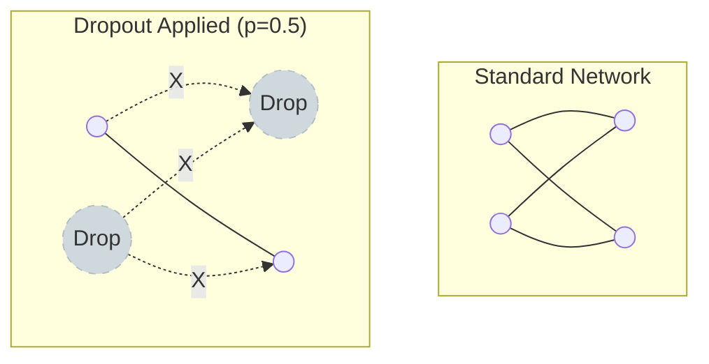

# 19. Regularization (정규화)

## 1. 개요
모델이 학습 데이터에만 너무 과하게 맞춰져(Overfitting), 새로운 데이터에 대한 예측 성능(Generalization)이 떨어지는 것을 막기 위해 **모델의 복잡도를 의도적으로 줄이는 기법**이다.

> [!abstract] 핵심 원리
> **Loss Function + Penalty Term**
> "정답을 맞추는 것(Loss 최소화)"뿐만 아니라, "파라미터를 작게 유지하는 것(Penalty 최소화)"도 목표로 삼는다.

## 2. Weight Decay (가중치 감쇠)
학습 중에 큰 가중치(Weight) 값을 가지는 파라미터에 페널티를 부과하여, 모델이 특정 피처에 과도하게 의존하는 것을 막는다.

$$
\mathcal{L}_{\text{total}}(\theta) = \mathcal{L}_{\text{original}}(\theta) + \lambda \cdot \text{Penalty}(\theta)
$$
-   $\lambda$ (Lambda): 규제 강도(Hyperparameter). 값이 클수록 규제가 강해져 모델이 단순해진다.

### 2.1. L1 Regularization (Lasso)
가중치의 **절댓값의 합**을 페널티로 사용한다.
$$
\text{Penalty}(\theta) = \sum_{i} |\theta_i|
$$
-   **특징**: 기하학적으로 마름모꼴 제한 영역을 가진다. 최적점이 좌표축(0) 위에 생길 확률이 높다.
-   **효과**: 중요하지 않은 변수의 가중치를 **완전히 0으로 만든다**.
-   **활용**: **변수 선택(Feature Selection)**이 필요할 때, 희소 모델(Sparse Model)을 만들 때. (예: Lasso Regression)

### 2.2. L2 Regularization (Ridge)
가중치의 **제곱의 합**을 페널티로 사용한다.
$$
\text{Penalty}(\theta) = \sum_{i} \theta_i^2
$$
-   **특징**: 기하학적으로 원형 제한 영역을 가진다.
-   **효과**: 가중치를 0에 가깝게 줄이지만, **완전히 0이 되지는 않는다**. 모든 변수를 골고루 사용하게 만든다.
-   **활용**: 일반적인 딥러닝 모델의 기본 규제. (예: Ridge Regression, AdamW)

### 2.3. Elastic Net
L1과 L2의 장점을 결합한 방식이다.
$$
\mathcal{L} = \mathcal{L}_{\text{original}} + r \lambda \sum |\theta_i| + \frac{1-r}{2} \lambda \sum \theta_i^2
$$
-   **활용**: 변수가 너무 많고(Lasso 필요), 변수 간 상관관계도 높을 때(Ridge 필요) 사용한다.

## 3. 딥러닝 특화 규제 기법

### 3.1. Dropout
학습 과정에서 신경망의 뉴런(Node)을 임의로 **꺼버리는(Drop)** 기법이다.

-   **작동**: 매 학습 단계(Step)마다 확률 $p$로 뉴런을 삭제한다.
-   **효과**: 특정 뉴런의 독주를 막고, 마치 여러 개의 서로 다른 신경망을 합친 **앙상블(Ensemble)** 효과를 낸다.
-   **주의**: **추론(Test) 시**에는 모든 노드를 켜되, 출력값에 $(1-p)$를 곱하거나 학습 때 $\frac{1}{1-p}$로 스케일링하여 평균을 맞춰야 한다.

### 3.2. Early Stopping (조기 종료)
Validation Loss가 더 이상 줄어들지 않고 다시 증가하려는 시점(Overfitting 시작점)에서 학습을 강제로 멈춘다.
-   가장 직관적이고 강력한 규제 방법 중 하나다.

## 4. 요약 비교

| 기법             | 페널티 수식          | 특징          | 주요 효과                                 |
| :------------- | :-------------- | :---------- | :------------------------------------ |
| **L1 (Lasso)** | $\sum\theta$    | 미분 불가능 점 존재 | **Feature Selection** (가중치 $\to$ 0)   |
| **L2 (Ridge)** | $\sum \theta^2$ | 모든 구간 미분 가능 | **Weight Smoothing** (가중치 $\to$ 0 근처) |
| **Dropout**    | (구조적 변경)        | 무작위 노드 삭제   | **Ensemble Effect** (Robustness 증가)   |
