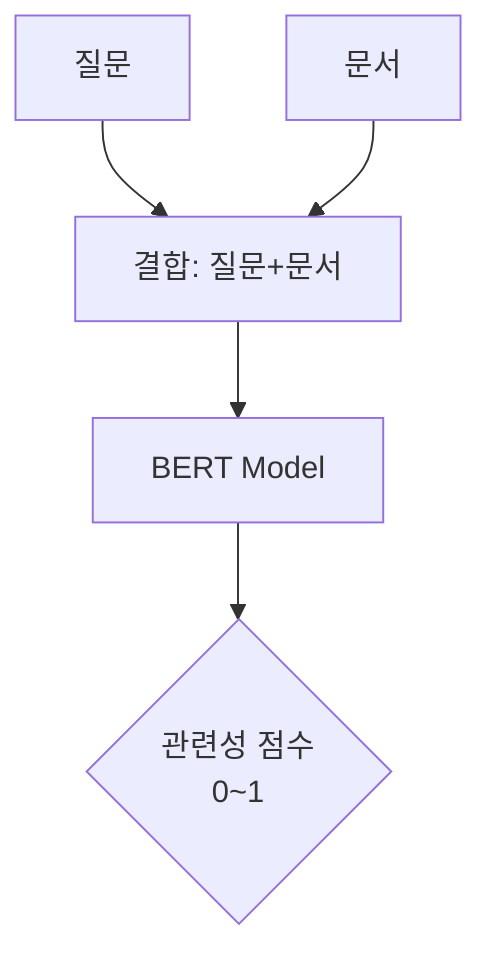

# 1. Bi-encoder의 한계
> "압축하면 디테일이 사라진다"

[[Dense Sparse Embedding#^f0d2cc]]는 질문과 문서를 각각 **독립적인 벡터**로 변환합니다.

- **질문**: "애플 주가 어때?" $\rightarrow$ 벡터 $A$
- **문서**: (애플의 3분기 실적 보고서 전체 내용) $\rightarrow$ 벡터 $B$

여기서 문제가 발생합니다. 아무리 긴 문서라도 고정된 크기(예: 768차원)의 벡터 하나로 압축해버리기 때문에, **문서 내의 세세한 정보나 뉘앙스가 뭉개져 버립니다(Information Bottleneck).** 또한 질문과 문서가 서로 상호작용(Interaction)하지 못하고, 각자 만든 벡터의 방향만 비교하기 때문에 "문맥상 정답인지" 판단하는 능력은 떨어집니다.

# 2. Cross-encoder
> "질문과 문서를 한 방에 읽는다"

이 문제를 해결하기 위해 등장한 것이 **Cross-encoder**입니다. 이름 그대로 질문과 문서를 교차(Cross)시켜서 읽습니다.

> **Cross-encoder**: 질문과 문서를 하나의 입력으로 합쳐서(Concat) 모델에 통과시키는 방식.

## 2.1. 작동 원리

- 질문과 문서를 `[CLS] 질문 [SEP] 문서` 형태로 이어 붙여 모델에 넣습니다.
- Transformer의 **Self-Attention** 메커니즘 덕분에, 질문의 단어 하나하나가 문서의 모든 단어와 직접 비교(Full Interaction)됩니다.
- **결과**: "이 문서는 질문에 대한 답이 될 확률이 98%야"라는 아주 정확한 점수(Score)를 뱉어냅니다.
## 2.2. 치명적인 단점: 속도

정확도는 최고지만, **치명적으로 느립니다.**

- **Bi-encoder**: 문서 벡터를 미리 DB에 저장해둠 $\rightarrow$ 질문 벡터 1개만 만들어서 단순 비교 (0.01초 소요).
- **Cross-encoder**: 질문이 들어올 때마다 문서와 합쳐서 무거운 모델을 돌려야 함. 문서가 100만 개라면 모델을 100만 번 실행해야 합니다. (실시간 서비스 불가능)

# 3. 해결책: Reranking (재순위화) 전략

그래서 현대 RAG 시스템은 **"빠른 놈으로 먼저 찾고, 똑똑한 놈으로 검수하는"** 2단계 전략을 사용합니다. 이것이 바로 **Reranking**입니다.

## 3.1. 2-Stage Retrieval Pipeline

1. **1단계 (Retrieval)**: **Bi-encoder**나 **BM25**를 사용하여 전체 데이터베이스에서 후보 문서 **50~100개**를 빠르게 가져옵니다. (정확도는 좀 낮아도 됨)
2. **2단계 (Reranking)**: 가져온 100개의 문서에 대해서만 **Cross-encoder**를 돌려 정밀하게 채점합니다.
3. **최종 선택**: 점수가 가장 높은 상위 3~5개를 골라 LLM에게 전달합니다.
    

## 3.2. 효과

- 이 방식을 쓰면, 단순 벡터 검색(Bi-encoder)만 썼을 때보다 **정확도(MRR, NDCG)** 가 비약적으로 상승합니다.
- 실제로 Cohere Rerank, BGE-Reranker 같은 모델들이 이 역할을 수행하며, RAG 성능 향상의 '치트키'로 불립니다.

# 4. 요약
> "속도와 정확도의 Trade-off"

| **특징**   | **Bi-encoder (1부)**         | **Cross-encoder (2부)**        |
| -------- | --------------------------- | ----------------------------- |
| **구조**   | 질문/문서 각각 처리 (Twin Tower)    | 질문/문서 합쳐서 처리                  |
| **상호작용** | 없음 (벡터 내적만 수행)              | **강력함** (모든 토큰 간 Attention)   |
| **속도**   | **매우 빠름** (Pre-computation) | 매우 느림 (Real-time computation) |
| **정확도**  | 낮음 (문맥 파악 부족)               | **높음**                        |
| **역할**   | 1차 검색 (Retrieval)           | **2차 검증 (Reranking)**         |
