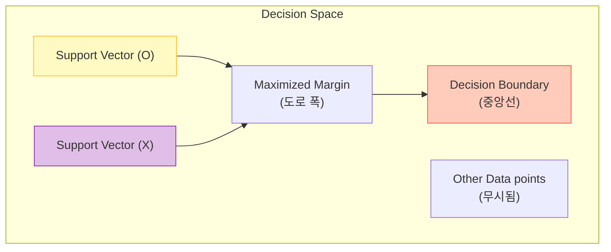

# Support Vector Machine (SVM)

## 1. 개요
데이터를 분류하는 **결정 경계(Decision Boundary)** 를 찾되, 클래스 간의 **간격(Margin)이 최대가 되는 경계** 를 찾는 알고리즘이다.

> [!abstract] 핵심 직관
> **"두 클래스 사이의 도로폭(Margin)을 가장 넓게 만드는 중앙선(Hyperplane)을 그어라."**

## 2. 최대 마진 분류기 (Hard Margin)
데이터가 완벽하게 선형 분리 가능할 때(Linearly Separable), 가장 이상적인 경계를 찾는다.

### 2.1. 핵심 수식
결정 경계가 $w^T x + b = 0$일 때, 경계에서 가장 가까운 데이터($x_i$)와의 거리는 다음과 같다.
$$
\text{Distance} = \frac{|w^T x_i + b|}{\|w\|}
$$
우리의 목표는 이 거리(Margin)를 최대화하는 것이다. 이는 수학적으로 **$\|w\|$를 최소화**하는 문제와 같다.
$$
\min_{w, b} \frac{1}{2}\|w\|^2 \quad \text{s.t.} \quad y_i(w^T x_i + b) \ge 1
$$

### 2.2. 서포트 벡터 (Support Vector)
모든 데이터가 경계를 결정하는 데 참여하지 않는다. 오직 **경계선에 가장 가까이 있는 데이터(도로의 가장자리에 있는 점들)** 만이 모델을 결정한다. 이를 **Support Vector**라 한다.

## 3. 소프트 마진 (Soft Margin) 
현실 데이터는 노이즈가 섞여 있어 완벽한 선형 분리가 불가능하다. 
따라서 **"도로 안쪽으로 침범하는 것을 약간 허용(Slack Variable)"** 하되, 그 대가로 페널티를 부과한다.
### 3.1. 최적화 문제 (Hinge Loss) 
마진 최대화($\|w\|^2$)와 에러 최소화($\sum \xi$) 사이의 균형을 맞춘다. 
$$ \min_{w, b} \left[ \underbrace{\frac{1}{2}\|w\|^2}_{\text{Margin Maximize}} + C \sum_{i=1}^{n} \underbrace{\xi_i}_{\text{Error Penalty}} \right] $$
또는 딥러닝의 Loss 형태(Hinge Loss)로 표현하면: 
$$ \min_{w, b} \sum_{i=1}^{n} \max(0, 1 - y_i(w^T x_i + b)) + \lambda \|w\|^2 $$
### 3.2. 파라미터 C와 $\lambda$의 관계 
모델의 복잡도를 결정하는 핵심 하이퍼파라미터다. ($C \propto \frac{1}{\lambda}$) 

| 파라미터 상태 | 의미 | 마진(Margin) | 모델 복잡도 | 위험 요소 |
| :--- | :--- | :--- | :--- | :--- | 
| **$C$ 큼 / $\lambda$ 작음** | 에러를 용납하지 않음 (Strict) | **좁아짐 (Narrow)** | 복잡함 | **Overfitting** | 
| **$C$ 작음 / $\lambda$ 큼** | 에러를 너그럽게 허용 (Soft) | **넓어짐 (Wide)** | 단순함 | **Underfitting** | 

> [!tip] 튜닝 포인트 > $C$가 너무 크면 이상치(Outlier) 하나 때문에 도로가 비틀거린다. 적절한 $C$를 찾아 일반화 성능을 높여야 한다.

## 4. 커널 (Kernel) 기법
데이터가 선형으로 분리되지 않을 때(예: 원형 분포), 데이터를 **고차원 공간으로 매핑**하여 선형 분리가 가능하게 만든다.

### 4.1. 커널 트릭 (Kernel Trick)
실제로 데이터를 고차원으로 변환($\phi(x)$)하면 연산량이 폭발한다. 대신, **내적 연산 $\langle x_i, x_j \rangle$만 고차원 공간의 함수 $K(x_i, x_j)$로 대체**하여 계산 비용을 줄인다.

### 4.2. 주요 커널 함수

| 종류             | 수식 $K(x_i, x_j)$                | 특징                  | 사용처                  |
| :------------- | :------------------------------ | :------------------ | :------------------- |
| **Linear**     | $x_i^T x_j$                     | 변환 없음               | 텍스트 분류 등 차원이 이미 높을 때 |
| **Polynomial** | $(1 + \gamma x_i^T x_j)^d$      | 다항식 곡선              | 이미지 처리 (옛날 방식)       |
| **RBF (RBF)**  | $\exp(-\gamma \|x_i - x_j\|^2)$ | **가우시안 분포** (무한 차원) | **가장 일반적인 비선형 SVM**  |

### 4.3. RBF 커널의 $\gamma$ (Gamma)
-   **$\gamma$ 높음**: 데이터 포인트 하나하나에 민감하게 반응 (뾰족한 산) $\to$ **Overfitting**
-   **$\gamma$ 낮음**: 부드러운 경계 (완만한 언덕) $\to$ **Underfitting**

## 5. 한 줄 요약
> **"SVM은 두 클래스 사이의 거리(Margin)를 최대화하는 최적의 선을 찾되(Hard), 에러를 허용하거나(Soft: C), 차원을 높여서(Kernel) 복잡한 경계를 그려낸다."**