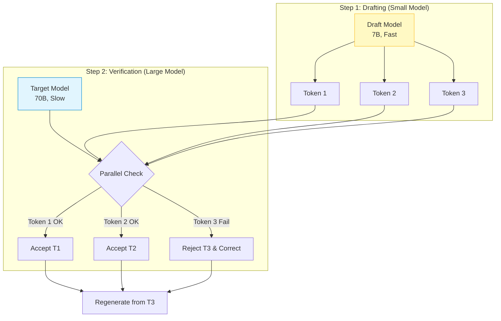

# Speculative Decoding

## 1. 개요
거대 언어 모델(Target Model)의 추론 속도를 높이기 위해, 작고 빠른 모델(Draft Model)이 먼저 '초안'을 쓰고 거대 모델이 이를 '검수'하는 방식이다.

> [!abstract] 핵심 아이디어
> **"인턴(Draft Model)이 보고서를 대충 써오면, 부장님(Target Model)은 그걸 읽고 수정만 한다."**
> 부장님이 처음부터 타이핑하는 것보다, 인턴이 쓴 걸 검토하는 게 훨씬 빠르다.

## 2. 등장 배경: Memory Bound 문제
LLM 추론은 **Memory Bandwidth Bound(메모리 대역폭 병목)** 상태다.
-   GPU가 연산을 못 해서 느린 게 아니라, **VRAM에서 가중치(Weight)를 꺼내오는 시간이 오래 걸려서** 느리다.
-   $N$개의 토큰을 생성하려면 가중치를 $N$번 꺼내와야 한다.
-   **핵심**: 가중치를 한 번 꺼내왔을 때, 토큰 1개가 아니라 **여러 개를 동시에 처리**하면 이득이다.

## 3. 작동 메커니즘 (Draft-and-Verify)
작은 모델($M_q$)과 큰 모델($M_p$)이 협력한다.

1.  **Drafting (추측)**: 작은 모델이 미래의 토큰 $K$개를 빠르게 생성한다. (예: "대한", "민국", "만세")
2.  **Verification (검증)**: 큰 모델이 이 $K$개 토큰을 **한 번의 Forward Pass(병렬 연산)** 로 채점한다.
3.  **Accept/Reject**: 큰 모델의 확률 분포와 비교하여, 맞으면 채택하고 틀리면 그 지점부터 다시 생성한다.

## 4. 수학적 원리 (Rejection Sampling) 
단순히 똑같은 단어인지 확인하는 것을 넘어, 확률 분포를 보정하여 **큰 모델이 혼자 생성했을 때와 수학적으로 동일한 분포**를 보장한다. 
### 4.1. 수식 Draft 모델의 확률 $q(x)$와 Target 모델의 확률 $p(x)$를 비교한다. 
$$ \text{Accept Probability } r = \min\left(1, \frac{p(x)}{q(x)}\right) $$
- $p(x) \ge q(x)$: 큰 모델이 더 높은 확률로 지지함 $\to$ **무조건 수락**. 
- $p(x) < q(x)$: 큰 모델이 덜 지지함 $\to$ **확률적으로 거부(Resample)**. 
### 4.2. 속도 향상 (Speedup) 
평균적으로 한 번의 Forward Pass당 생성되는 토큰 수 $\alpha$ (Acceptance Rate)가 클수록 빨라진다. 
$$ \text{Speedup} \approx \frac{1}{1 - \alpha + \frac{1}{\gamma}} $$
- $\gamma$: 모델 간 속도 비율 (작은 모델이 얼마나 빠른가). 
- 보통 코딩이나 요약 같은 뻔한 작업에서는 2~3배 빨라진다. 

### 4.3. 왜 결과 분포가 Target 모델 단독 생성과 정확히 같은가 (증명)
거부됐을 때 그냥 다시 샘플링하는 게 아니라, **보정된 분포** $\dfrac{\max(0,p(x)-q(x))}{\sum_{x'}\max(0,p(x')-q(x'))}$에서 다시 뽑는다. 이 설계 덕분에 최종적으로 토큰 $x$가 나올 확률이 정확히 $p(x)$가 됨을 증명할 수 있다.

토큰 $x$가 채택되는 경로는 두 가지뿐이다.
$$ P(x\text{ 채택}) = \underbrace{P(\text{draft가 }x\text{를 제안하고 수락됨})}_{\text{경로 1}} + \underbrace{P(\text{어떤 draft가 거부된 뒤, 보정 분포에서 } x\text{를 뽑음})}_{\text{경로 2}} $$

**경로 1**: draft가 $x$를 제안할 확률은 $q(x)$, 그걸 수락할 확률은 $\min(1, p(x)/q(x))$이므로
$$ q(x)\cdot\min\left(1,\frac{p(x)}{q(x)}\right)=\min(q(x),p(x)) $$

**경로 2**: 먼저 draft 토큰 $x'$을 뽑고서 거부할 확률은 $q(x')-p(x')$ (단, $p(x')>q(x')$이면 거부 확률은 0이므로 $\max(0,\cdot)$로 표현), 이를 모든 $x'$에 대해 합하면 총 거부 확률이 된다.
$$ P(\text{거부}) = \sum_{x'}\max(0,q(x')-p(x')) = \sum_{x'}\max(0,p(x')-q(x')) $$
(두 식이 같은 이유: $p,q$ 모두 합이 1이므로 $\sum(q-p)=0$, 즉 $\sum\max(0,q-p)=\sum\max(0,p-q)$.)

거부된 뒤 보정 분포에서 $x$가 뽑힐 확률은 (거부 확률) × (보정 분포에서 $x$일 확률) 이고, 분모가 그대로 약분되어
$$ \sum_{x'}\max(0,p(x')-q(x'))\cdot\frac{\max(0,p(x)-q(x))}{\sum_{x'}\max(0,p(x')-q(x'))}=\max(0,p(x)-q(x)) $$

**두 경로를 더하면**
$$ \min(q(x),p(x)) + \max(0,p(x)-q(x)) = p(x) $$
($p(x)\ge q(x)$이면 $q(x)+(p(x)-q(x))=p(x)$, $p(x)<q(x)$이면 $p(x)+0=p(x)$ — 어느 경우든 성립.)

즉 speculative decoding은 근사가 아니라, **draft 모델이 무엇이든 상관없이 최종 출력 분포가 target 모델 단독 생성과 수학적으로 완전히 동일함을 보장하는** 정확한(exact) 샘플링 기법이다.

## 5. 최신 변종 (Trend) 
별도의 Draft 모델을 로드하는 것이 메모리 낭비라는 지적에 따라 새로운 기법들이 등장했다. 

| 기법                   | 설명                                                 | 특징                 |
| :------------------- | :------------------------------------------------- | :----------------- |
| **Medusa**           | 별도 모델 대신, **모델 머리에 Head를 여러 개 달아서** 미래 토큰을 예측하게 함. | 추가 모델 불필요, 구조 간단   |
| **Lookahead**        | 모델 없이 **n-gram** 패턴 등을 이용해 자기 자신을 복제해서 추측함.        | 학습 불필요 (Zero-shot) |
| **Self-Speculative** | 모델의 **일부 레이어만 통과**시켜 Draft를 만듦.                    | 메모리 효율 최적화         |
| **EAGLE**            | 기존 임베딩에 '미래 정보'를 더해서 더 정확하게 추측함.                   | 현재 SOTA급 성능        |

## 6. 한 줄 요약 
> **"비싼 가중치 로딩 비용을 아끼기 위해, 싼 모델로 미리 질러보고(Speculate) 비싼 모델로 뒷수습(Verify)하는 기술."**