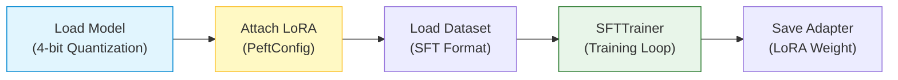

# Hands-on LLM Training (SFT + QLoRA)

## 1. 개요
최신 LLM(7B~70B)을 일반 GPU(Colab, 개인 서버)에서 학습시키기 위해 **Hugging Face `trl` 라이브러리**와 **QLoRA** 기법을 사용하는 실전 코드다.

> [!abstract] 학습 목표
> **"Pre-trained Model(멍청한 천재)에게 Instruction Dataset(족보)을 주입하여 QLoRA(가벼운 어댑터)만 빠르게 학습시킨다."**

## 2. 학습 파이프라인
전체 코드는 아래 흐름으로 진행된다.


## 3. 라이브러리 설치 및 모델 로드 
### 3.1. 필수 라이브러리 
```bash 
pip install torch transformers peft bitsandbytes trl accelerate
```
- `transformers`: 모델 로드 및 처리 핵심.
- `peft`: LoRA 등 효율적 튜닝 지원.
- `bitsandbytes`: 4-bit 양자화 지원.
- `trl`: SFTTrainer 등 LLM 학습 전용 도구.
### 3.2. 모델 로드 (4-bit Quantization)

메모리 절약을 위해 **NF4 (Normal Float 4)** 포맷으로 양자화하여 로드한다.
```python
import torch
from transformers import AutoTokenizer, AutoModelForCausalLM, BitsAndBytesConfig

# 1. 모델 ID 설정 (여기선 Qwen2.5-7B 예시)
model_id = "Qwen/Qwen2.5-7B-Instruct"

# 2. 양자화 설정 (QLoRA 핵심)
bnb_config = BitsAndBytesConfig(
    load_in_4bit=True,
    bnb_4bit_use_double_quant=True,     # 양자화 상수를 한 번 더 양자화 (메모리 절약)
    bnb_4bit_quant_type="nf4",          # LLM에 최적화된 정규분포 4bit
    bnb_4bit_compute_dtype=torch.bfloat16 # 연산은 16bit로 수행
)

# 3. 모델 로드
model = AutoModelForCausalLM.from_pretrained(
    model_id,
    quantization_config=bnb_config,
    device_map="auto" # GPU 자동 할당
)

# 4. 토크나이저 로드
tokenizer = AutoTokenizer.from_pretrained(model_id)
tokenizer.padding_side = 'right' # 훈련 시에는 right padding 권장
```
## 4. LoRA 설정 및 데이터셋 
### 4.1. LoRA Config (어댑터 설정) 
전체 파라미터를 얼리고(Freeze), 학습할 랭크($r$)를 설정한다. 
```python
from peft import LoraConfig, get_peft_model, prepare_model_for_kbit_training 
# 모델을 학습 가능한 상태로 전처리 (Gradient Checkpointing 등) 
model = prepare_model_for_kbit_training(model) 
# LoRA 설정 
peft_config = LoraConfig( 
	r=16, # Rank: 클수록 표현력 좋지만 메모리 많이 듦 (보통 8~64) 
	lora_alpha=32, # Scaling factor: 보통 r의 2배로 설정 
	lora_dropout=0.05, 
	bias="none", 
	task_type="CAUSAL_LM", 
	target_modules=["q_proj", "k_proj", "v_proj", "o_proj", "gate_proj", "up_proj", "down_proj"] # 모든 Linear Layer에 적용하는 것이 성능이 제일 좋음 (QLoRA 논문) 
	)
model = get_peft_model(model, peft_config)
model.print_trainable_parameters() 
# 결과 예: "trainable params: 20M || all params: 7B || trainable%: 0.28%"
```
### 4.2. 데이터셋 로드

Hugging Face의 `datasets` 라이브러리를 사용한다.
```python
from datasets import load_dataset

# 예시 데이터: databricks-dolly-15k (Instruction Dataset)
dataset = load_dataset("databricks/databricks-dolly-15k", split="train")

# 프롬프트 포맷팅 함수 (모델마다 다름, 아래는 일반적인 예시)
def formatting_prompts_func(example):
    output_texts = []
    for i in range(len(example['instruction'])):
        text = f"### Instruction:\n{example['instruction'][i]}\n\n### Response:\n{example['response'][i]}"
        output_texts.append(text)
    return output_texts
```
## 5. Trainer 실행 (SFTTrainer)
Hugging Face `trl`의 **SFTTrainer**는 복잡한 PyTorch Loop를 추상화하여 매우 간편하다.
### 5.1. 학습 인자 (Arguments) 설정
```python 
from transformers import TrainingArguments 
from trl import SFTTrainer
training_args = TrainingArguments( 
	output_dir="./results", 
	num_train_epochs=1, # 에폭 (보통 1~3) 
	per_device_train_batch_size=4, # 배치 사이즈 (GPU 메모리에 맞춰 조절) 
	gradient_accumulation_steps=4, # 그래디언트 누적 (배치 크기 키우는 효과) 
	learning_rate=2e-4, # QLoRA 표준 학습률 
	weight_decay=0.001, 
	fp16=False, 
	bf16=True, # Ampere(A100, 3090, 4090) 이상이면 bf16 추천 
	logging_steps=25, 
	optim="paged_adamw_32bit", # 메모리 부족 시 페이징 기법 사용 (중요) 
	lr_scheduler_type="cosine", # 학습률 스케줄러 
	)
```
### 5.2. 학습 시작	
```python
trainer = SFTTrainer(
    model=model,
    train_dataset=dataset,
    peft_config=peft_config,
    formatting_func=formatting_prompts_func, # 데이터 포맷팅 함수 연결
    max_seq_length=1024,                     # 문맥 길이 제한
    args=training_args,
    packing=False,                           # 여러 짧은 샘플을 하나로 묶을지 여부
)

trainer.train()
```
### 5.3. 저장 및 추론 테스트

학습된 것은 **LoRA 어댑터** 파일들이다. (`adapter_model.bin`, `adapter_config.json`)
```python
# 1. 어댑터 저장
trainer.save_model("./qwen2.5-7b-finetuned")

# 2. 추론 테스트
text = "### Instruction:\n양자 역학을 설명해줘.\n\n### Response:"
device = "cuda:0"
inputs = tokenizer(text, return_tensors="pt").to(device)

outputs = model.generate(**inputs, max_new_tokens=100)
print(tokenizer.decode(outputs[0], skip_special_tokens=True))
```
## 6. 요약

> "BitsAndBytes로 4bit 로드 $\to$ PEFT로 LoRA 부착 $\to$ SFTTrainer로 학습 $\to$ 어댑터만 저장."
> 
> 이 4단계가 2025년 기준 LLM 파인튜닝의 표준 절차다.

