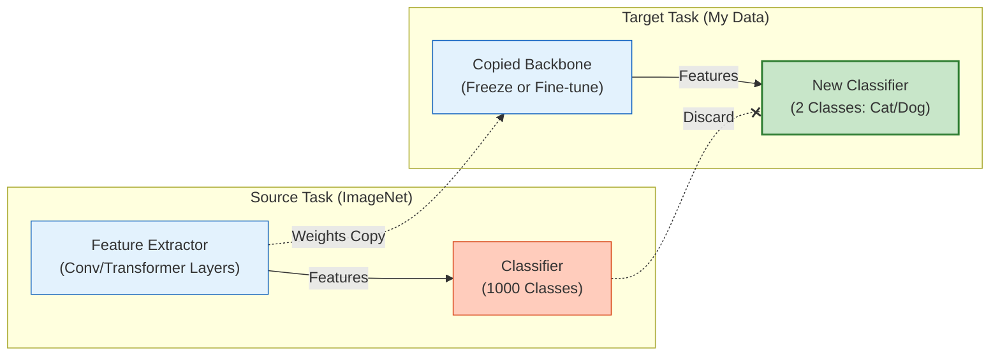

# Transfer Learning (전이 학습)

## 1. 개요
거대 데이터셋(ImageNet, WebText 등)으로 학습된 **Pre-trained Model의 지식(가중치)**을 가져와서, 데이터가 적은 **새로운 작업(Target Task)**에 재사용하는 기법이다.

> [!abstract] 핵심 철학
> **"바퀴를 다시 발명하지 마라 (Don't reinvent the wheel)."**
> 남이 수천억 원 들여 학습한 모델의 '특징 추출 능력'만 빌려와서 내 문제만 푼다.

## 2. 언제, 어떻게 쓰는가? (4가지 시나리오)
내 데이터의 양과 유사도에 따라 전략이 달라진다.

| 내 데이터 양 | 기존 데이터와 유사도 | 추천 전략 | 비고 |
| :--- | :--- | :--- | :--- |
| **적음** | **높음** | **Feature Extraction** | Backbone 고정(Freeze), 분류기만 학습 (가장 흔함) |
| **많음** | **높음** | **Fine-tuning** | 전체 모델 미세 조정 (성능 극대화) |
| **적음** | **낮음** | **난감함** | 초기 레이어만 쓰고 나머지는 재학습 (과적합 위험) |
| **많음** | **낮음** | **Train from Scratch** | 굳이 전이 학습을 할 필요가 없을 수도 있음 |

## 3. 구조적 프로세스
가장 일반적인 "Head Replacement" 방식의 도식이다.

## 4. 상세 기법 
### 4.1. Feature Extraction (특징 추출) 
Backbone(CNN/Transformer)을 **고정된(Frozen) 함수**로 취급한다. 
- **작동**: 입력 $x$를 Backbone에 통과시켜 특징 벡터 $f(x)$를 얻고, 이 벡터로 얕은 분류기(Linear Layer, SVM 등)만 학습시킨다. 
- **장점**: 연산 비용이 매우 적고, 데이터가 적어도 과적합(Overfitting)이 잘 안 일어난다. 
### 4.2. Fine-tuning (미세 조정) 
Backbone의 가중치도 함께 업데이트한다. (보통 학습률을 매우 낮게 설정: $1e-5$ 이하)
- **작동**: Pre-trained Weight를 초기값(Initialization)으로 사용하고, 전체 네트워크를 역전파로 학습한다. 
- **주의**: 데이터가 너무 적으면 사전 학습된 지식이 파괴(Catastrophic Forgetting)되거나 과적합될 수 있다. 
 >[!tip] 최신 트렌드: PEFT 
>최근 LLM에서는 전체 Fine-tuning이 너무 무겁기 때문에, [[LoRA]]나 Adapter 같은 **PEFT(Parameter-Efficient Fine-Tuning)** 기법이 사실상 표준 전이 학습 방법으로 자리 잡았다. 
## 5. 핵심 수식 (Domain & Task) 
전이 학습을 수학적으로 정의하면 다음과 같다. 
- **Domain $\mathcal{D}$**: 특징 공간 $\mathcal{X}$와 확률 분포 $P(X)$
- **Task $\mathcal{T}$**: 레이블 공간 $\mathcal{Y}$와 예측 함수 $f(\cdot)$
**목표**: 소스 도메인 $\mathcal{D}_S$와 태스크 $\mathcal{T}_S$에서 얻은 지식을 활용하여, 타겟 태스크 예측 함수 $f_T(\cdot)$의 성능을 높이는 것. 
$$ P(Y_T | X_T) \approx P(Y_S | X_S) \quad \text{(가정: 공유된 특징이 존재함)} $$
## 6. Transfer Learning vs Continual Learning
사용자가 자주 혼동하는 두 개념의 결정적 차이다.

| 구분 | Transfer Learning (이직) | Continual Learning (자기계발) |
| :--- | :--- | :--- |
| **목적** | **Target Task 성능 극대화** | **모든 Task 성능 유지** (과거 기억 보존) |
| **과거 지식** | Target에 도움 안 되면 **잊어도 됨** | 절대 잊으면 안 됨 (**No Forgetting**) |
| **데이터** | Source 데이터는 보통 버림 | 과거 데이터 접근이 제한됨 (Replay buffer만 허용) |
| **비유** | "수능 공부(Source) 바탕으로 코딩(Target) 배우기" | "국어, 영어, 수학을 순서대로 다 잘하기" |

## 7. 한 줄 요약
> **"Transfer Learning은 거인의 어깨 위에 올라타서 내 사과를 따는 기술이고, Continual Learning은 거인이 사과도 따고 배도 따고 감도 따면서 아무것도 안 까먹게 만드는 기술이다."**