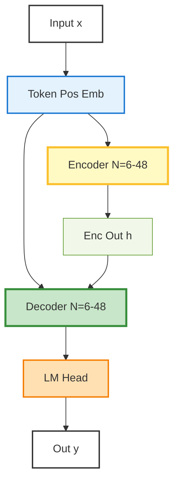
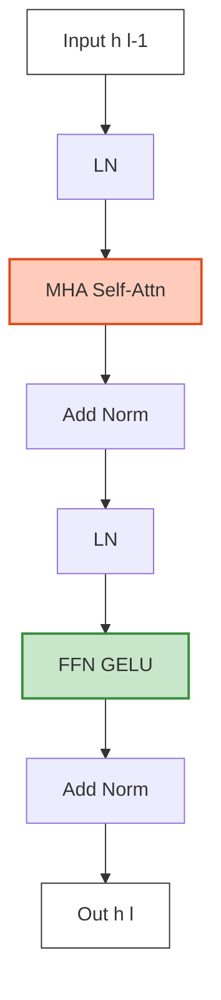

# Transformer

> “Attention is All You Need” 이후 8년, 여전히 모든 LLM의 뼈대  
> → MoE도, Retrieval도, State Space도 결국 이 위에 얹는 거다

## 1. 전체 구조

# 2. Encoder Decoder 하나의 레이어 구조

# 3. 핵심 수식
\[
\begin{align} 
&\text{1. Scaled Dot-Product Attention (한 헤드)} \ &\quad \text{Attention}(Q,K,V) &= \text{softmax}\left(\frac{QK^T}{\sqrt{d_k}}\right)V \[1em]

&\text{2. Multi-Head Attention} \ &\quad \text{MultiHead}(Q,K,V) &= \text{Concat}(\text{head}_1,\dots,\text{head}_h)W^O \ &\quad \text{head}_i &= \text{Attention}(QW_i^Q, KW_i^K, VW_i^V) \[1em]

&\text{3. Position-wise Feed-Forward} \ &\quad \text{FFN}(x) &= \max(0, xW_1 + b_1)W_2 + b_2 \quad \text{(ReLU/GELU)} \ &\quad &\text{→ 2025년은 대부분 SwiGLU: } (xW_1 \odot \text{SiLU}(xV_1))W_2 \[1em]

&\text{4. Residual + LayerNorm (Pre-Norm이 표준)} \ &\quad \text{LayerOutput} &= \text{LayerNorm}(x + \text{Sublayer}(x)) \[1em]

&\text{5. Positional Encoding (원래 논문)} \ &\quad PE_{(pos,2i)} &= \sin(pos / 10000^{2i/d}) \ &\quad PE_{(pos,2i+1)} &= \cos(pos / 10000^{2i/d}) \ &\quad &\text{→ 2025년은 RoPE (Rotary Positional Embedding)가 압도적 표준} 
\end{align}
\]

# 4. 실무에서 쓰이는 Transformer 변종
| 변종             | 핵심 변화점                            | 대표 모델                       |
| -------------- | --------------------------------- | --------------------------- |
| Pre-Norm       | LayerNorm을 sublayers 앞에           | GPT-3, Llama, PaLM, Gemma   |
| RMSNorm        | LayerNorm → 제곱합으로 정규화             | Llama, Mistral, Qwen2       |
| SwiGLU         | ReLU → SwiGLU 활성화                 | Llama-2, PaLM-2, Mixtral    |
| RoPE           | Sinusoidal → Rotary Embedding     | Llama, PaLM, Mistral, Gemma |
| GQA / MQA      | KV 헤드 공유 → 속도 2~4배                | Llama-2 70B, Mistral-7B     |
| Sliding Window | Full attention → window attention | Mistral, Phi-3              |
# 5. 한 줄 요약
>입력 → Embedding + RoPE → N번 반복 (Pre-Norm → Multi-Head Self-Attention → Residual → Pre-Norm → SwiGLU FFN → Residual) → LM Head 이 구조만 알면 MoE도, Retrieval도, Long-Context도 다 설명 가능

