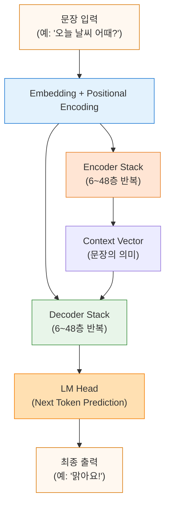
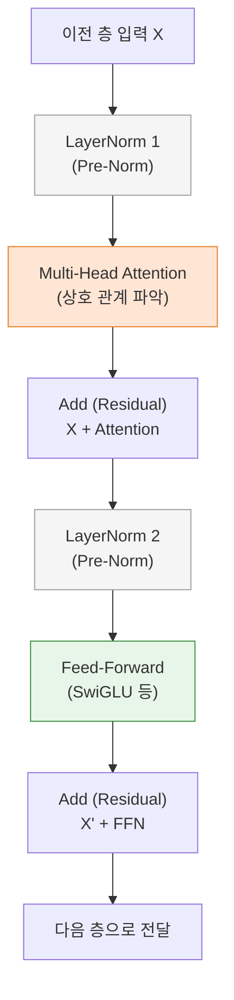

# 0. 개요
2017년 구글의 "Attention Is All You Need" 논문에서 제안된 아키텍처이다. 등장 이후 8년이 지났지만, 최신 기술인 MoE(Mixture of Experts), Retrieval(RAG), Mamba 등도 결국 이 구조 위에 얹어지는 부품일 뿐, 거대한 뼈대는 변하지 않았다. 

> [!abstract] 핵심 철학 
> **"복잡한 재귀(RNN)나 합성곱(CNN) 없이, 오직 어텐션(Attention)만으로 충분하다."**

# 1. 전체 구조
- Transformer는 크게 입력을 이해하는 **Encoder**와 출력을 생성하는 **Decoder**로 나뉜다. 
	- 최신 LLM인 GPT 계열은 Decoder만 사용하기도 한다.

### 구조적 특징 
1. **입력 임베딩**: 텍스트를 벡터로 변환하고 위치 정보(Positional Encoding)를 더한다. 
2. **Encoder**: 입력 문맥을 깊이 있게 이해하여 '의미 벡터'를 생성한다. 
3. **Decoder**: Encoder가 만든 의미 벡터와 이전에 생성한 단어들을 참고하여 다음 단어를 예측한다.
# 2. 레이어 상세 구조 (Encoder/Decoder Block)

- **LayerNorm**: 데이터 값들이 너무 커지거나 작아지지 않게 정규화하여 학습 안정을 돕는다. (Pre-Norm 방식이 대세) 
- **Self-Attention**: "현재 단어가 문장 내의 다른 어떤 단어와 연관되는가?"를 계산한다. (문맥 파악) 
- **Residual Connection (잔차 연결)**: $x + f(x)$ 형태로, 연산 전의 정보를 더해주어 정보 손실을 막고 학습을 돕는다. 
- **Feed-Forward Network (FFN)**: 어텐션으로 모은 정보를 바탕으로 심층적인 특징을 추출하고 처리한다. ("생각을 정리하는 단계")
# 3. 핵심 수식
[[Attention]] 메커니즘 사용
$$ \text{Attention}(Q, K, V) = \text{softmax}\left( \frac{QK^T}{\sqrt{d_k}} \right) V $$ - **$Q$ (Query)**: 질문 ("나랑 관련된 애 누구야?") 
- **$K$ (Key)**: 색인 ("나 여기 있어") 
- **$V$ (Value)**: 내용 ("내 정보는 이거야") 
- **$\sqrt{d_k}$**: 차원이 커져도 내적 값이 폭발하지 않도록 나누어주는 스케일링 팩터(Insurance).

### Feed-Forward Network (FFN) 
과거에는 ReLU를 썼으나, 최근엔 학습 안정성이 높은 **SwiGLU**를 주로 쓴다.
$$ \begin{aligned} \text{Old (ReLU)} &: \text{ReLU}(xW_1 + b_1)W_2 \\ \text{New (SwiGLU)} &: \text{Swish}(xW_G) \otimes (xW_1) W_2 \end{aligned} $$
### Positional Encoding (위치 정보) 
순서 정보가 없는 Attention에 위치 정보를 주입한다. 
- **Original (2017)**: $\sin, \cos$ 함수를 이용한 고정된 절대 위치 값. 
- **Modern (RoPE)**: **Rotary Positional Embedding**. 벡터를 회전시켜 상대적인 위치 관계를 보존한다. Llama, Qwen 등이 채택하여 수십만 토큰 길이도 처리가 가능하다.
# 4. 실무에서 쓰이는 Transformer 변종

| 컴포넌트 | 변화점 (Key Change) | 적용 모델 예시 |
| :--- | :--- | :--- |
| **Normalization** | **Pre-Norm / RMSNorm** 입력 값을 평균 0, 분산 1로 맞추되, 평균 연산을 빼서 속도를 높임 | Llama 2/3, Mistral, Gemma |
| **Activation** | **SwiGLU** ReLU보다 미분 가능 구간이 부드러워 학습이 잘 됨 | Llama, PaLM, Mixtral |
| **Position** | **RoPE (Rotary)** 절대 위치 대신 회전 변환으로 상대 위치를 학습 | Llama, PaLM, Gemma |
| **Attention** | **GQA / MQA** Key, Value 헤드 수를 줄여 메모리 절약 및 속도 2~4배 향상 | Llama-2 70B, Mistral |
| **Context** | **Sliding Window** 전체를 다 보지 않고 특정 윈도우만 보며 연산량 감소 | Mistral, Phi-3 |

# 5. 한 줄 요약
> **Modern Transformer Recipe:**
> 입력 $\to$ Emb(+RoPE) $\to$ $N$번 반복 [ RMSNorm $\to$ Attention(GQA) $\to$ Residual $\to$ RMSNorm $\to$ SwiGLU $\to$ Residual ] $\to$ LM Head