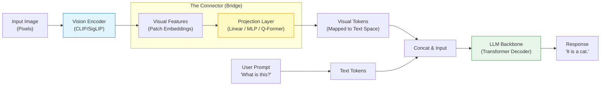
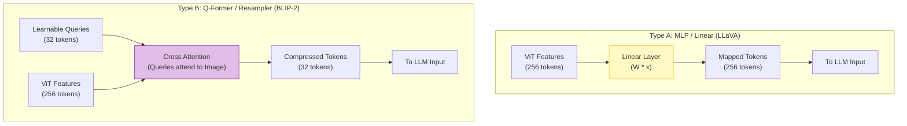

# VLM Architecture (Vision-Language Model)

## 1. 개요
VLM은 텍스트만 이해하던 LLM에게 '**눈(Vision Encoder)**'을 달아주어, 이미지를 보고 대화할 수 있게 만든 모델이다.
핵심은 "**이미지의 픽셀 정보를 언어 모델이 이해할 수 있는 단어(토큰) 벡터 공간으로 변환(Projection)하여 주입하는 것**"이다.

> [!abstract] 핵심 파이프라인
> **Input Image $\xrightarrow{\text{Vision Encoder}}$ Visual Embeddings $\xrightarrow{\text{Connector}}$ Text Embeddings $\xrightarrow{\text{LLM}}$ Answer**

## 2. 메인 아키텍처 (LLaVA Style)
가장 표준적인 구조(LLaVA, GPT-4V 등)는 **Vision Encoder + Connector + LLM**의 3단 합체 로봇 형태다.



### 구성 요소
1.  **Vision Encoder**: 이미지를 처리하여 특징(Feature)을 추출한다. (예: [[ViT]], CLIP-ViT, SigLIP)
2.  **Connector (Adapter)**: 이미지 특징 벡터의 차원을 LLM의 텍스트 임베딩 차원과 맞추고, 언어적 공간으로 변환한다.
3.  **LLM Backbone**: 변환된 이미지 토큰을 텍스트 프롬프트와 함께 입력받아 답변을 생성한다. (예: Vicuna, Llama-3, Qwen)

### 구체적 차원 추적 (LLaVA 예시)
실제 텐서 shape가 어떻게 변해가는지 따라가 보면 파이프라인이 명확해진다 (LLM 차원 $D=4096$, CLIP 차원 1024 가정).

```text
Image [224, 224, 3]
    ↓ patchify (14x14 패치)
Patches [256, 588]                     # 256 = (224/14)^2, 588 = 14*14*3
    ↓ linear projection (패치별 독립 적용)
Patch embeddings [256, 1024]
    ↓ CLS 토큰 추가 + position embedding
Sequence [257, 1024]
    ↓ CLIP (24-layer transformer encoder)
CLIP output [256, 1024]                # CLS 제외
    ↓ projection W (토큰별 독립 적용)
Visual embeddings [256, 4096]
    ↓ 텍스트 임베딩 [N, 4096]과 concat
Full sequence [256+N, 4096]
    ↓ LLM transformer
```

여기서 "Connector"가 하는 일은 정확히 **CLIP output [256,1024] → Visual embeddings [256,4096]** 구간의 projection이다 (§4.1 Linear Projection과 동일한 $H_v = W \cdot Z_v + b$).

## 3. Vision Encoder: CLIP의 역할 
단순히 이미지를 분류하는 모델(ResNet 등)보다는, **이미지와 텍스트의 관계를 이미 알고 있는 모델**을 인코더로 쓰는 것이 유리하다. 그래서 **CLIP**을 주로 사용한다. 
### 3.1. 왜 CLIP인가? 
CLIP(Contrastive Language-Image Pre-training)은 인터넷상의 수억 쌍의 (이미지, 캡션) 데이터를 대조 학습(Contrastive Learning)하여, **이미지 벡터와 텍스트 벡터를 같은 공간에 정렬(Alignment)**시켜 둔 모델이다. 
- **장점**: CLIP을 통과한 이미지 임베딩은 이미 어느 정도 언어적 의미를 함유하고 있다. 
- **구조**: 보통 CLIP의 **Visual Encoder(ViT)** 부분만 떼어내서 VLM의 '눈'으로 사용한다. 

### 3.2. 핵심 수식 (Contrastive Loss) 
CLIP이 학습한 원리다. $N$개의 이미지-텍스트 쌍이 있을 때, 정답 쌍의 내적(유사도)은 최대화하고 오답 쌍은 최소화한다. 
$$ \mathcal{L}_{i}^{(v \to t)} = - \log \frac{\exp(\text{sim}(I_i, T_i) / \tau)}{\sum_{j=1}^{N} \exp(\text{sim}(I_i, T_j) / \tau)} $$
- $I$: 이미지 임베딩, $T$: 텍스트 임베딩 
- $\text{sim}$: 코사인 유사도 ($I \cdot T^T$) 
- $\tau$: Temperature parameter

## 4. The Connector: 내부 연결 방식
Vision Encoder에서 나온 벡터(ViT의 Patch Embedding)를 LLM에 어떻게 넣어줄 것인가? 
이 **연결 부위**가 VLM 기술의 핵심이다.



### 4.1. Linear Projection (LLaVA 방식)
가장 단순하고 강력한 방식이다. 이미지 벡터 $Z_v$에 학습 가능한 행렬 $W$를 곱해 LLM 차원으로 변환한다.
$$
H_v = W \cdot Z_v + b
$$
-   **특징**: 단순하지만 성능이 매우 뛰어나다. 이미지 토큰을 마치 "외국어 단어"처럼 취급하여 LLM에 넣어버리는 방식이다.

### 4.2. Q-Former (BLIP-2 방식)
단순 투영은 이미지 정보 손실이 크거나 토큰 수가 너무 많을 수 있다. **Learnable Query**를 이용해 핵심 정보만 추출한다.
-   **구조**: 별도의 작은 Transformer(Q-Former)를 두고, 고정된 개수(예: 32개)의 Query 벡터가 이미지 인코더의 출력과 **[[Cross Attention]]** 을 수행한다.
-   **장점**: 긴 이미지 토큰 시퀀스를 짧고 압축된 형태로 요약하여 LLM에 전달한다.

### 4.3. Cross-Attention (Flamingo 방식)
이미지 토큰을 LLM 입력(프롬프트)에 직접 붙이지 않고, LLM 내부의 Attention 레이어 사이에 **새로운 Gated Cross-Attention 레이어**를 끼워 넣는다.
$$
y = \text{tanh}(\alpha) \cdot \text{Attention}(x_{\text{text}}, x_{\text{img}}, x_{\text{img}}) + x_{\text{text}}
$$
-   **특징**: 텍스트 생성을 하다가 필요할 때마다 이미지를 "컨닝"하는 구조다.

## 5. 학습 파이프라인 (Training Recipe) 
보통 2단계(Two-stage) 학습을 진행한다. (LLaVA 기준) 
### Stage 1: Pre-training (Feature Alignment) 
- **상태**: Vision Encoder(Freeze), LLM(Freeze), **Connector(Train)**. 
- **데이터**: 이미지-캡션 쌍 (CC3M 등).
- **목적**: "이미지 벡터를 LLM이 해석 가능한 단어 벡터 공간으로 위치 이동시키기." 
### Stage 2: Visual Instruction Tuning 
- **상태**: Vision Encoder(Freeze), **LLM(Train)**, **Connector(Train)**. 
- **데이터**: 시각적 문답 데이터 (VQAv2, LLaVA-Instruct 등). 
- **목적**: "이미지를 보고 사용자의 복잡한 지시사항(Instruction)을 따르는 능력 배양." 
- **Loss Function**: 텍스트 생성과 동일한 Auto-regressive Loss를 사용하되, 이미지 $X_v$가 조건부로 들어간다. 
$$ P(Y|X_v, X_{\text{instruct}}) = \prod_{i=1}^{L} P(y_i | X_v, X_{\text{instruct}}, y_{<i}) $$
## 6. 해상도 문제: 고정 해상도의 한계와 최신 해법
초기 VLM들은 입력 이미지 크기가 고정(예: 224×224)되어 있었다. §2의 파이프라인에서 보듯 패치 수가 항상 256개로 고정되므로, position embedding도 $[256, D]$ shape로 학습되어 다른 해상도나 종횡비의 이미지는 처리할 수 없었다 — 단지 "학습된 position embedding 개수가 고정"되어 있었기 때문에 생긴 제약이다.

### 6.1. LLaVA-NeXT: Dynamic Resolution
고해상도 이미지를 여러 개의 crop으로 쪼갠 뒤, 각 crop을 Vision Encoder로 독립적으로 인코딩하고 그 결과를 이어붙인다(concatenate). 인코더나 Connector 구조를 바꾸지 않고 해상도 문제를 우회하는 방식이다.

### 6.2. Qwen2-VL: 2D-RoPE
패치 크기 자체는 고정하되, 학습된 절대 position embedding 대신 **2D-RoPE**를 쓴다.
- 각 패치의 위치를 (row, column) 좌표로 인코딩
- RoPE가 실시간으로(on-the-fly) 위치 인코딩을 생성하므로, 학습된 고정 개수의 position embedding 테이블이 필요 없음
- 결과적으로 임의의 해상도와 종횡비로 일반화 가능

>[!tip] 이해(Understanding) vs 생성(Generation)의 아키텍처 분리
> 현재 주류 패러다임은 방향에 따라 서로 다른 구조를 쓴다.
> - **이해(understanding)**: ViT 인코더 → feature 추출 (본 노트가 다루는 LLaVA류 구조)
> - **생성(generation)**: 픽셀 공간에서 동작하는 diffusion 모델
> 즉 "이미지를 보는" 모델과 "이미지를 그리는" 모델이 현재는 서로 다른 접근을 취하는 경우가 많다.

## 7. 요약 비교
| 모델           | Vision Encoder         | Connector         | LLM            | 특징                     |
| :----------- | :--------------------- | :---------------- | :------------- | :--------------------- |
| **LLaVA**    | CLIP ViT-L             | Linear Projection | Vicuna / Llama | 단순함의 승리, 현재 오픈소스 표준    |
| **BLIP-2**   | ViT                    | Q-Former          | OPT / Flan-T5  | 쿼리 기반 압축, 가벼운 연산       |
| **Flamingo** | Normalizer-Free ResNet | Gated Cross-Attn  | Chinchilla     | In-context Learning 강점 |
| **GPT-4V**   | (추정) CLIP-like         | (추정) Advanced MLP | GPT-4          | 압도적 성능, 세부 사항 비공개      |
| **LLaVA-NeXT** | CLIP ViT-L (multi-crop) | Linear Projection | Vicuna / Llama | 고해상도 이미지를 crop으로 분할 처리 |
| **Qwen2-VL** | ViT + 2D-RoPE           | MLP                | Qwen2          | 임의 해상도/종횡비 지원          |

## 8. 한 줄 요약 
> **"VLM은 잘 훈련된 눈(CLIP)과 뇌(LLM)를 준비하고, 그 사이를 통역기(Connector)로 연결해 '이미지 토큰'을 '단어'처럼 읽게 만든 모델이다."**