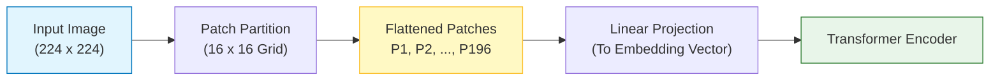
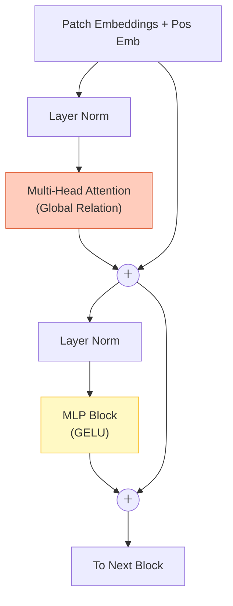

# Vision Transformer (ViT)

## 1. 개요
2020년 구글이 발표한 모델로, **"CNN 없이도 Transformer만으로 이미지 처리가 가능하다"** 는 것을 증명했다. 
현재 대다수 VLM(LLaVA, GPT-4V, Gemini)의 눈(Vision Encoder) 역할을 담당하는 표준 아키텍처다.

> [!abstract] 핵심 아이디어
> **"An Image is worth 16x16 Words."**
> 문장을 단어 단위로 쪼개듯, 이미지를 **패치(Patch) 단위로 쪼개서** 일렬로 나열하면 Transformer에 넣을 수 있다.

## 2. VLM에서의 역할
CNN(ResNet 등)은 이미지를 3차원 덩어리(Feature Map)로 처리하지만, ViT는 이미지를 **토큰 시퀀스(1D Vectors)** 로 변환한다.
-   **이점**: 텍스트 토큰과 구조가 똑같아지므로, [[10_VLM_Architecture|Connector]]를 통해 LLM과 결합하기가 훨씬 수월하다.

## 3. 작동 메커니즘 (The Pipeline) 
### 3.1. Patch Embedding (이미지 조각내기)
이미지 $x \in \mathbb{R}^{H \times W \times C}$를 고정된 크기의 패치 $P \times P$로 자른다. 
- 보통 $P=16$ (즉, $16 \times 16$ 픽셀이 하나의 단어가 됨). 
- 패치 개수 $N = HW / P^2$. (예: $224 \times 224$ 이미지 $\to$ 196개 패치). 각 패치는 납작하게 펴진(Flatten) 뒤, 행렬 $E$와 곱해져 임베딩 벡터가 된다. 
$$ z_0 = [x_p^1 E; x_p^2 E; \cdots; x_p^N E] + E_{pos} $$
### 3.2. Learnable `[CLS]` Token 
BERT의 아이디어를 차용하여, 패치 시퀀스 맨 앞에 **`[CLS]`(Class)** 토큰을 하나 추가한다. 
- 이 토큰은 이미지의 모든 패치와 어텐션을 주고받으며 **"이미지 전체의 함축적 의미"** 를 담게 된다. 
- **VLM 활용**: CLIP 모델 등에서는 이 `[CLS]` 토큰의 최종 출력 벡터 하나만을 꺼내서 이미지 전체의 임베딩으로 사용한다. (단, LLaVA 등은 모든 패치 토큰을 다 쓴다.) 

### 3.3. Position Embedding 
Transformer는 순서를 모른다(Permutation Invariant). 
따라서 패치가 그림의 **어느 위치(좌상단, 우하단 등)** 에 있었는지 알려주는 위치 정보를 더해준다. ($E_{pos}$)
## 4. 아키텍처 상세

Transformer Encoder 구조를 그대로 사용한다.
1.  **MSA (Multi-Head Self-Attention)**: 패치끼리 서로 관계를 파악 ("강아지 귀 패치를 보니 아래쪽 꼬리 패치랑 연관이 있네").
2.  **MLP (Multi-Layer Perceptron)**: GELU 활성화 함수를 사용해 특징을 추출.
3.  **[[Layer Normalization|Layer Norm]] (LN)**: 각 블록 앞단에 적용 (Pre-Norm).

## 5. ViT vs CNN (Inductive Bias)

| 구분 | CNN (ResNet, EfficientNet) | ViT (Vision Transformer) |
| :--- | :--- | :--- |
| **시야각 (Receptive Field)** | 국소적 (Local). 주변 픽셀만 봄. | **전역적 (Global)**. 처음부터 모든 패치를 다 봄. |
| **Inductive Bias** | **강함**. (이미지는 지역적이고 평행이동 불변하다는 가정) | **약함**. (데이터 간의 관계를 스스로 학습해야 함) |
| **데이터 효율성** | 적은 데이터로도 학습 잘 됨. | **대규모 데이터(JFT-300M, LAION) 필수**. |
| **확장성 (Scaling)** | 일정 수준 넘으면 성능 포화. | **데이터가 많을수록 성능이 계속 오름**. |

> [!tip] 왜 VLM은 ViT를 쓰는가?
> VLM은 인터넷상의 수십억 장 이미지(LAION-5B 등)를 학습한다. 데이터가 무지막지하게 많을 때는 Inductive Bias가 적은 ViT가 CNN보다 훨씬 더 높은 성능 한계치(Capacity)를 가지기 때문이다.

## 6. 한 줄 요약 
> **"이미지를 16x16 조각으로 잘라서 단어처럼 취급했더니, CNN보다 더 크게(Scalable) 똑똑해지더라."**