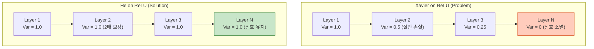

# Weight Initialization (가중치 초기화)

## 1. 개요
신경망 학습을 시작할 때, 파라미터(Weight)에 **어떤 초기값을 줄 것인가**를 결정하는 기법이다.
초기화가 잘못되면 Gradient Vanishing/Exploding이 발생하여 학습이 아예 진행되지 않는다.

> [!abstract] 핵심 목표
> **"전방(Forward) 전달 시 신호의 분산(Variance)이 일정하게 유지되고, 역방향(Backward) 전달 시 그래디언트의 분산도 일정하게 유지되도록 만든다."**

## 2. 절대 하면 안 되는 초기화 (Bad Practices)

### 2.1. 0으로 초기화 (Zero Initialization)
모든 가중치를 0으로 설정하면 ($W=0$), 모든 뉴런이 똑같은 연산을 수행하게 된다.
-   **대칭성 문제 (Symmetry Breaking)**: 역전파 시 모든 뉴런이 똑같은 그래디언트를 받게 되어, 아무리 학습해도 **모든 뉴런이 똑같은 값**을 갖게 된다. (신경망이 1개의 뉴런처럼 동작함)

### 2.2. 너무 작거나 큰 랜덤 초기화
-   **너무 작음 ($W \approx 0$)**: 층을 지날수록 신호가 0으로 수렴 $\to$ **Vanishing Gradient**.
-   **너무 큼 ($W \gg 1$)**: 층을 지날수록 값이 폭발하거나, 활성화 함수(Sigmoid/Tanh)의 양 끝단(Saturation)에 도달해 미분값이 0이 됨 $\to$ **Exploding / Vanishing**.

## 3. 고전적 초기화: Xavier (Glorot)
2010년 *Glorot & Bengio*가 제안했다. **Sigmoid**나 **Tanh** 함수에 적합하다.

### 3.1. 핵심 아이디어
"입력($X$)의 분산과 출력($Y$)의 분산이 같아야 한다."
-   입력 노드 수: $n_{\text{in}}$ (Fan-in)
-   출력 노드 수: $n_{\text{out}}$ (Fan-out)

### 3.2. 수식
정규분포(Normal)와 균등분포(Uniform) 두 가지 방식이 있다.

$$
\begin{align}
W &\sim \mathcal{N}\left(0, \sqrt{\frac{2}{n_{\text{in}} + n_{\text{out}}}}\right) \\
W &\sim \mathcal{U}\left(-\sqrt{\frac{6}{n_{\text{in}} + n_{\text{out}}}}, \sqrt{\frac{6}{n_{\text{in}} + n_{\text{out}}}}\right)
\end{align}
$$
-   **문제점**: **ReLU**를 사용하면 음수값이 0이 되어버려 분산이 절반으로 깎인다. 층이 깊어질수록 신호가 소실된다.

## 4. 현대적 초기화: He Initialization
2015년 *Kaiming He (ResNet 저자)*가 제안했다. **ReLU** 계열 함수에 최적화된 표준이다.

### 4.1. 핵심 아이디어
ReLU는 입력의 절반(음수)을 0으로 만드므로, **Xavier보다 분산을 2배 더 키워야** 신호 강도가 유지된다.
-   $n_{\text{out}}$은 고려하지 않고, **$n_{\text{in}}$(Fan-in)** 만 고려한다.

### 4.2. 수식
$$
\begin{align}
W &\sim \mathcal{N}\left(0, \sqrt{\frac{2}{n_{\text{in}}}}\right) \\
W &\sim \mathcal{U}\left(-\sqrt{\frac{6}{n_{\text{in}}}}, \sqrt{\frac{6}{n_{\text{in}}}}\right)
\end{align}
$$
-   **Xavier와의 차이**: 분모에 $n_{\text{out}}$이 없고, 분자가 2배 더 크다.

## 5. 요약 및 선택 가이드

| 활성화 함수 (Activation) | 추천 초기화 (Initialization) | 이유 |
| :--- | :--- | :--- |
| **Sigmoid / Tanh** | **Xavier (Glorot)** | 선형 구간(0 부근)을 잘 활용하기 위함 |
| **ReLU / Leaky ReLU** | **He (Kaiming)** | 절반이 0이 되는 것을 보상하기 위함 |
| **SELU** | **LeCun Normal** | 자체 정규화(SNN) 특성을 유지하기 위함 |
| **GELU / Swish** | **He (Kaiming)** | ReLU와 유사한 특성이므로 He 사용 |

> [!tip] 실무 팁
> 고민할 필요 없이 **"ReLU 류를 쓴다면 무조건 He Initialization"**을 쓰면 된다. PyTorch나 TensorFlow의 기본값도 이를 따른다.

## 6. 심화 초기화 기법

딥러닝 모델이 더 깊어지고 특수한 구조(RNN, Norm-Free)가 등장하면서 개발된 기법들이다.

### 6.1. Orthogonal Initialization (직교 초기화)
가중치 행렬 $W$를 **직교 행렬(Orthogonal Matrix)**로 초기화하는 기법이다. (Saxe et al., 2013)

-   **수식 조건**: $W^T W = I$ (또는 $W W^T = I$).
-   **핵심 원리**: 직교 행렬의 고유값(Eigenvalue) 절댓값은 모두 1이다. 따라서 행렬 곱을 아무리 반복해도 벡터의 크기(Norm)가 커지거나 작아지지 않고 **보존(Isometry)** 된다.
-   **용도**: 순환 신경망(**RNN, LSTM, GRU**)이나 매우 깊은 네트워크에서 **Exploding/Vanishing Gradient**를 방지하는 데 탁월하다.

### 6.2. Fixup Initialization (Fixed-Update)
"Batch Normalization(BN)이나 Layer Norm 없이도 심층 신경망을 학습할 수 없을까?"라는 질문에서 시작되었다. (Zhang et al., 2019)

-   **문제**: Norm 레이어가 없으면 깊은 망에서 출력이 발산한다.
-   **해결책**:
    1.  가중치를 아주 작은 값으로 스케일링한다. (예: $L$이 층수일 때 $L^{-1/(2m-2)}$ 등으로 조정)
    2.  Bias와 Multiplier를 0으로 초기화하고 학습 가능하게 둔다.
-   **용도**: **Norm-Free ResNet**, **T-Fixup (Transformer)** 등 정규화 레이어를 제거하여 추론 속도를 높이고자 할 때 사용한다.

## 7. 총정리

| 기법 | 주요 특징 | 추천 상황 |
| :--- | :--- | :--- |
| **Xavier (Glorot)** | 입출력 분산 유지 | **Sigmoid / Tanh** 사용 시 |
| **He (Kaiming)** | Xavier $\times 2$ (ReLU 보정) | **ReLU / GELU** 사용 시 (**기본값**) |
| **Orthogonal** | 고유값 = 1 유지 | **RNN / LSTM** (시계열) |
| **Fixup** | 작은 스케일로 시작 | **Norm-Free** (BN/LN 제거 모델) |
| **LSUV** | 데이터 기반 초기화 | 복잡한 구조라 He Init이 안 먹힐 때 |