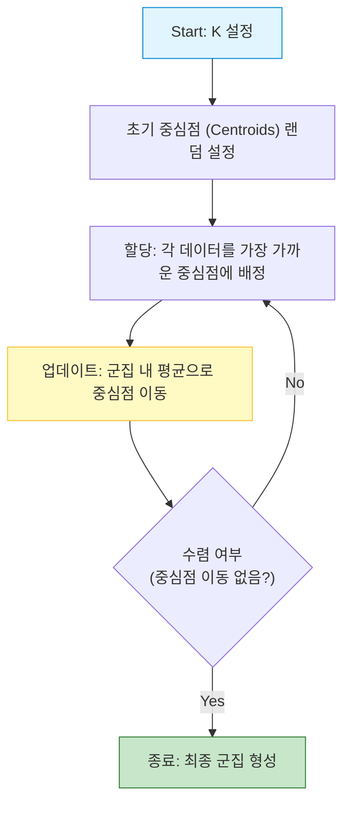
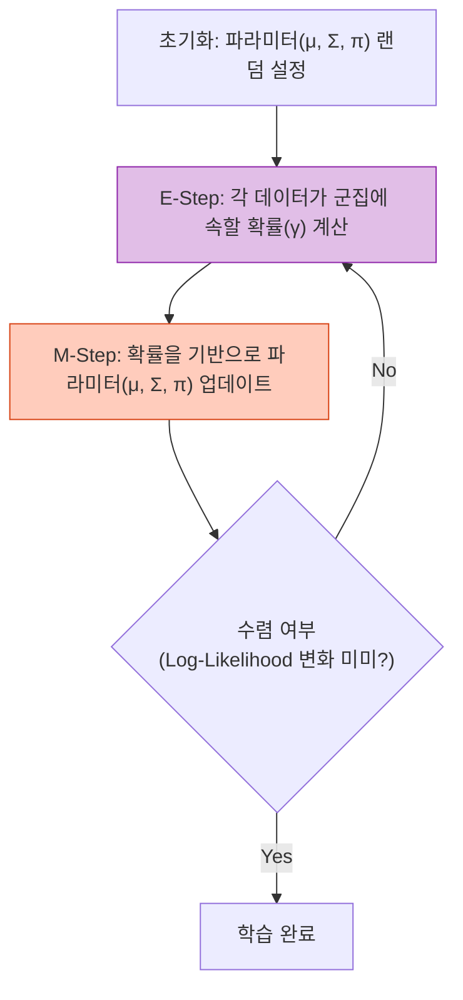

# Clustering: K-means

## 1. 개요
유사한 속성을 가진 데이터들을 그룹(Cluster)으로 묶는 **비지도 학습(Unsupervised Learning)** 기법이다. 
정답(Label) 없이 데이터의 특징(Feature)만으로 패턴을 찾는다.

> [!abstract] 핵심 질문
> **"누가 누구랑 비슷해? (Similarity)"**
> 여기서 '비슷하다'의 기준은 사용자가 정의한 거리(Distance)나 유사도 척도에 따라 결정된다.

## 2. K-means 알고리즘
데이터를 $k$개의 그룹으로 나누는 가장 대표적인 분할(Partitioning) 알고리즘이다.

### 2.1. 핵심 원리 (WCV 최소화)
각 군집의 중심(Centroid)과 해당 군집에 속한 데이터 사이의 거리(분산)를 최소화하는 것이 목표다. 
이를 **WCV (Within-Cluster Variance)** 라 한다.

$$
\text{Minimize } \text{WCV} = \sum_{k=1}^{K} \sum_{i \in C_k} \| x_i - \mu_k \|^2
$$
-   $\mu_k$: $k$번째 군집의 중심점 (Centroid).
-   $C_k$: $k$번째 군집에 포함된 데이터 집합.

### 2.2. 알고리즘 프로세스 (Iterative)
최적해(Optimal)를 한 번에 찾는 것은 불가능하므로, 반복을 통해 근사해(Sub-optimal)를 찾는다.

1.  **초기화**: 임의의 중심점 $k$개를 찍는다.
2.  **할당 (Assignment)**: 각 데이터를 가장 가까운 중심점에 배정한다.
3.  **업데이트 (Update)**: 배정된 데이터들의 평균으로 중심점을 이동시킨다.
4.  **반복**: 중심점이 더 이상 움직이지 않을 때까지 2~3 과정을 반복한다.

### 2.3. 주요 이슈 및 튜닝
-   **K의 결정 (Elbow Method)**: 군집 수 $k$를 늘릴수록 WCV는 무조건 감소한다. WCV의 감소율이 급격히 둔화되는 지점(Elbow)을 적절한 $k$로 선택한다. 
-   **스케일링 (Scaling)**: 거리를 기반으로 하므로, 분산이 큰 변수가 결과를 지배할 수 있다. 정규화(Standardization)가 필수다.
-   **초기값 민감성**: 초기 중심점 위치에 따라 결과가 달라지므로, 여러 번 수행하거나 K-means++ 등을 사용한다.

## 1. 개요 (Soft Clustering) 
데이터가 **여러 개의 정규분포(Gaussian Distribution)를 섞은(Mixture) 형태**에서 생성되었다고 가정하는 확률적 모델이다. 
- **K-means**: "너는 무조건 A팀이야." (Hard Clustering) 
- **GMM**: "너는 70% 확률로 A팀이고, 30% 확률로 B팀이야." (Soft Clustering)

## 2. 확률 모델 수식 
데이터 $x$가 관측될 확률 $P(x)$는 각 군집($C_k$)에서 나올 확률의 가중합이다. 
$$ P(x) = \sum_{k=1}^{K} \pi_k \cdot \mathcal{N}(x | \mu_k, \Sigma_k) $$
- $\pi_k$: 혼합 계수 (Mixing Coefficient). $k$번째 군집이 선택될 확률. ($\sum \pi_k = 1$) 
- $\mathcal{N}(x | \mu_k, \Sigma_k)$: $k$번째 군집의 정규분포 확률밀도함수. 
## 3. 학습 방법: EM 알고리즘 
우도(Likelihood)를 최대화하는 파라미터($\mu, \Sigma, \pi$)를 찾기 위해 **EM (Expectation-Maximization)** 알고리즘을 사용한다. 

### 3.1. E-Step (Expectation) 
"현재 추정된 분포를 기준으로, 데이터가 각 군집에 속할 확률(Responsibility)을 계산한다." 
$$ \gamma(z_{nk}) = \frac{\pi_k \mathcal{N}(x_n | \mu_k, \Sigma_k)}{\sum_{j=1}^{K} \pi_j \mathcal{N}(x_n | \mu_j, \Sigma_j)} $$
### 3.2. M-Step (Maximization) 
"계산된 확률을 바탕으로, 각 군집의 파라미터(평균, 공분산, 혼합계수)를 업데이트한다." 
$$ \mu_k^{\text{new}} = \frac{1}{N_k} \sum_{n=1}^{N} \gamma(z_{nk}) x_n $$
$$ \Sigma_k^{\text{new}} = \frac{1}{N_k} \sum_{n=1}^{N} \gamma(z_{nk}) (x_n - \mu_k^{\text{new}})(x_n - \mu_k^{\text{new}})^T $$
- 이 과정을 로그 우도(Log-Likelihood)가 수렴할 때까지 반복한다. 
# Hierarchical Clustering (계층적 군집화) 
## 1. 개요 
군집의 개수 $k$를 미리 정하지 않고, 데이터 간의 계층적 구조(Tree)를 형성하여 군집화하는 방식이다. 
결과는 나뭇가지 모양의 **덴드로그램(Dendrogram)** 으로 표현된다. 
## 2. 종류 
- **병합형 (Agglomerative)**: Bottom-up. 각 데이터가 하나의 군집에서 시작해, 가장 가까운 군집끼리 합쳐 나간다. (가장 많이 씀) 
- **분리형 (Divisive)**: Top-down. 전체가 하나의 군집에서 시작해, 멀리 있는 것을 쪼개 나간다. 
## 3. 연결법 (Linkage Method) 
"군집과 군집 사이의 거리를 어떻게 잴 것인가?"에 대한 기준이다.

| 방식                         | 설명                            | 특징                      |
| :------------------------- | :---------------------------- | :---------------------- |
| **Min (Single Linkage)**   | 두 군집에서 **가장 가까운** 점 사이의 거리    | 길게 늘어진 군집(Chain) 형성 가능성 |
| **Max (Complete Linkage)** | 두 군집에서 **가장 먼** 점 사이의 거리      | 둥글고 컴팩트한 군집 형성          |
| **Average Linkage**        | 두 군집 내 모든 점 간의 **평균** 거리      | 이상치에 강건함 (Robust)       |
| **Centroid Linkage**       | 두 군집의 **중심점(Centroid)** 간의 거리 | 역전 현상 발생 가능             |
## 4. 거리 측정 (Distance Metric) 
데이터 포인트 간의 거리를 재는 방법이다. (Linkage와 다름) 
- **유클리드 (Euclidean)**: 최단 직선거리. (가장 일반적) 
- **맨하탄 (Manhattan)**: 직각 이동 거리. (Grid 환경) 
- **코사인 (Cosine)**: 벡터 사이의 각도. (문서 유사도 등 크기보다 방향이 중요할 때)