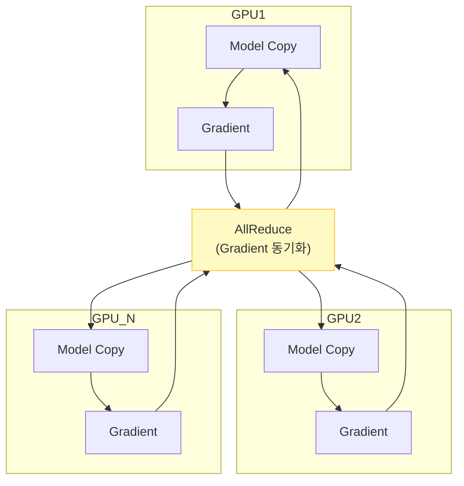
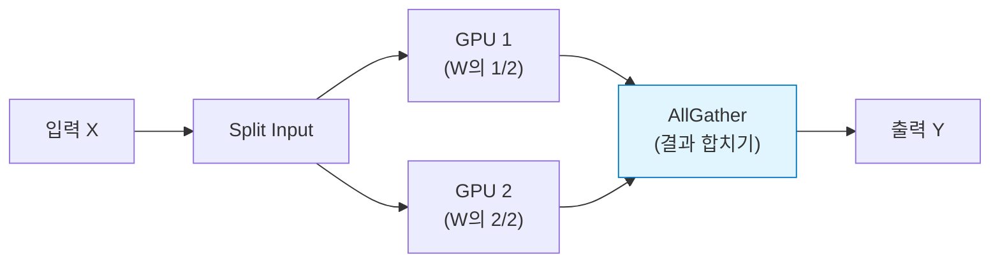
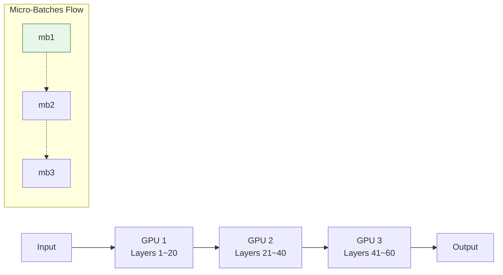

# Distributed GPU Training

## 1. 개요
대형 모델(70B ~ 1.8T)은 단일 GPU 메모리에 적재할 수 없다. 따라서 여러 GPU에 모델이나 데이터를 쪼개어 학습시키는 **분산 학습(Distributed Training)**이 필수적이다.

> [!abstract] 핵심 전략: 3D Parallelism
> 실무에서는 아래 세 가지 기법을 조합하여 사용한다.
> **Total GPUs** = $N_{DP} \times N_{TP} \times N_{PP}$

## 2. 병렬화 기법 비교

| 기법 | 한국어 명칭 | 핵심 아이디어 | 적용 대상 (Size) |
| :--- | :--- | :--- | :--- |
| **Data Parallelism (DP)** | 데이터 병렬 | 모델은 복사, **데이터(Batch)**만 나눔 | 소형 모델 (< 7B) |
| **Tensor Parallelism (TP)** | 텐서 병렬 | 하나의 **레이어(행렬)**를 쪼갬 | 대형 모델 (70B+) |
| **Pipeline Parallelism (PP)** | 파이프라인 병렬 | **레이어 그룹**을 층별로 나눔 | 초대형 모델 (100+ Layers) |

## 3. 메모리 소비 모델링 (수식)
모델 파라미터 수($\Phi$)에 따른 대략적인 VRAM 요구량은 다음과 같다.
$$
M_{\text{total}} = M_{\text{params}} + M_{\text{grads}} + M_{\text{optimizer}}
$$
-   **Mixed Precision(fp16/bf16)** 기준, 파라미터 1개당 약 **16~20 bytes**의 메모리가 필요하다.
-   예: 70B 모델 $\approx 70 \times 20 \text{GB} = 1.4\text{TB}$ (단일 GPU 불가능)

## 4. 상세 기법

### 4.1. Data Parallelism (DP)
가장 기초적인 방식이다. 모든 GPU가 동일한 모델 복사본을 가진다.
-   **작동**: 배치를 $N$등분하여 각자 계산 후, Gradient를 합친다.
-   **통신**: **AllReduce** 연산으로 Gradient를 동기화한다.
-   **한계**: 모델 자체가 GPU 메모리보다 크면 사용할 수 없다.

### 4.2. Tensor Parallelism (TP)
하나의 거대한 행렬 곱(MatMul) 연산을 여러 GPU가 나누어 처리한다.
-   **작동**: $W$ 행렬을 열(Column)이나 행(Row) 단위로 쪼갠다.
-   **통신**: **AllGather**가 필요하며, 통신 빈도가 매우 높아 NVLink 같은 고속 연결이 필수다.
-   **특징**: Megatron-LM의 핵심 기술이며, 보통 단일 노드(8 GPU) 내부에서만 수행한다.

### 4.3. Pipeline Parallelism (PP)
모델을 층(Layer) 단위로 잘라서 서로 다른 GPU에 배치한다.
-   **작동**: GPU 1이 1~10층, GPU 2가 11~20층을 담당한다.
-   **Micro-Batch**: 노는 시간(Bubble)을 줄이기 위해 배치를 아주 잘게 쪼개서 흘려보낸다.

## 5. ZeRO (Zero Redundancy Optimizer) 
DP의 문제점인 "모든 GPU가 똑같은 파라미터를 중복해서 가짐"을 해결하기 위해 개발되었다. (Microsoft DeepSpeed 팀) 
> [!tip] 핵심 개념 
> **"어차피 다 연결되어 있으니, 파라미터를 조각내서 서로 나눠 갖자(Sharding)."** 
### 5.1. 단계별 절감 효과
| 단계          | 분할 대상 (Sharding Target)  | 메모리 절감율    | 비고                  |
| :---------- | :----------------------- | :--------- | :------------------ |
| **ZeRO-1**  | Optimizer States         | **4배**     | 속도 저하 거의 없음 (기본값)   |
| **ZeRO-2**  | Gradients + Opt States   | **8배**     | 통신량 약간 증가           |
| **ZeRO-3**  | Parameters + Grads + Opt | **메모리 비례** | 통신량 증가, 초대형 모델 필수   |
| **Offload** | CPU/NVMe로 데이터 피신         | 극대화        | 단일 GPU로 거대 모델 학습 가능 |
### 5.2. ZeRO-3 작동 원리 수식 
기존 DP 메모리 사용량이 $N_{gpu}$에 관계없이 일정했다면, ZeRO-3는 GPU 수에 비례해 줄어든다. 
$$ M_{\text{ZeRO3}} \approx \frac{M_{\text{model}} + M_{\text{opt}}}{N_{\text{gpu}}} $$
- **결과**: GPU를 늘릴수록 더 큰 모델을 올릴 수 있게 된다.

## 6. 프레임워크 비교

| 프레임워크 | 장점 | 단점 | 추천 상황 |
| :--- | :--- | :--- | :--- |
| **DeepSpeed** | ZeRO, 3D Parallel, Offload 등 기능 최강 | 설정이 다소 복잡함 | **학습(Training) 표준** |
| **FSDP (PyTorch)** | PyTorch 내장(Native), 설정 간편 | DeepSpeed 대비 기능 약간 부족 | Llama, Gemma 미세조정 |
| **Megatron-LM** | TP(Tensor Parallel) 최적화가 가장 잘됨 | 코드가 오래되고 유지보수 어려움 | Pre-training 연구 |
| **vLLM** | 추론(Inference) 속도 압도적 | 학습 기능은 제한적 | **추론(Serving) 표준** |

## 7. 실무 요약 가이드 (2025 기준)

| 모델 크기 | 추천 조합 (Recipe) |
| :--- | :--- |
| **~7B** | **DP** (ZeRO-1/2) |
| **13B ~ 70B** | **ZeRO-3** (FSDP or DeepSpeed) |
| **70B ~ 175B** | **ZeRO-3 + TP** (GPU 8장 이상) |
| **400B+** | **3D Parallelism** (DP $\times$ TP $\times$ PP) |
| **NoteBook** | **ZeRO-Offload** (느리지만 학습 가능) |

> [!summary] 결론
> 2025년 기준, 분산 학습은 **"DeepSpeed(혹은 FSDP) + ZeRO-3"** 조합이면 99%의 상황을 해결할 수 있다.