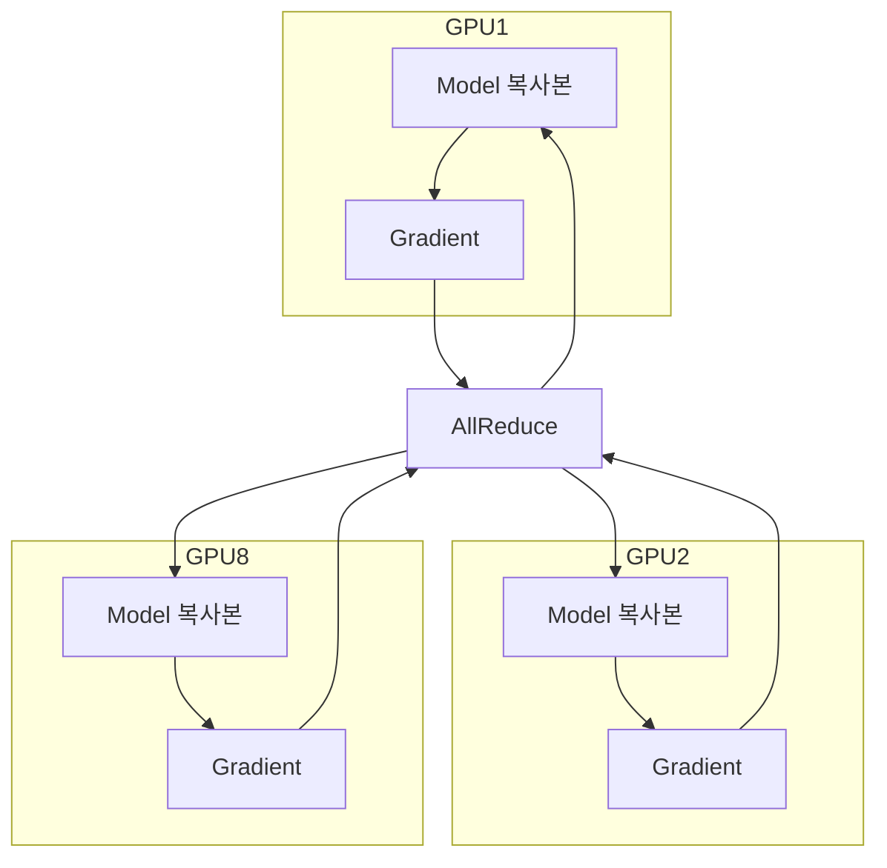
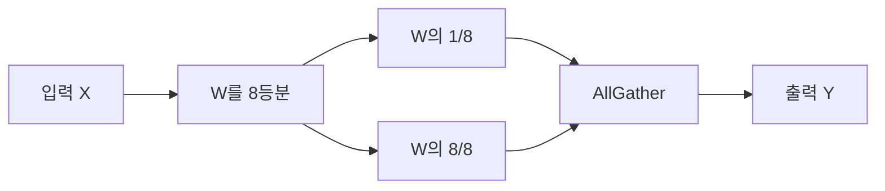
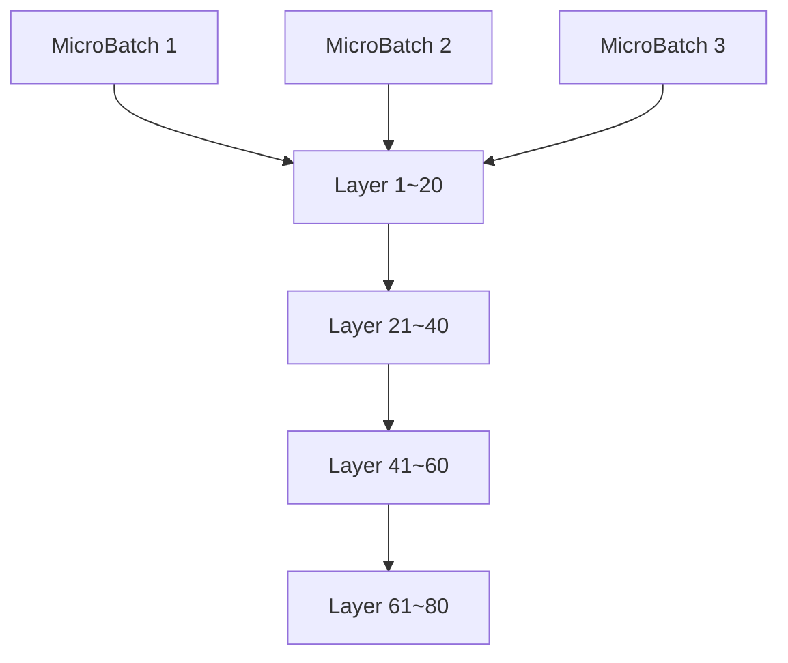

# 분산 GPU 훈련 기법

- 대형 모델(70B~1.8T)은 한 장의 GPU에 절대 안 들어간다.  
- 그래서 여러 GPU에 모델을 쪼개서 동시에 학습시키는 기술이 필요하다.

## 1. 기본 전략

| 이름                   | 한국어 이름   | 핵심 아이디어                   | 언제 쓰나?                   |
| -------------------- | -------- | ------------------------- | ------------------------ |
| Data Parallelism     | 데이터 병렬   | 모델은 복사, 데이터만 나눔           | 모델이 작을 때 (7B 이하)         |
| Tensor Parallelism   | 텐서 병렬    | 하나의 레이어(W 행렬)를 여러 GPU에 쪼갬 | 레이어가 너무 클 때 (70B+)       |
| Pipeline Parallelism | 파이프라인 병렬 | 레이어를 층별로 다른 GPU에 배치       | 층이 너무 많을 때 (100+ layers) |

- 실무에서는 위 세 가지를 조합해서 쓴다 → 3D Parallelism
## 2. 디테일

### 2-1. Data Parallelism (DP)

- 같은 모델을 8장 GPU에 복사
- 배치를 8등분해서 각각 학습
- gradient를 AllReduce로 합쳐서 동기화
- 장점: 구현 가장 쉬움
- 단점: 모델 전체가 각 GPU 메모리에 들어가야 함 → 70B는 불가능

### 2-2. Tensor Parallelism (TP)

- 하나의 큰 행렬 곱을 여러 GPU에 쪼갬
- 예: W가 4096×4096 → 8장 GPU면 각 GPU가 4096×512만 가짐
- Megatron-LM, DeepSpeed, vLLM에서 기본 지원
- AllReduce 대신 AllGather 필요 → 통신량 ↑
- 보통 TP=8 정도가 실무 최대

### 2-3. Pipeline Parallelism (PP)

- 모델을 층(layer) 단위로 쪼갬 (예: 80층 → 8장 GPU면 GPU당 10층)
- 미니배치를 또 쪼개서 파이프라인처럼 흘려보냄
- 버블 시간(bubble)이 생김 → GPipe, PipeDream, DeepSpeed로 해결
- ZeRO-3 + PP 조합이 현재 대세

### 2-4. 3D Parallelism
총 GPU 수 = DP × TP × PP
예: 512 GPU로 1.8T 모델 학습
→ DP=64, TP=8, PP=1 → 흔한 조합
→ DP=32, TP=8, PP=2 → 메모리 더 부족할 때

### 2-5. ZeRO (Zero Redundancy Optimizer)
- 메모리 절약의 신

| 단계   | 뭘 나눠서 저장하나?               | 메모리 절감량          | 대표 구현         |
|--------|------------------------------------|-------------------------|-------------------|
| ZeRO-1 | Optimizer state만 나눔            | 4배 절감               | DeepSpeed        |
| ZeRO-2 | Gradient도 나눔                   | 8배 절감               |                   |
| ZeRO-3 | 파라미터까지 나눔                 | 100B도 8장 GPU 가능     | DeepSpeed, FSDP   |
| ZeRO-Offload | CPU나 NVMe로 offload          | 13B도 노트북에서 학습  | DeepSpeed        |

→ 2025년 기준 ZeRO-3 + 3D Parallelism = 사실상 표준

## 3. 프레임워크 비교

| 프레임워크       | 장점                                   | 단점                        | 대표 모델 예시          |
|------------------|----------------------------------------|-----------------------------|--------------------------|
| DeepSpeed        | ZeRO, 3D Parallel, Offload 완벽 지원  | 설정 조금 복잡              | LLaMA, DeepSeek, Qwen2   |
| FSDP (PyTorch)   | PyTorch 네이티브, 설정 쉬움           | 기능은 DeepSpeed보다 살짝 부족 | Llama-3, Gemma-2         |
| Megatron-LM      | Tensor Parallel 최적화 최고            | 오래된 코드, 유지보수↓      | GPT-3 초기 버전          |
| vLLM + TensorRT-LLM | 추론 전용, 훈련은 약함             | 훈련은 DeepSpeed 써야 함   | 추론 서버                |

## 4. 요약

| 상황                     | 추천 조합                              |
|--------------------------|----------------------------------------|
| 7B 이하 모델             | 그냥 Data Parallel (8장 이하)         |
| 13~70B 모델              | ZeRO-3 + DP (8~32장)                   |
| 70B~175B 모델            | ZeRO-3 + DP × TP=8                     |
| 400B+ 모델               | ZeRO-3 + DP × TP=8 × PP=2~4            |
| 개인 노트북에서 13B 학습 | ZeRO-Offload + DeepSpeed              |

“모델이 커질수록  
Data Parallel → Tensor Parallel → Pipeline Parallel 순으로 쪼개고,  
ZeRO-3로 메모리까지 나눠 가지면  
이론상 GPU 수만 있으면 몇 조 파라미터도 학습 가능하다.”

이제 2025년 기준 분산 학습은  
DeepSpeed + ZeRO-3 + 3D Parallelism 쓰면 99% 해결된다.