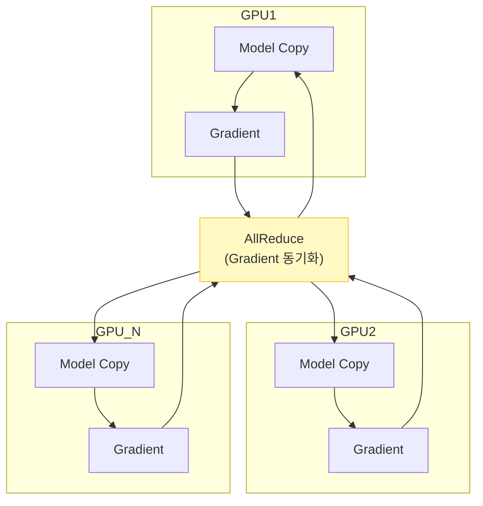
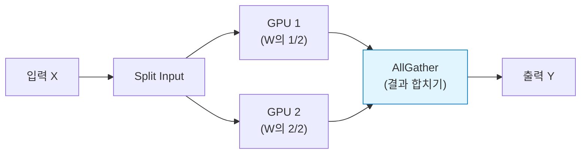
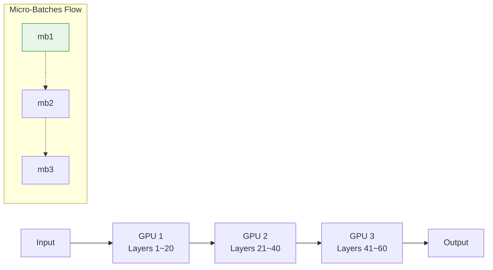

# Distributed GPU Training

## 1. 개요
대형 모델(70B ~ 1.8T)은 단일 GPU 메모리에 적재할 수 없다. 따라서 여러 GPU에 모델이나 데이터를 쪼개어 학습시키는 **분산 학습(Distributed Training)**이 필수적이다.

> [!abstract] 핵심 전략: 3D Parallelism
> 실무에서는 아래 세 가지 기법을 조합하여 사용한다.
> **Total GPUs** = $N_{DP} \times N_{TP} \times N_{PP}$

실제로는 여기에 **Sequence Parallelism(SP)**과 **Expert Parallelism(EP, MoE 전용)**을 더해 5D parallelism으로 확장되기도 한다. 각 기법이 줄여주는 자원이 서로 다르다는 점이 핵심이다.

| 기법 | 줄이는 자원 |
| :--- | :--- |
| DP | 처리량(throughput) 증가 |
| TP / PP | 모델 파라미터 메모리 |
| SP | activation 메모리 |
| EP | MoE 모델의 expert 파라미터 메모리 |

>[!tip] Data Parallelism의 한계와 Strong Scaling
> DP는 GPU 수 $M$이 배치 크기 $B$보다 작아야 한다($M < B$). 그렇다고 $B$를 무작정 키우는 것도 능사는 아니다 — 배치가 "critical batch size"를 넘어서면 스텝당 얻는 수렴 이득이 줄어든다. 또한 모델 자체가 GPU 하나에 올라가지 않으면 DP만으로는 근본적으로 해결이 안 된다(ZeRO-3를 써도 activation 메모리는 GPU당 그대로 남는다).
> **Strong scaling**이란 GPU 수를 늘릴수록 처리량(FLOPs/s)이 비례해서 증가하는 이상적인 상황을 말한다 — 분산 학습 설계의 목표점이다.

## 2. 병렬화 기법 비교

| 기법 | 한국어 명칭 | 핵심 아이디어 | 적용 대상 (Size) |
| :--- | :--- | :--- | :--- |
| **Data Parallelism (DP)** | 데이터 병렬 | 모델은 복사, **데이터(Batch)**만 나눔 | 소형 모델 (< 7B) |
| **Tensor Parallelism (TP)** | 텐서 병렬 | 하나의 **레이어(행렬)**를 쪼갬 | 대형 모델 (70B+) |
| **Pipeline Parallelism (PP)** | 파이프라인 병렬 | **레이어 그룹**을 층별로 나눔 | 초대형 모델 (100+ Layers) |

## 3. 메모리 소비 모델링 (수식)
모델 파라미터 수($\Phi$)에 따른 대략적인 VRAM 요구량은 다음과 같다.
$$
M_{\text{total}} = M_{\text{params}} + M_{\text{grads}} + M_{\text{optimizer}}
$$
-   **Mixed Precision(fp16/bf16)** 기준, 파라미터 1개당 약 **16~20 bytes**의 메모리가 필요하다.
-   예: 70B 모델 $\approx 70 \times 20 \text{GB} = 1.4\text{TB}$ (단일 GPU 불가능)

## 4. 상세 기법

### 4.1. Data Parallelism (DP)
가장 기초적인 방식이다. 모든 GPU가 동일한 모델 복사본을 가진다.
-   **작동**: 배치를 $N$등분하여 각자 계산 후, Gradient를 합친다.
-   **통신**: **AllReduce** 연산으로 Gradient를 동기화한다.
-   **한계**: 모델 자체가 GPU 메모리보다 크면 사용할 수 없다.



### 4.2. Tensor Parallelism (TP)
하나의 거대한 행렬 곱(MatMul) 연산을 여러 GPU가 나누어 처리한다.
-   **작동**: $W$ 행렬을 열(Column)이나 행(Row) 단위로 쪼갠다.
-   **통신**: **AllGather**가 필요하며, 통신 빈도가 매우 높아 NVLink 같은 고속 연결이 필수다.
-   **특징**: Megatron-LM의 핵심 기술이며, 보통 단일 노드(8 GPU) 내부에서만 수행한다.



#### Column-Parallel → Row-Parallel 조합
MLP처럼 선형 레이어 두 개가 연속으로 이어진 경우, 중간에 아무 통신 없이 **딱 한 번의 AllReduce**만으로 처리할 수 있다.
- 첫 번째 행렬 $W_1$은 **열(column) 단위**로 쪼갠다 → 각 GPU가 activation까지 로컬로 계산 (통신 없음)
- 두 번째 행렬 $W_2$는 **행(row) 단위**로 쪼갠다 → 각 GPU가 부분합만 갖게 되므로, 마지막에 AllReduce로 합산

$$
y = h W_2 = [h_0, h_1] \begin{bmatrix} W_{2,0} \\ W_{2,1} \end{bmatrix} = h_0 W_{2,0} + h_1 W_{2,1} = y_0 + y_1
$$

일반화하면, 행렬곱 $Y=XW$에서 $W$를 **열 방향**으로 쪼개면 각 디바이스가 출력의 슬라이스를 그대로 갖게 되어 추가 통신이 필요 없지만, **행 방향**으로 쪼개면 각 디바이스가 출력의 부분합만 가지므로 반드시 리덕션(AllReduce)이 필요하다.

Attention도 같은 패턴이다: head들은 서로 독립적이므로 QKV projection을 column-parallel로 head 단위로 쪼개면, attention 계산 자체는 통신 없이 로컬로 끝나고 output projection을 row-parallel로 둬서 마지막에 AllReduce 한 번만 하면 된다.

```python
class ColumnParallelLinear(nn.Module):
    def __init__(self, in_features, out_features, world_size, rank):
        super().__init__()
        self.linear = nn.Linear(in_features, out_features // world_size, bias=False)

    def forward(self, x):
        return self.linear(x)  # 통신 없음 — 출력이 이미 샤딩되어 있음


class RowParallelLinear(nn.Module):
    def __init__(self, in_features, out_features, world_size, rank):
        super().__init__()
        self.linear = nn.Linear(in_features // world_size, out_features, bias=False)

    def forward(self, x):
        partial = self.linear(x)                          # 각 GPU는 부분합만 가짐
        dist.all_reduce(partial, op=dist.ReduceOp.SUM)     # 최종 합산
        return partial
```

### 4.3. Pipeline Parallelism (PP)
모델을 층(Layer) 단위로 잘라서 서로 다른 GPU에 배치한다.
-   **작동**: GPU 1이 1~10층, GPU 2가 11~20층을 담당한다.
-   **Micro-Batch**: 노는 시간(Bubble)을 줄이기 위해 배치를 아주 잘게 쪼개서 흘려보낸다.



## 5. ZeRO (Zero Redundancy Optimizer) 
DP의 문제점인 "모든 GPU가 똑같은 파라미터를 중복해서 가짐"을 해결하기 위해 개발되었다. (Microsoft DeepSpeed 팀) 
> [!tip] 핵심 개념 
> **"어차피 다 연결되어 있으니, 파라미터를 조각내서 서로 나눠 갖자(Sharding)."** 
### 5.1. 단계별 절감 효과
| 단계          | 분할 대상 (Sharding Target)  | 메모리 절감율    | 비고                  |
| :---------- | :----------------------- | :--------- | :------------------ |
| **ZeRO-1**  | Optimizer States         | **4배**     | 속도 저하 거의 없음 (기본값)   |
| **ZeRO-2**  | Gradients + Opt States   | **8배**     | 통신량 약간 증가           |
| **ZeRO-3**  | Parameters + Grads + Opt | **메모리 비례** | 통신량 증가, 초대형 모델 필수   |
| **Offload** | CPU/NVMe로 데이터 피신         | 극대화        | 단일 GPU로 거대 모델 학습 가능 |

>[!tip] ZeRO 1/2/3가 통신 오버헤드 없이 메모리만 아끼는 이유
> 하나의 AllReduce는 사실 **ReduceScatter + AllGather**를 합친 것과 통신 비용이 동일하다. ZeRO는 원래 하던 AllReduce를 이 두 연산으로 쪼갠 것뿐이므로, ZeRO-1/2/3 모두 순수 DP(AllReduce)와 동일한 통신 비용을 가지면서 메모리만 절약하는 "공짜" 최적화다.
> - **ZeRO-1**: 순전파 → 역전파 → **ReduceScatter**(자신이 담당하는 파라미터의 gradient만 획득) → 자신의 옵티마이저 상태로 자신의 파라미터만 업데이트 → **AllGather**(갱신된 파라미터 공유)
> - **ZeRO-2**: 레이어별로 gradient가 계산되는 즉시 ReduceScatter하고 나머지는 버려서, gradient 자체도 GPU당 $1/M$만 보관
> - **ZeRO-3 (FSDP)**: 파라미터도 $1/M$만 보관하다가, 각 레이어 연산 직전에 필요한 만큼만 AllGather → 계산 → 즉시 폐기

### 5.2. ZeRO-3 작동 원리 수식 
기존 DP 메모리 사용량이 $N_{gpu}$에 관계없이 일정했다면, ZeRO-3는 GPU 수에 비례해 줄어든다. 
$$ M_{\text{ZeRO3}} \approx \frac{M_{\text{model}} + M_{\text{opt}}}{N_{\text{gpu}}} $$
- **결과**: GPU를 늘릴수록 더 큰 모델을 올릴 수 있게 된다.

## 6. 프레임워크 비교

| 프레임워크 | 장점 | 단점 | 추천 상황 |
| :--- | :--- | :--- | :--- |
| **DeepSpeed** | ZeRO, 3D Parallel, Offload 등 기능 최강 | 설정이 다소 복잡함 | **학습(Training) 표준** |
| **FSDP (PyTorch)** | PyTorch 내장(Native), 설정 간편 | DeepSpeed 대비 기능 약간 부족 | Llama, Gemma 미세조정 |
| **Megatron-LM** | TP(Tensor Parallel) 최적화가 가장 잘됨 | 코드가 오래되고 유지보수 어려움 | Pre-training 연구 |
| **vLLM** | 추론(Inference) 속도 압도적 | 학습 기능은 제한적 | **추론(Serving) 표준** |

## 7. 실무 요약 가이드 (2025 기준)

| 모델 크기 | 추천 조합 (Recipe) |
| :--- | :--- |
| **~7B** | **DP** (ZeRO-1/2) |
| **13B ~ 70B** | **ZeRO-3** (FSDP or DeepSpeed) |
| **70B ~ 175B** | **ZeRO-3 + TP** (GPU 8장 이상) |
| **400B+** | **3D Parallelism** (DP $\times$ TP $\times$ PP) |
| **NoteBook** | **ZeRO-Offload** (느리지만 학습 가능) |

> [!summary] 결론
> 2025년 기준, 분산 학습은 **"DeepSpeed(혹은 FSDP) + ZeRO-3"** 조합이면 99%의 상황을 해결할 수 있다.

## 8. [Appendix] Collective Operations 정의와 통신 비용
지금까지 AllReduce, AllGather 같은 용어를 직관적으로 썼는데, 왜 특정 병렬화 기법이 특정 collective를 요구하는지 정확히 이해하려면 이들의 formal한 정의를 알아둘 필요가 있다.

>[!attention] 4가지 기본 Collective Operation
> - **Broadcast**: 한 GPU가 가진 데이터를 모든 GPU에 동일하게 복사한다.
> - **AllGather**: 각 GPU가 데이터의 조각(shard)만 갖고 있을 때, 모든 GPU가 전체 데이터를 갖게 만든다 (샤딩 해제).
>   $$\operatorname{AllGather}_Y:\mathbf A[I,J_Y]\rightarrow \mathbf A[I,J]$$
> - **ReduceScatter**: 각 GPU가 미합산(unreduced) 데이터를 갖고 있을 때, 합산한 뒤 그 결과를 다시 조각내어 분산 저장한다 (샤딩 추가).
>   $$\operatorname{ReduceScatter}_{Y,J}:\mathbf A[I,J]\{U_Y\}\rightarrow \mathbf A[I,J_Y]$$
> - **AllReduce**: 각 GPU가 미합산 데이터를 갖고 있을 때, 합산한 결과를 모든 GPU가 동일하게 갖는다.
>   $$\operatorname{AllReduce}_Y\,\mathbf A[I,J]\{U_Y\}\rightarrow \mathbf A[I,J]$$

### Ring AllReduce
실제 구현에서 AllReduce는 **ReduceScatter + AllGather**로 분해되어, 링 형태로 인접한 두 프로세스끼리만 통신하는 방식으로 수행된다.
1. **ReduceScatter**: 모든 덧셈 연산을 수행하지만 복사(중복 전송)는 없다 — 각 GPU가 축소된 부분집합 하나씩을 갖게 됨.
2. **AllGather**: 모든 복사를 수행하지만 연산은 없다 — 각 GPU가 축소된 조각들의 전체 집합을 갖게 됨.

>[!tip] 통신 비용의 반직관적인 성질
> AllGather, ReduceScatter, AllReduce의 통신 시간은 **배열의 크기와 대역폭에만 의존하고, 몇 개의 디바이스로 나눠서 샤딩했는지와는 무관하다.** GPU를 더 많이 써도 통신 비용 자체는 늘지 않는다는 뜻이다.

### Forward-Backward 쌍
AllGather와 ReduceScatter는 서로의 backward에 정확히 대응한다.
- **forward에서 AllGather → backward에서 ReduceScatter**: forward에서 같은 조각을 여러 디바이스에 뿌리는 것(fan-out)은, backward에서 여러 곳으로부터 온 gradient를 원래 디바이스로 모아 합산하는 것(sum)에 대응된다.
- **forward에서 ReduceScatter → backward에서 AllGather**: forward에서 여러 입력을 하나로 합산하는 것은, backward에서 upstream gradient를 각 기여자에게 그대로 복사해서 뿌리는 것에 대응된다.
- 따라서 **AllReduce의 backward는 또 다른 AllReduce**다.

## 9. [Appendix] Sharding 표기법과 행렬곱 4가지 경우
디바이스 메시가 $(X, Y)$ 두 축을 갖고, 행렬 $A$가 $(I, J)$ 축을 가질 때 다음과 같은 표기를 쓴다.
- $I_X$: $A$의 행(row)을 메시의 $X$축을 따라 분할
- $J_Y$: $A$의 열(column)을 메시의 $Y$축을 따라 분할
- 메시 축이 표기에 없으면 그 축을 따라 데이터가 복제(replicate)되어 있다는 뜻

행렬곱 $A \cdot B \rightarrow C$를 블록 단위로 쪼개서 수행할 때, 두 행렬의 샤딩 방식에 따라 4가지 경우가 생긴다 ($J$가 contracting dimension일 때).

| 경우 | 샤딩 상태 | 필요한 통신 |
| :--- | :--- | :--- |
| 1. contracting dim을 둘 다 안 쪼갬 | $A[I_X,J]\cdot B[J,K_Y]\to C[I_X,K_Y]$ | 없음 — 로컬 블록 행렬곱만으로 원하는 샤딩 결과가 나옴 |
| 2. 한쪽만 contracting dim을 쪼갬 | $A[I,J_X]\cdot B[J,K]\to C[I,K]$ | $A$를 AllGather한 뒤 곱함 |
| 3. 양쪽 다 contracting dim을 쪼갬 | $A[I,J_X]\cdot B[J_X,K]\to C[I,K]\{U_X\}$ | 각 디바이스가 부분합만 가지므로 AllReduce로 합산 |
| 4. non-contracting dim이 같은 축으로 쪼개짐 | - | case 1의 변형, 출력도 자연히 샤딩된 채로 나옴 |

Case 3이 바로 [[분산 GPU 훈련#4.2. Tensor Parallelism (TP)|Tensor Parallelism]]에서 row-parallel 이후 AllReduce가 필요한 이유이고, Case 2가 순수 column-parallel 변형에서 AllGather 통신이 발생하는 이유다.