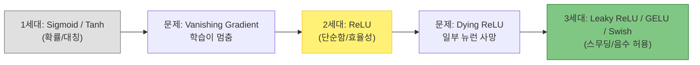

# Activation Functions (활성화 함수)

## 1. 개요
신경망의 뉴런이 입력값을 받아 계산한 뒤, 다음 뉴런으로 보낼 값을 결정하는 함수다. $y = \sigma(Wx + b)$ 형태를 띤다.

> [!abstract] 핵심 역할: 비선형성(Non-linearity)
> 활성화 함수가 없다면 아무리 깊은 신경망(Deep Network)을 쌓아도 결국 **하나의 거대한 선형 함수(Linear Transformation)**와 같아진다. 복잡한 문제를 풀기 위해선 비선형 함수인 $\sigma$가 필수적이다.

## 2. 발전 흐름
초기에는 인간의 뉴런을 모방한 Sigmoid가 쓰였으나, 학습 문제(Vanishing Gradient)로 인해 ReLU가 표준이 되었고, 최근 LLM에서는 더 부드러운 GELU/Swish가 대세다.

## 3. 고전적 활성화 함수 (S-Curve) 
### 3.1. Sigmoid Function 입력을 0과 1 사이로 압축한다. 
$$ \sigma(z) = \frac{1}{1+e^{-z}} $$
- **장점**: 출력이 확률($0 \sim 1$)로 해석될 수 있다. 
- **단점 (치명적)**: 
	1. **Vanishing Gradient**: 입력이 아주 크거나 작으면 기울기(미분값)가 거의 0이 되어, 역전파 시 학습이 소멸된다. 
	2. **Not Zero-centered**: 출력이 항상 양수라 학습 경로가 지그재그로 불안정해질 수 있다. 
### 3.2. Hyperbolic Tangent (Tanh) 
Sigmoid를 중심점 0으로 이동시킨 형태다. 
$$ \sigma(z) = \tanh(z) = \frac{e^z - e^{-z}}{e^z + e^{-z}} $$
- **장점**: 중심이 0이므로 Sigmoid보다 편향(Bias) 문제가 적다. 
- **단점**: 여전히 양 끝단에서 기울기가 소실되는 문제는 남는다.

## 4. 현대적 활성화 함수 (Rectifiers)

### 4.1. ReLU (Rectified Linear Unit)
딥러닝 혁명을 이끈 가장 대중적인 함수다.
$$
\sigma(z) = \max(0, z)
$$
-   **장점**:
    1.  **계산 효율**: 지수 연산($e^x$)이 없어 매우 빠르다.
    2.  **Gradient 보존**: 양수 구간에서 미분값이 1이므로 깊은 망에서도 학습이 잘 된다.
-   **단점 (Dying ReLU)**: 음수 입력이 계속 들어오면 기울기가 0이 되어 해당 뉴런이 영구적으로 죽어버릴 수 있다.

### 4.2. Leaky ReLU
ReLU의 "죽은 뉴런" 문제를 해결하기 위해 음수 구간에 약간의 기울기를 줬다.
$$
\sigma(z) = \max(\alpha z, z) \quad (\text{보통 } \alpha=0.01)
$$
-   **특징**: 음수일 때도 학습이 아주 조금씩 일어난다.

### 4.3. Swish (Self-Gated Activation)
Google Brain(2017)이 자동 탐색(NAS)을 통해 찾아낸 함수다. **"ReLU보다 깊은 층에서 더 잘 작동함"** 이 입증되었다.
$$
f(x) = x\cdot \sigma(\beta x) = \frac{x}{1+e^{-\beta x}}
$$
(보통 $\beta = 1$을 사용하며 이 경우 SiLU(Sigmoid Linear Unit) 라고도 부른다)

-  핵심 특징:
	1. **비단조성 (Non-monotonicity)**: $x < 0$ 구간에서 잠시 음수로 내려갔다가 0으로 수렴한다. 이 "살짝 휜" 음수 구간이 모델의 표현력을 높여준다.
	2. **매끄러움 (Smoothness)**: ReLU와 달리 모든 구간에서 미분 가능하다. 최적화 시 Loss 지형(Landscape)을 부드럽게 만들어 수렴을 돕는다.
	3. **Self-Gating**: 입력값 $x$ 자체가 자신의 게이트($\sigma(x)$) 역할을 하여 정보를 얼마나 통과시킬지 결정한다. (LSTM의 게이팅 메커니즘을 단순화한 형태)

### 4.4 GELU(Gaussian Error Linear Unit)
BERT, GPT, Llama 등 **현재 사실상 모든 LLM의 표준** 활성화 함수다. 
Dropout과 ReLU의 개념을 확률적으로 결합했다.

#### 이론적 배경 (Probabilistic Intuition)
ReLU가 입력 부호에 따라 0 또는 $x$를 내보내는 것($x \cdot \mathbb{1}(x>0)$)을 **"입력 크기에 비례한 확률로 켠다"** 로 부드럽게 해석했다. 
정규분포의 누적분포함수 $\Phi(x)$를 사용하여 입력을 가중한다.
$$
\text{GELU}(x) = x\cdot P(X\leq x) = x\Phi(x)
$$
(입력 $x$가 작을수록 꺼질(0이 될) 확률이 높고, 클수록 켜질($x$가 될) 확률이 높다.)
#### 근사 수식 (Implementation)
실제 구현 시 $\Phi(x)$(erf 함수) 계산 비용을 줄이기 위해 $\tanh$ 근사식을 사용한다.
$$\text{GELU}(x) \approx 0.5x \left( 1 + \tanh \left[ \sqrt{\frac{2}{\pi}} (x + 0.044715 x^3) \right] \right)$$
*(여기서 $0.044715$ 는 수학적으로 도출된 값이 아니라 근사식 계수를 찾다가 나온 최적의 매직 넘버.)*
- **특징**: Swish와 비슷하게 $x=0$ 부근에서 부드러운 곡선을 그리며, 음수 영역에서 약간의 값을 허용한다.
## 5. 출력층 전용 함수 (Output Layer)

### 5.1. Softmax
다중 클래스 분류(Multi-class Classification)의 최종 출력으로 쓰인다. 입력받은 점수(Logits)들을 **총합이 1인 확률**로 변환한다.
$$
\sigma(z)_i = \frac{e^{z_i}}{\sum_{j=1}^{K} e^{z_j}}
$$
-   **특징**: 가장 큰 값의 확률을 부각(Highlight)시킨다.

## 6. 요약 비교표
| **함수**           | **수식 특징**            | **장점**               | **단점**                | **주요 사용처**           |
| ---------------- | -------------------- | -------------------- | --------------------- | -------------------- |
| **Sigmoid**      | $\frac{1}{1+e^{-z}}$ | 확률 해석 가능             | 기울기 소실                | 이진 분류 출력층            |
| **Tanh**         | $\tanh(z)$           | 0 중심 (Zero-centered) | 기울기 소실                | RNN, LSTM            |
| **ReLU**         | $\max(0, z)$         | 빠름, 연산 효율적           | Dying ReLU, 0에서 미분 불가 | CNN, 일반 은닉층          |
| **Leaky ReLU**   | $\max(\alpha z, z)$  | Dying ReLU 방지        | $\alpha$ 튜닝 필요        | GAN 판별자              |
| **Swish (SiLU)** | $x \cdot \sigma(x)$  | 매끄러운 미분, 비단조성        | 지수 연산 비용 ($e^x$)      | EfficientNet, YOLO   |
| **GELU**         | $x \Phi(x)$          | **확률적 게이팅, 최적화 안정성** | 연산 비용 가장 높음           | **BERT, GPT, Llama** |
