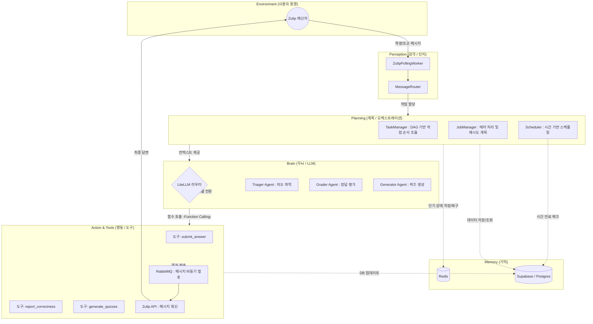

### 🎬 시나리오: 학생의 퀴즈 답안 제출부터 채점 결과 통보까지

#### Step 1. 학생이 Zulip으로 메시지 전송 (Zulip ➡️ 관문 서비스)

- 학생이 Zulip 메신저에서 챗봇(Agent)에게 개인 메시지(PM)로 "정답은 5입니다"라고 보냅니다.
    
- 시스템의 관문 역할을 하는 `ZulipPollingWorker`가 이 메시지를 낚아챕니다.

#### Step 2. 대기열에 줄 세우기 (➡️ RabbitMQ)

- 수강생 100명이 동시에 답을 보낼 수도 있습니다. 서버가 뻗지 않도록 이 메시지들을 RabbitMQ(메시지 큐)라는 우체국 컨베이어 벨트에 차곡차곡 올려둡니다.
    
- _💡 **RabbitMQ의 역할:** "일단 요청을 받아두고, 순서대로 꺼내서 처리하자"는 버퍼 역할을 합니다._

#### Step 3. 누구의 메시지인지 파악하고 담당자 배정 (➡️ MessageRouter)

- `MessageRouter`가 RabbitMQ에서 메시지를 하나 꺼냅니다.
    
- 데이터베이스(Supabase)를 조회해보니 보낸 사람이 '조교(Admin)'가 아니라 '학생'입니다.
    
- 메시지를 학생 전용 처리반인 `StudentHandler`로 넘깁니다.

#### Step 4. 작업 진척도 기록 시작 (➡️ Redis & TaskManager)

- `StudentHandler`는 작업을 여러 단계(1. 의도파악 -> 2. 채점 -> 3. 답장)로 나누어 실행하는 `TaskManager`를 가동합니다.
    
- 이때 Redis(인메모리 DB)가 등장합니다.
    
- _💡 **Redis의 역할 (단기 기억/체크포인트):**_ TaskManager는 "지금 1단계 시작함", "1단계 끝남" 같은 상태를 매우 빠른 DB인 Redis에 계속 적어둡니다. 만약 2단계 채점 중에 서버가 잠시 꺼졌다가 켜져도, Redis를 보고 "아까 1단계는 끝났었지? 2단계부터 다시 하자"라고 영리하게 복구할 수 있게 해줍니다.

#### Step 5. "이게 답안 제출이 맞나?" 판단 (➡️ Triager Agent & LiteLLM)

- 첫 번째 AI 에이전트인 Triager(분류자)가 나섭니다.
    
- 이때 **LiteLLM** 프레임워크가 작동합니다.
    
- _💡 **LiteLLM의 역할 (AI 모델 라우터/번역기):**_ 시스템이 GPT-4, Claude, Gemini 등 여러 AI 모델을 돌려가며 쓸 수 있게 해주는 도구입니다. "이번 질문은 GPT-4o-mini한테 물어봐" 하고 연결해 줍니다. 만약 OpenAI 서버가 터지면 자동으로 Claude로 우회 접속하는 똑똑한 기능도 합니다.
    
- Triager는 LiteLLM을 통해 AI에게 묻습니다: _"학생이 '정답은 5입니다'라고 했는데, 이게 진짜 퀴즈 답안을 낸 거야, 아니면 딴소리야?"_
    
- AI가 "답안 제출이 맞다"고 판단(`submit_answer` 도구 호출)하면, 이 메시지를 DB(Supabase)에 '제출됨(answered)' 상태로 저장합니다.

#### Step 6. 본격적인 채점 진행 (➡️ Grader Agent & Supabase)

- 의도 파악이 끝났으니, 두 번째 AI 에이전트인 Grader(채점자)가 바톤을 이어받습니다.
    
- Grader는 DB(Supabase)에서 원래 출제했던 문제와 정답 기준(criteria)을 가져옵니다.
    
- 다시 **LiteLLM**을 통해 AI에게 묻습니다: _"문제는 이거고 기준은 이건데, 학생이 '5'라고 답했어. 정답이야 오답이야?"_
    
- AI가 채점 결과를 내놓으면(`report_correctness` 도구 호출), 그 결과(Result: True/False)를 DB의 장기 기억(Supabase)에 영구적으로 기록합니다.

#### Step 7. 학생에게 결과 답장 발송 (➡️ RabbitMQ ➡️ Zulip)

- 모든 과정이 끝났습니다. "채점이 완료되었습니다. 정답입니다!"라는 답장 텍스트가 만들어집니다.
    
- 이 답장 내용은 다시 **RabbitMQ**의 `reply_to`라는 큐에 올려집니다.
    
- 시스템 관문 서비스가 이걸 꺼내서 최종적으로 **Zulip API**를 호출해 학생의 메신저로 답장을 쏩니다.